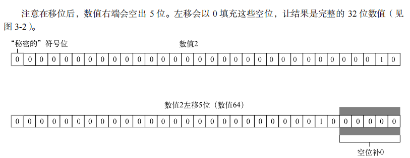
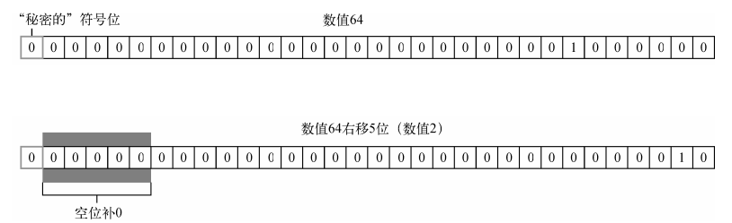
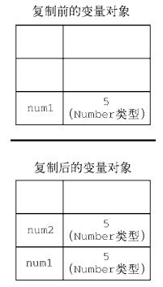
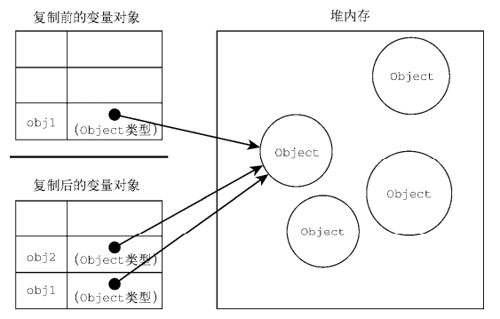
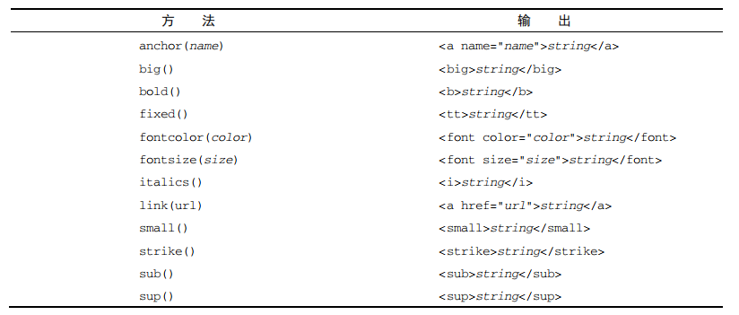
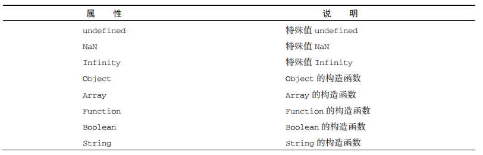
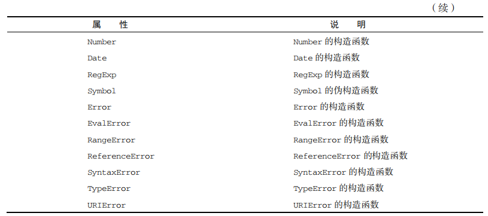
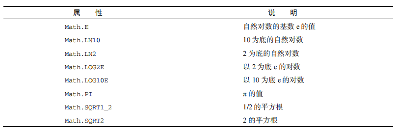
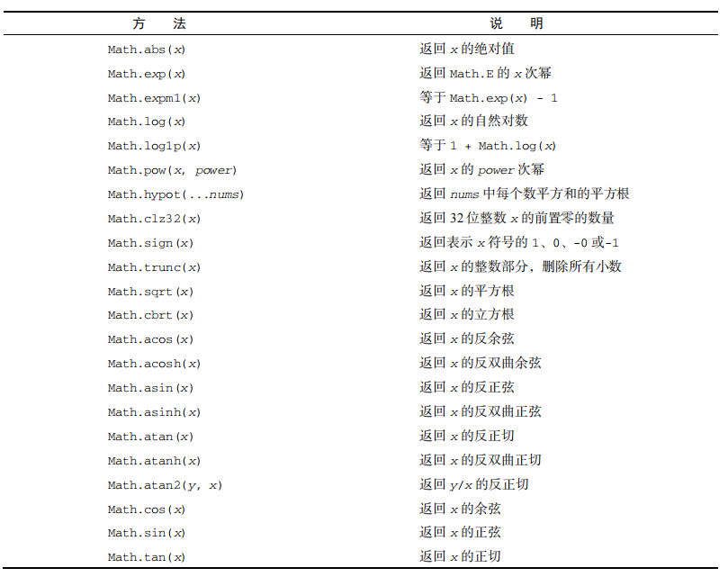
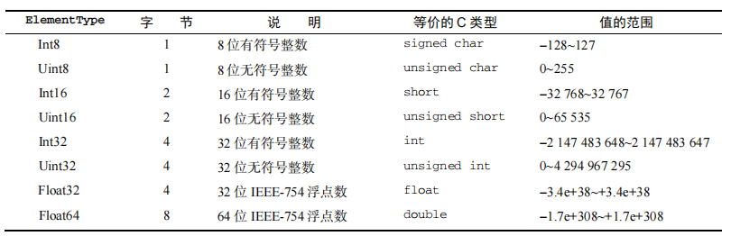

## 1.什么是 JavaScript

JavaScript 是一门用来与网页交互的脚本语言，包含以下三个组成部分。

- ECMAScript：由 [ECMA-262](https://262.ecma-international.org/6.0/) 定义并提供核心功能。

- 文档对象模型（[DOM](https://baike.baidu.com/item/%E6%96%87%E6%A1%A3%E5%AF%B9%E8%B1%A1%E6%A8%A1%E5%9E%8B/1033822)）：提供与网页内容交互的方法和接口。

- 浏览器对象模型（[BOM](https://baike.baidu.com/item/BOM/1801)）：提供与浏览器交互的方法和接口。

JavaScript 的这三个部分得到了五大 Web 浏览器（IE、Firefox、Chrome、Safari 和 Opera）不同程度的支持。所有浏览器基本上对 ES5（ECMAScript 5）提供了完善的支持，而对 ES6（ECMAScript 6）和 ES7（ECMAScript 7）的支持度也在不断提升。这些浏览器对 DOM 的支持各不相同，但对 Level 3 的支持日益趋于规范。HTML5 中收录的 BOM 会因浏览器而异，不过开发者仍然可以假定存在很大一部分公共特性。

## 2.HTML 中的 JavaScript

### 2.1 \<script\>元素

在 HTML 页面中插入 JavaScript 的主要方法有两种：

1. 在 HTML 中使用 \<script\> 元素，内部直接嵌入 JavaScript 代码
2. 外部引用 JavaScript 脚本

\<script\>元素有下列 8 个属性：

| 属性 | 描述 |
| :-- | :-: |
| async | 表示应该立即开始下载脚本，但不能阻止其他页面动作，比如下载资源或等待其他脚本加载。只对外部脚本文件有效 |
| charset | 使用 src 属性指定的代码字符集。这个属性很少使用，因为大多数浏览器不在乎它的值 |
| crossorigin | 配置相关请求的 CORS（跨源资源共享）设置。默认不使用 CORS。crossorigin= "anonymous"配置文件请求不必设置凭据标志。crossorigin="use-credentials"设置凭据标志，意味着出站请求会包含凭据 |
| defer | 表示脚本可以延迟到文档完全被解析和显示之后再执行。只对外部脚本文件有效。在 IE7 及更早的版本中，对行内脚本也可以指定这个属性 |
| integrity | 允许比对接收到的资源和指定的加密签名以验证子资源完整性（SRI，Subresource Integrity）。如果接收到的资源的签名与这个属性指定的签名不匹配，则页面会报错，脚本不会执行。这个属性可以用于确保内容分发网络（CDN，Content Delivery Network）不会提供恶意内容 |
| language | 废弃。最初用于表示代码块中的脚本语言（如"JavaScript"、"JavaScript 1.2"或"VBScript"）。大多数浏览器都会忽略这个属性，不应该再使用它 |
| src | 表示包含要执行的代码的外部文件 |
| type | 代替 language，表示代码块中脚本语言的内容类型（也称 MIME 类型）。按照惯例，这个值始终都是"text/javascript"，尽管"text/javascript"和"text/ecmascript"都已经废弃了。JavaScript 文件的 MIME 类型通常是"application/x-javascript"，不过给 type 属性这个值有可能导致脚本被忽略。在非 IE 的浏览器中有效的其他值还有"application/javascript"和"application/ecmascript"。如果这个值是 module，则代码会被当成 ES6 模块，而且只有这时候代码中才能出现 import 和 export 关键字 |

注意：

`defer`和`async`都是用于异步加载 JavaScript 脚本的属性，但它们之间有一些区别：

1. 加载顺序：使用`defer`属性加载的脚本会在 HTML 文档解析完成后按照顺序依次执行，而使用`async`属性加载的脚本则不保证执行的顺序，只要下载完成就会立即执行。

2. 执行时机：使用`defer`属性加载的脚本会在文档解析完成后、`DOMContentLoaded`事件之前执行，而使用`async`属性加载的脚本则会在下载完成后立即执行，不会等待文档解析完成。

3. 对 DOM 的影响：使用`defer`属性加载的脚本不会阻塞`DOM`的解析和渲染，也不会影响页面的加载速度，因为它会等到 HTML 文档解析完成后再执行。而使用 async 属性加载的脚本可能会影响 DOM 的解析和渲染，因为它会在下载完成后立即执行，如果脚本需要操作 DOM 元素，可能会影响到页面的加载速度和用户体验。

综上所述，使用`defer`属性加载的脚本适用于需要按顺序执行的脚本，并且不依赖于`DOM`元素的脚本；而使用`async`属性加载的脚本适用于独立的、不依赖于其他脚本和`DOM`元素的脚本。

### 2.2 行内代码与外部文件

推荐使用外部文件的理由如下。

- 可维护性。JavaScript 代码如果分散到很多 HTML 页面，会导致维护困难。而用一个目录保存所有 JavaScript 文件，则更容易维护，这样开发者就可以独立于使用它们的 HTML 页面来编辑代码。

- 缓存。浏览器会根据特定的设置缓存所有外部链接的 JavaScript 文件，这意味着如果两个页面都用到同一个文件，则该文件只需下载一次。这最终意味着页面加载更快。

- 适应未来。通过把 JavaScript 放到外部文件中，就不必考虑用 XHTML 或前面提到的注释黑科技。包含外部 JavaScript 文件的语法在 HTML 和 XHTML 中是一样的。在配置浏览器请求外部文件时，要重点考虑的一点是它们会占用多少带宽。在 SPDY/HTTP2 中，预请求的消耗已显著降低，以轻量、独立 JavaScript 组件形式向客户端送达脚本更具优势。

### 2.3 文档模式

IE5.5 发明了文档模式的概念，即可以使用 doctype 切换文档模式。最初的文档模式有两种：**混杂模式**（quirks mode）和**标准模式**（standards mode）。前者让 IE 像 IE5 一样（支持一些非标准的特性），后者让 IE 具有兼容标准的行为。虽然这两种模式的主要区别只体现在通过 CSS 渲染的内容方面，但对 JavaScript 也有一些关联影响，或称为副作用。本书会经常提到这些副作用。

1. 混杂模式下的盒模型为 IE 的盒模型

```js
//IE标准下的盒模型的宽高分别为：
CSS中的宽（width）= 内容（content）的宽 +（border+padding）*2
CSS中的高（height）= 内容（content）的高 +（border+padding）*2
```

2. 标准模式下的盒模型是 W3C 标准的盒模型

```js
//在w3c标准中，盒模型的宽高分别为：
CSS中的宽（width）= 内容（content）的宽
CSS中的高（height）= 内容（content）的高
```

在标准模式下，所有尺寸都必须包含单位，若不含单位的话，会被忽略;

在混杂模式下，可以把 style.width 设置为"20"，相当于"20px"。

### 2.4 \<noscript\>元素

- 浏览器不支持脚本；

- 浏览器对脚本的支持被关闭。

```js
<noscript>
  <p>This page requires a JavaScript-enabled browser.</p>
</noscript>
```

这个例子是在脚本不可用时让浏览器显示一段话。如果浏览器支持脚本，则用户永远不会看到它。

### 2.5 小结

JavaScript 是通过\<script\>元素插入到 HTML 页面中的。这个元素可用于把 JavaScript 代码嵌入到 HTML 页面中，跟其他标记混合在一起，也可用于引入保存在外部文件中的 JavaScript。本章的重点可以总结如下。

- 要包含外部 JavaScript 文件，必须将 src 属性设置为要包含文件的 URL。文件可以跟网页在同一台服务器上，也可以位于完全不同的域。

- 所有\<script\>元素会依照它们在网页中出现的次序被解释。在不使用 defer 和 async 属性的情况下，包含在\<script>元素中的代码必须严格按次序解释。

- 对不推迟执行的脚本，浏览器必须解释完位于\<script\>元素中的代码，然后才能继续渲染页面的剩余部分。为此，通常应该把\<script>元素放到页面末尾，介于主内容之后及\</body>标签之前。

- 可以使用 defer 属性把脚本推迟到文档渲染完毕后再执行。推迟的脚本原则上按照它们被列出的次序执行。

- 可以使用 async 属性表示脚本不需要等待其他脚本，同时也不阻塞文档渲染，即异步加载。异步脚本不能保证按照它们在页面中出现的次序执行。

- 通过使用\<noscript\>元素，可以指定在浏览器不支持脚本时显示的内容。如果浏览器支持并启用脚本，则\<noscript\>元素中的任何内容都不会被渲染。

## 3.语言基础

任何语言的核心所描述的都是这门语言在最基本的层面上如何工作，涉及语法、操作符、数据类型以及内置功能，在此基础之上才可以构建复杂的解决方案。如前所述，[ECMA-262](https://262.ecma-international.org/6.0/)以一个名为 ECMAScript 的伪语言的形式，定义了 JavaScript 的所有这些方面。

### 3.1 语法

#### 3.1.1 区分大小写

ECMAScript 中一切都区分大小写。无论是变量、函数名还是操作符，都区分大小写。

#### 3.1.2 标识符

所谓标识符，就是变量、函数、属性或函数参数的名称。标识符可以由一或多个下列字符组成：

- 第一个字符必须是一个字母、下划线（\_）或美元符号（$）；
- 剩下的其他字符可以是字母、下划线、美元符号或数字。

按照惯例，ECMAScript 标识符使用驼峰大小写形式，即第一个单词的首字母小写，后面每个单词的首字母大写，如：

- firstWord
- myCar
- doSomethingImportant

注意：关键字、保留字、true、false 和 null 不能作为标识符

#### 3.1.3 注释

ECMAScript 采用 C 语言风格的注释，包括单行注释和块注释。

// 单行注释

/_ 这是多行注释 _/

#### 3.1.4 严格模式

要对整个脚本启用严格模式，在脚本开头加上这一行：

```js
'use strict';
```

虽然看起来像个没有赋值给任何变量的字符串，但它其实是一个预处理指令。任何支持的 JavaScript 引擎看到它都会切换到严格模式。选择这种语法形式的目的是不破坏 ECMAScript 3 语法。也可以单独指定一个函数在严格模式下执行，只要把这个预处理指令放到函数体开头即可：

```js
function doSomething() {
  'use strict';
  // 函数体
}
```

严格模式会影响 JavaScript 执行的很多方面，因此本书在用到它时会明确指出来。所有现代浏览器都支持严格模式。

#### 3.1.5 语句

ECMAScript 中的语句以分号结尾。省略分号意味着由解析器确定语句在哪里结尾，如下面的例子所示，加分号也有助于在某些情况下提升性能，因为解析器会尝试在合适的位置补上分号以纠正语法错误。

```js
let sum = a + b; // 没有分号也有效，但不推荐
let diff = a - b; // 加分号有效，推荐
```

if 之类的控制语句只在执行多条语句时要求必须有代码块。不过，最佳实践是始终在控制语句中使用代码块，即使要执行的只有一条语句，如下例所示：

```js
// 有效，但容易导致错误，应该避免
if (test) console.log(test);

// 推荐
if (test) {
  console.log(test);
}
```

在控制语句中使用代码块可以让内容更清晰，在需要修改代码时也可以减少出错的可能性。

### 3.2 关键字与保留字

ECMA-262 描述了一组保留的关键字，这些关键字有特殊用途，比如表示控制语句的开始和结束，或者执行特定的操作。按照规定，保留的关键字不能用作标识符或属性名。ECMA-262 第 6 版规定的所有关键字如下：

```js
break do in typeof case else instanceof var

catch export new void class extends return while

const finally super with continue for switch yield

debugger function this default if throw delete import try
```

规范中也描述了一组未来的保留字，同样不能用作标识符或属性名。虽然保留字在语言中没有特定用途，但它们是保留给将来做关键字用的。以下是 ECMA-262 第 6 版为将来保留的所有词汇:

```js
//始终保留:
enum

//严格模式下保留:
implements package public interface protected static let private

//模块代码中保留:
await
```

### 3.3 变量

ECMAScript 变量是松散类型的，意思是变量可以用于保存任何类型的数据。每个变量只不过是一个用于保存任意值的命名占位符。有 3 个关键字可以声明变量：var、const 和 let。其中，var 在 ECMAScript 的所有版本中都可以使用，而 const 和 let 只能在 ECMAScript 6 及更晚的版本中使用。

**想深入了解三者的区别，看一下这篇文章：** [解读 let-const-var 的区别](http://leoamazing.gitee.io/blog/blogs/frontend/2020/20201208.html#let-%E5%92%8C-var-%E7%9A%84%E5%8C%BA%E5%88%AB)

#### 3.3.1 var 关键字

```js
var message;
var message = 'hi';
message = 100; // 合法，但不推荐

var message = 'hi',
  found = false,
  age = 29;

var name;
var name;
```

1. var 声明作用域

```js
function test() {
  var message = 'hi'; // 局部变量
}
test();
console.log(message); // 出错！
```

```js
function test() {
  message = 'hi'; // 全局变量
}
test();
console.log(message); // "hi"
```

2. var 声明提升使用 var 时，下面的代码不会报错。这是因为使用这个关键字声明的变量会自动提升到函数作用域顶部：

```js
function foo() {
  console.log(age);
  var age = 26;
}
foo(); // undefined
```

等价下面

```js
function foo() {
  var age;
  console.log(age);
  age = 26;
}
foo(); // undefined
```

#### 3.3.2 let 声明

let 跟 var 的作用差不多，但有着非常重要的区别。最明显的区别是，let 声明的范围是块作用域，而 var 声明的范围是函数作用域。

```js
if (true) {
  var name = 'Matt';
  console.log(name); // Matt
}
console.log(name); // Matt

if (true) {
  let age = 26;
  console.log(age); // 26
}
console.log(age); // ReferenceError: age 没有定义
```

```js
let age;
let age; // SyntaxError；标识符 age 已经声明过了
```

```js
var name;
let name; // SyntaxError

let age;
var age; // SyntaxError
```

1. 暂时性死区

```js
// name 会被提升
console.log(name); // undefined
var name = 'Matt';

// age 不会被提升
console.log(age); // ReferenceError：age 没有定义
let age = 26;

// 在解析代码时，JavaScript 引擎也会注意出现在块后面的 let 声明，
// 只不过在此之前不能以任何方式来引用未声明的变量。
// 在 let 声明之前的执行瞬间被称为“暂时性死区”（temporal dead zone），
// 在此阶段引用任何后面才声明的变量都会抛出 ReferenceError。
```

2. 全局声明

与 var 关键字不同，使用 let 在全局作用域中声明的变量不会成为 window 对象的属性（var 声明的变量则会）。

```js
var name = 'Matt';
console.log(window.name); // 'Matt'

let age = 26;
console.log(window.age); // undefined
```

3. 条件声明

在使用 var 声明变量时，由于声明会被提升，JavaScript 引擎会自动将多余的声明在作用域顶部合并为一个声明。因为 let 的作用域是块，所以不可能检查前面是否已经使用 let 声明过同名变量，同时也就不可能在没有声明的情况下声明它。

4. for 循环中的 let 声明

```js
for (var i = 0; i < 5; ++i) {
  // 循环逻辑
}
console.log(i); // 5

for (let i = 0; i < 5; ++i) {
  // 循环逻辑
}
console.log(i); // ReferenceError: i 没有定义
```

```js
for (var i = 0; i < 5; ++i) {
  setTimeout(() => console.log(i), 0);
}
// 你可能以为会输出 0、1、2、3、4
// 实际上会输出 5、5、5、5、5

for (let i = 0; i < 5; ++i) {
  setTimeout(() => console.log(i), 0);
}
// 会输出 0、1、2、3、4
```

#### 3.3.3 const 声明

const 的行为与 let 基本相同，唯一一个重要的区别是用它声明变量时必须同时初始化变量，且尝试修改 const 声明的变量会导致运行时错误。

```js
const age = 26;
age = 36; // TypeError: 给常量赋值

// const 也不允许重复声明
const name = 'Matt';
const name = 'Nicholas'; // SyntaxError

// const 声明的作用域也是块
const name = 'Matt';
if (true) {
  const name = 'Nicholas';
}
console.log(name); // Matt
```

const 声明的限制只适用于它指向的变量的引用。换句话说，如果 const 变量引用的是一个对象，那么修改这个对象内部的属性并不违反 const 的限制。

```js
const person = {};
person.name = 'Matt'; // ok
```

#### 3.3.4 声明风格及最佳实践

1. 不使用 var
2. const 优先，let 次之

### 3.4 数据类型

ECMAScript 有 6 种简单数据类型（也称为原始类型）：Undefined、Null、Boolean、Number、String 和 Symbol。Symbol（符号）是 ECMAScript 6 新增的。还有一种复杂数据类型叫 Object（对象）。

**想深入了解数据类型，看一下这篇文章：**[数据类型](http://leoamazing.gitee.io/blog/blogs/frontend/2020/20201203.html#%E4%B8%80%E3%80%81%E6%95%B0%E6%8D%AE%E7%B1%BB%E5%9E%8B)

#### 3.4.1 typeof 操作符

```js
let message = 'some string';
console.log(typeof message); // "string"
```

注意：调用 typeof null 返回的是"object"

#### 3.4.2 Undefined 类型

```js
let message;
console.log(message == undefined); // true
```

#### 3.4.3 Null 类型

```js
let car = null;
console.log(typeof car); // "object"
```

#### 3.4.4 Boolean 类型

```js
let found = true;
let lost = false;
```

| 数据类型  |    转换为 true 的值    | 转换为 false 的值 |
| :-------- | :--------------------: | ----------------: |
| Boolean   |          true          |             false |
| String    |       非空字符串       |    ""（空字符串） |
| Number    | 非零数值（包括无穷值） |            0、NaN |
| Object    |        任意对象        |                -- |
| Undefined |           --           |         undefined |

#### 3.4.5 Number 类型

```js
let intNum = 55; // 整数

let octalNum1 = 070; // 八进制的 56
let octalNum2 = 079; // 无效的八进制值，当成 79 处理
let octalNum3 = 08; // 无效的八进制值，当成 8 处理

let hexNum1 = 0xa; // 十六进制 10
let hexNum2 = 0x1f; // 十六进制 31

let floatNum1 = 1.1;
let floatNum2 = 0.1;
let floatNum3 = 0.1; // 有效，但不推荐

let floatNum = 3.125e7; // 等于 31250000

let result = Number.MAX_VALUE + Number.MAX_VALUE;
console.log(isFinite(result));
// false 如果参数是 NaN，正无穷大或者负无穷大，会返回 false，其他返回 true。

console.log(0 / 0); // NaN
console.log(-0 / +0); // NaN

console.log(isNaN(NaN)); // true
console.log(isNaN(10)); // false，10 是数值
console.log(isNaN('10')); // false，可以转换为数值 10
console.log(isNaN('blue')); // true，不可以转换为数值
console.log(isNaN(true)); // false，可以转换为数值 1

console.log(5 / 0); // Infinity
console.log(5 / -0); // -Infinity
```

注意：实际中可能存在正零（+0）和负零（-0）。正零和负零在所有情况下都被认为是等同的，使用 Number.NEGATIVE_INFINITY 和 Number.POSITIVE_INFINITY 也可以获取正、负 Infinity。

**数值转换**

有 3 个函数可以将非数值转换为数值：Number()、parseInt()和 parseFloat()。Number()是转型函数，可用于任何数据类型。后两个函数主要用于将字符串转换为数值。对于同样的参数，这 3 个函数执行的操作也不同

Number()函数基于如下规则执行转换。

- 布尔值，true 转换为 1，false 转换为 0。
- 数值，直接返回。
- null，返回 0。
- undefined，返回 NaN。
- 字符串，应用以下规则。
  - 如果字符串包含数值字符，包括数值字符前面带加、减号的情况，则转换为一个十进制数值。因此， Number("1")返回 1，Number("123")返回 123，Number("011")返回 11（忽略前面的零）。
  - 如果字符串包含有效的浮点值格式如"1.1"，则会转换为相应的浮点值（同样，忽略前面的零）。
  - 如果字符串包含有效的十六进制格式如"0xf"，则会转换为与该十六进制值对应的十进制整数值。
  - 如果是空字符串（不包含字符），则返回 0。
  - 如果字符串包含除上述情况之外的其他字符，则返回 NaN。
- 对象，调用 valueOf()方法，并按照上述规则转换返回的值。如果转换结果是 NaN，则调用 toString()方法，再按照转换字符串的规则转换。

```js
let num1 = Number('Hello world!'); // NaN
let num2 = Number(''); // 0
let num3 = Number('000011'); // 11
let num4 = Number(true); // 1
```

parseInt()函数更专注于字符串是否包含数值模式

```js
let num1 = parseInt('1234blue'); // 1234
let num2 = parseInt(''); // NaN
let num3 = parseInt('0xA'); // 10，解释为十六进制整数
let num4 = parseInt(22.5); // 22
let num5 = parseInt('70'); // 70，解释为十进制值
let num6 = parseInt('0xf'); // 15，解释为十六进制整数
```

parseInt()也接收第二个参数，用于指定底数（进制数）。

```js
let num = parseInt('0xAF', 16); // 175

//事实上，如果提供了十六进制参数，那么字符串前面的"0x"可以省掉：
let num1 = parseInt('AF', 16); // 175
let num2 = parseInt('AF'); // NaN
```

parseFloat()只解析十进制值，因此不能指定底数

```js
let num1 = parseFloat('1234blue'); // 1234，按整数解析
let num2 = parseFloat('0xA'); // 0
let num3 = parseFloat('22.5'); // 22.5
let num4 = parseFloat('22.34.5'); // 22.34
let num5 = parseFloat('0908.5'); // 908.5
let num6 = parseFloat('3.125e7'); // 31250000
```

#### 3.4.6 String 类型

```js
let firstName = 'John';
let lastName = 'Jacob';
let lastName = `Jingleheimerschmidt`;
```

**字符字面量** | 字 面 量 | 含 义 | | :------- | :----------------------------------------------------------------------------------------------: | | \n | 换行 | | \t | 制表 | | \b | 退格 | | \r | 回车 | | \f | 换页 | | \\ | 反斜杠（\） | | \' | 单引号（'），在字符串以单引号标示时使用，例如'He said, \'hey.\'' | | \" | 双引号（"），在字符串以双引号标示时使用，例如"He said, \"hey.\"" | | \` | 反引号（\`），在字符串以反引号标示时使用，例如\`He said, \`hey.\`` | | \xnn | 以十六进制编码 nn 表示的字符（其中 n 是十六进制数字 0~F），例如\x41 等于"A" | | \unnnn | 以十六进制编码 nnnn 表示的 Unicode 字符（其中 n 是十六进制数字 0~F），例如\u03a3 等于希腊字符"Σ" |

toString()方法可见于数值、布尔值、对象和字符串值。（没错，字符串值也有 toString()方法，该方法只是简单地返回自身的一个副本。）null 和 undefined 值没有 toString()方法。

```js
let age = 11;
let ageAsString = age.toString(); // 字符串"11"

let found = true;
let foundAsString = found.toString(); // 字符串"true"
```

如果你不确定一个值是不是 null 或 undefined，可以使用 String()转型函数，它始终会返回表示相应类型值的字符串。String()函数遵循如下规则。

- 如果值有 toString()方法，则调用该方法（不传参数）并返回结果。
- 如果值是 null，返回"null"。
- 如果值是 undefined，返回"undefined"

```js
let value1 = 10;
let value2 = true;
let value3 = null;
let value4;

console.log(String(value1)); // "10"
console.log(String(value2)); // "true"
console.log(String(value3)); // "null"
console.log(String(value4)); // "undefined"
```

注意：用加号操作符给一个值加上一个空字符串""也可以将其转换为字符串

**模板字面量标签函数**

模板字面量也支持定义标签函数（tag function），而通过标签函数可以自定义插值行为。标签函数会接收被插值记号分隔后的模板和对每个表达式求值的结果。

[辅助理解 1](https://juejin.cn/post/7034773431639867400?searchId=20230807175759C3905F93DE06190718DC)

[辅助理解 2](https://juejin.cn/post/7241590185845211195?searchId=2023080718004900C775EB828D0E07C330)

```js
let a = 6;
let b = 9;

function simpleTag(strings, aValExpression, bValExpression, sumExpression) {
  console.log(strings);
  console.log(aValExpression);
  console.log(bValExpression);
  console.log(sumExpression);
  return 'foobar';
}

let untaggedResult = `${a} + ${b} = ${a + b}`;
let taggedResult = simpleTag`${a} + ${b} = ${a + b}`;

// ["", " + ", " = ", ""]
// 6
// 9
// 15

console.log(untaggedResult); // "6 + 9 = 15"
console.log(taggedResult); // "foobar"
```

**原始字符串**

使用模板字面量也可以直接获取原始的模板字面量内容（如换行符或 Unicode 字符），而不是被转换后的字符表示。为此，可以使用默认的 String.raw 标签函数：

```js
// Unicode 示例
// \u00A9 是版权符号
console.log(`\u00A9`); // ©
console.log(String.raw`\u00A9`); // \u00A9

// 换行符示例
console.log(`first line\nsecond line`);
// first line
// second line

console.log(String.raw`first line\nsecond line`); // "first line\nsecond line"
```

也可以通过标签函数的第一个参数，即字符串数组的.raw 属性取得每个字符串的原始内容：

```js
function printRaw(strings) {
  console.log('Actual characters:');
  for (const string of strings) {
    console.log(string);
  }
  console.log('Escaped characters;');

  for (const rawString of strings.raw) {
    console.log(rawString);
  }
}

printRaw`\u00A9${'and'}\n`;

// Actual characters:
// ©
//（换行符）
// Escaped characters:
// \u00A9
// \n
```

#### 3.4.7 Symbol 类型

**symbol**  是一种基本数据类型

```js
let sym = Symbol();
console.log(typeof sym); // symbol

let genericSymbol = Symbol();
let otherGenericSymbol = Symbol();
let fooSymbol = Symbol('foo');
let otherFooSymbol = Symbol('foo');
console.log(genericSymbol == otherGenericSymbol); // false
console.log(fooSymbol == otherFooSymbol); // false

let fooSymbol = Symbol('foo');
console.log(fooSymbol); // Symbol(foo);

let mySymbol = new Symbol(); // TypeError: Symbol is not a constructor
let mySymbol = Symbol();
let myWrappedSymbol = Object(mySymbol);
console.log(typeof myWrappedSymbol); // "object"
```

使用全局符号注册表

```js
let fooGlobalSymbol = Symbol.for('foo');
console.log(typeof fooGlobalSymbol); // symbol

let fooGlobalSymbol = Symbol.for('foo'); // 创建新符号
let otherFooGlobalSymbol = Symbol.for('foo'); // 重用已有符号
console.log(fooGlobalSymbol === otherFooGlobalSymbol); // true

//采用相同的符号描述，在全局注册表中定义的符号跟使用 Symbol()定义的符号也并不等同：
let localSymbol = Symbol('foo');
let globalSymbol = Symbol.for('foo');
console.log(localSymbol === globalSymbol); // false
```

Symbol.keyFor()来查询全局注册表，这个方法接收符号，返回该全局符号对应的字符串键。如果查询的不是全局符号，则返回 undefined。

```js
// 创建全局符号
let s = Symbol.for('foo');
console.log(Symbol.keyFor(s)); // foo

// 创建普通符号
let s2 = Symbol('bar');
console.log(Symbol.keyFor(s2)); // undefined

// 如果传给 Symbol.keyFor()的不是符号，则该方法抛出 TypeError：
Symbol.keyFor(123); // TypeError: 123 is not a symbol
```

**使用符号作为属性**

```js
let s1 = Symbol('foo'),
  s2 = Symbol('bar'),
  s3 = Symbol('baz'),
  s4 = Symbol('qux');

let o = {
  [s1]: 'foo val',
};
// 这样也可以：o[s1] = 'foo val';
console.log(o); // {Symbol(foo): foo val}

Object.defineProperty(o, s2, { value: 'bar val' });
console.log(o); // {Symbol(foo): foo val, Symbol(bar): bar val}

Object.defineProperties(o, {
  [s3]: { value: 'baz val' },
  [s4]: { value: 'qux val' },
});
console.log(o);
// {Symbol(foo): foo val, Symbol(bar): bar val,
// Symbol(baz): baz val, Symbol(qux): qux val}
```

**常用内置符号**

[详细可参考](http://www.verydoc.net/javascript/00005109.html)

注意：在提到 ECMAScript 规范时，经常会引用符号在规范中的名称，前缀为@@。比如，@@iterator 指的就是 Symbol.iterator

1. Symbol.iterator
   - 这个符号作为一个属性表示“一个方法，该方法返回对象默认的迭代器。由 for-of 语句使用”。换句话说，这个符号表示实现迭代器 API 的函数。
2. Symbol.asyncIterator
   - 自定义对象上重新定义 Symbol.iterator 的值，来改变 for-await-of 在迭代该对象时的行为
3. Symbol.hasInstance
   - 这个符号作为一个属性表示“一个方法，该方法决定一个构造器对象是否认可一个对象是它的实例。由 instanceof 操作符使用”
4. Symbol.isConcatSpreadable
   - 这个符号作为一个属性表示“一个布尔值，如果是 true，则意味着对象应该用 Array.prototype.concat()打平其数组元素”
5. Symbol.match
   - 这个符号作为一个属性表示“一个正则表达式方法，该方法用正则表达式去匹配字符串。由 String.prototype.match()方法使用”
6. Symbol.replace
   - 这个符号作为一个属性表示“一个正则表达式方法，该方法替换一个字符串中匹配的子串。由 String.prototype.replace()方法使用”
7. Symbol.search
   - 这个符号作为一个属性表示“一个正则表达式方法，该方法返回字符串中匹配正则表达式的索引。由 String.prototype.search()方法使用”
8. Symbol.species
   - 这个符号作为一个属性表示“一个函数值，该函数作为创建派生对象的构造函数”。这个属性在内置类型中最常用，用于对内置类型实例方法的返回值暴露实例化派生对象的方法。用 Symbol.species 定义静态的获取器（getter）方法，可以覆盖新创建实例的原型定义
9. Symbol.split
   - 这个符号作为一个属性表示“一个正则表达式方法，该方法在匹配正则表达式的索引位置拆分字符串。由 String.prototype.split()方法使用”
10. Symbol.toPrimitive - 这个符号作为一个属性表示“一个方法，该方法将对象转换为相应的原始值。由 ToPrimitive 抽象操作使用”。很多内置操作都会尝试强制将对象转换为原始值，包括字符串、数值和未指定的原始类型。对于一个自定义对象实例，通过在这个实例的 Symbol.toPrimitive 属性上定义一个函数可以改变默认行为
11. Symbol.toStringTag
    - 这个符号作为一个属性表示“一个字符串，该字符串用于创建对象的默认字符串描述。由内置方法 Object.prototype.toString()使用”
12. Symbol.unscopables
    - 这个符号作为一个属性表示“一个对象，该对象所有的以及继承的属性，都会从关联对象的 with 环境绑定中排除”。设置这个符号并让其映射对应属性的键值为 true，就可以阻止该属性出现在 with 环境绑定中

#### 3.4.8 Object 类型

```js
let o = new Object();
let o = new Object(); // 合法，但不推荐
```

每个 Object 实例都有如下属性和方法。

- constructor：用于创建当前对象的函数。在前面的例子中，这个属性的值就是 Object()函数。
- hasOwnProperty(propertyName)：用于判断当前对象实例（不是原型）上是否存在给定的属性。要检查的属性名必须是字符串（如 o.hasOwnProperty("name")）或符号。
- isPrototypeOf(object)：用于判断当前对象是否为另一个对象的原型。（第 8 章将详细介绍原型。）
- propertyIsEnumerable(propertyName)：用于判断给定的属性是否可以使用（本章稍后讨论的）for-in 语句枚举。与 hasOwnProperty()一样，属性名必须是字符串。
- toLocaleString()：返回对象的字符串表示，该字符串反映对象所在的本地化执行环境。
- toString()：返回对象的字符串表示。
- valueOf()：返回对象对应的字符串、数值或布尔值表示。通常与 toString()的返回值相同。

### 3.5 操作符

`操作符`，包括数学操作符（如加、减）、位操作符、关系操作符和相等操作符等。ECMAScript 中的操作符是独特的，因为它们可用于各种值，包括字符串、数值、布尔值，甚至还有对象。在应用给对象时，操作符通常会调用 valueOf()和/或 toString()方法来取得可以计算的值。

#### 3.5.1 一元操作符

1. 递增/递减操作符
2. 一元加和减

#### 3.5.2 位操作符

1. 按位非

```js
let num1 = 25; // 二进制 00000000000000000000000000011001
let num2 = ~num1; // 二进制 11111111111111111111111111100110
console.log(num2); // -26
```

2. 按位与

按位与操作在两个位都是 1 时返回 1，在任何一位是 0 时返回 0。

| 第一个数值的位 | 第二个数值的位 | 结 果 |
| :------------- | :------------: | ----: |
| 1              |       1        |     1 |
| 1              |       0        |     0 |
| 0              |       1        |     0 |
| 0              |       0        |     0 |

```js
let result = 25 & 3;
console.log(result); // 1

25 = 0000 0000 0000 0000 0000 0000 0001 1001
 3 = 0000 0000 0000 0000 0000 0000 0000 0011
---------------------------------------------
AND = 0000 0000 0000 0000 0000 0000 0000 0001
```

3. 按位或

按位或操作在至少一位是 1 时返回 1，两位都是 0 时返回 0

| 第一个数值的位 | 第二个数值的位 | 结 果 |
| :------------- | :------------: | ----: |
| 1              |       1        |     1 |
| 1              |       0        |     1 |
| 0              |       1        |     1 |
| 0              |       0        |     0 |

```js
let result = 25 | 3;
console.log(result); // 27

25 = 0000 0000 0000 0000 0000 0000 0001 1001
 3 = 0000 0000 0000 0000 0000 0000 0000 0011
---------------------------------------------
OR = 0000 0000 0000 0000 0000 0000 0001 1011
```

4. 按位异或

按位异或与按位或的区别是，它只在一位上是 1 的时候返回 1（两位都是 1 或 0，则返回 0）

| 第一个数值的位 | 第二个数值的位 | 结 果 |
| :------------- | :------------: | ----: |
| 1              |       1        |     0 |
| 1              |       0        |     1 |
| 0              |       1        |     1 |
| 0              |       0        |     0 |

```js
let result = 25 ^ 3;
console.log(result); // 26

25 = 0000 0000 0000 0000 0000 0000 0001 1001
 3 = 0000 0000 0000 0000 0000 0000 0000 0011
---------------------------------------------
XOR = 0000 0000 0000 0000 0000 0000 0001 1010
```

5. 左移

左移操作符用两个小于号（<<）表示，会按照指定的位数将数值的所有位向左移动

```js
let oldValue = 2; // 等于二进制 10
let newValue = oldValue << 5; // 等于二进制 1000000，即十进制 64
```



6. 有符号右移

有符号右移由两个大于号（>>）表示，会将数值的所有 32 位都向右移，同时保留符号（正或负）。有符号右移实际上是左移的逆运算。比如，如果将 64 右移 5 位，那就是 2：

```js
let oldValue = 64; // 等于二进制 1000000
let newValue = oldValue >> 5; // 等于二进制 10，即十进制 2
```



7. 无符号右移

无符号右移用 3 个大于号表示（>>>），会将数值的所有 32 位都向右移。对于正数，无符号右移与有符号右移结果相同。仍然以前面有符号右移的例子为例，64 向右移动 5 位，会变成 2：

```js
let oldValue = 64; // 等于二进制 1000000
let newValue = oldValue >>> 5; // 等于二进制 10，即十进制 2

let oldValue = -64; // 等于二进制 11111111111111111111111111000000
let newValue = oldValue >>> 5; // 等于十进制 134217726
```

#### 3.5.3 布尔操作符

1. 逻辑非 !
2. 逻辑与 &&
3. 逻辑或 ||

#### 3.5.4 乘性操作符

1. 乘法操作符
   - 如果操作数都是数值，则执行常规的乘法运算，即两个正值相乘是正值，两个负值相乘也是正值，正负符号不同的值相乘得到负值。如果 ECMAScript 不能表示乘积，则返回 Infinity 或-Infinity。
   - 如果有任一操作数是 NaN，则返回 NaN。
   - 如果是 Infinity 乘以 0，则返回 NaN。
   - 如果是 Infinity 乘以非 0 的有限数值，则根据第二个操作数的符号返回 Infinity 或-Infinity。
   - 如果是 Infinity 乘以 Infinity，则返回 Infinity。
   - 如果有不是数值的操作数，则先在后台用 Number()将其转换为数值，然后再应用上述规则。

```js
let result = 34 * 56;
```

2. 除法操作符
   - 如果操作数都是数值，则执行常规的除法运算，即两个正值相除是正值，两个负值相除也是正值，符号不同的值相除得到负值。如果 ECMAScript 不能表示商，则返回 Infinity 或-Infinity。
   - 如果有任一操作数是 NaN，则返回 NaN。
   - 如果是 Infinity 除以 Infinity，则返回 NaN。
   - 如果是 0 除以 0，则返回 NaN。
   - 如果是非 0 的有限值除以 0，则根据第一个操作数的符号返回 Infinity 或-Infinity。
   - 如果是 Infinity 除以任何数值，则根据第二个操作数的符号返回 Infinity 或-Infinity。
   - 如果有不是数值的操作数，则先在后台用 Number()函数将其转换为数值，然后再应用上述规则。

```js
let result = 66 / 11;
```

3. 取模操作符
   - 如果操作数是数值，则执行常规除法运算，返回余数。
   - 如果被除数是无限值，除数是有限值，则返回 NaN。
   - 如果被除数是有限值，除数是 0，则返回 NaN。
   - 如果是 Infinity 除以 Infinity，则返回 NaN。
   - 如果被除数是有限值，除数是无限值，则返回被除数。
   - 如果被除数是 0，除数不是 0，则返回 0。
   - 如果有不是数值的操作数，则先在后台用 Number()函数将其转换为数值，然后再应用上述规则。

```js
let result = 26 % 5; // 等于 1
```

#### 3.5.5 指数操作符

```js
console.log(Math.pow(3, 2); // 9
console.log(3 ** 2); // 9

console.log(Math.pow(16, 0.5); // 4
console.log(16** 0.5); // 4

let squared = 3;
squared **= 2;
console.log(squared); // 9

let sqrt = 16;
sqrt **= 0.5;
console.log(sqrt); // 4
```

#### 3.5.6 加性操作符

1. 加法操作符

   - 如果有任一操作数是 NaN，则返回 NaN；
   - 如果是 Infinity 加 Infinity，则返回 Infinity；
   - 如果是-Infinity 加-Infinity，则返回-Infinity；
   - 如果是 Infinity 加-Infinity，则返回 NaN；
   - 如果是+0 加+0，则返回+0；
   - 如果是-0 加+0，则返回+0；
   - 如果是-0 加-0，则返回-0。

   不过，如果有一个操作数是字符串，则要应用如下规则：

   - 如果两个操作数都是字符串，则将第二个字符串拼接到第一个字符串后面；
   - 如果只有一个操作数是字符串，则将另一个操作数转换为字符串，再将两个字符串拼接在一起。

   如果有任一操作数是对象、数值或布尔值，则调用它们的 toString()方法以获取字符串，然后再应用前面的关于字符串的规则。对于 undefined 和 null，则调用 String()函数，分别获取"undefined"和"null"。

2. 减法操作符

   - 如果两个操作数都是数值，则执行数学减法运算并返回结果。
   - 如果有任一操作数是 NaN，则返回 NaN。
   - 如果是 Infinity 减 Infinity，则返回 NaN。
   - 如果是-Infinity 减-Infinity，则返回 NaN。
   - 如果是 Infinity 减-Infinity，则返回 Infinity。
   - 如果是-Infinity 减 Infinity，则返回-Infinity。
   - 如果是+0 减+0，则返回+0。
   - 如果是+0 减-0，则返回-0。
   - 如果是-0 减-0，则返回+0。
   - 如果有任一操作数是字符串、布尔值、null 或 undefined，则先在后台使用 Number()将其转换为数值，然后再根据前面的规则执行数学运算。如果转换结果是 NaN，则减法计算的结果是 NaN。
   - 如果有任一操作数是对象，则调用其 valueOf()方法取得表示它的数值。如果该值是 NaN，则减法计算的结果是 NaN。如果对象没有 valueOf()方法，则调用其 toString()方法，然后再将得到的字符串转换为数值。

#### 3.5.7 关系操作符

关系操作符执行比较两个值的操作，包括小于（<）、大于（>）、小于等于（<=）和大于等于（>=），用法跟数学课上学的一样。

- 如果操作数都是数值，则执行数值比较。
- 如果操作数都是字符串，则逐个比较字符串中对应字符的编码。
- 如果有任一操作数是数值，则将另一个操作数转换为数值，执行数值比较。
- 如果有任一操作数是对象，则调用其 valueOf()方法，取得结果后再根据前面的规则执行比较。如果没有 valueOf()操作符，则调用 toString()方法，取得结果后再根据前面的规则执行比较。
- 如果有任一操作数是布尔值，则将其转换为数值再执行比较。

#### 3.5.8 相等操作符

1. 等于和不等于

   - 如果任一操作数是布尔值，则将其转换为数值再比较是否相等。false 转换为 0，true 转换为 1。
   - 如果一个操作数是字符串，另一个操作数是数值，则尝试将字符串转换为数值，再比较是否相等。
   - 如果一个操作数是对象，另一个操作数不是，则调用对象的 valueOf()方法取得其原始值，再根据前面的规则进行比较。

   在进行比较时，这两个操作符会遵循如下规则。

   - null 和 undefined 相等。
   - null 和 undefined 不能转换为其他类型的值再进行比较。
   - 如果有任一操作数是 NaN，则相等操作符返回 false，不相等操作符返回 true。记住：即使两个操作数都是 NaN，相等操作符也返回 false，因为按照规则，NaN 不等于 NaN。
   - 如果两个操作数都是对象，则比较它们是不是同一个对象。如果两个操作数都指向同一个对象，则相等操作符返回 true。否则，两者不相等。

   | 表 达             | 结 果 |
   | :---------------- | :---: |
   | null == undefined | true  |
   | "NaN" == NaN      | false |
   | 5 == NaN          | false |
   | NaN == NaN        | false |
   | NaN != NaN        | true  |
   | false == 0        | true  |
   | true == 1         | true  |
   | true == 2         | false |
   | undefined == 0    | false |
   | null == 0         | false |
   | "5" == 5          | true  |

2. 全等和不全等

```js
let result1 = '55' == 55; // true，转换后相等
let result2 = '55' === 55; // false，不相等，因为数据类型不同
```

#### 3.5.9 条件操作符

```js
let variable = boolean_expression ? true_value : false_value;

let max = num1 > num2 ? num1 : num2;
```

#### 3.5.10 赋值操作符

```js
let num = 10;
```

- 乘后赋值（\*=）
- 除后赋值（/=）
- 取模后赋值（%=）
- 加后赋值（+=）
- 减后赋值（-=）
- 左移后赋值（<<=）
- 右移后赋值（>>=）
- 无符号右移后赋值（>>>=）

这些操作符仅仅是简写语法，使用它们不会提升性能

#### 3.5.11 逗号操作符

```js
let num1 = 1,
  num2 = 2,
  num3 = 3;

let num = (5, 1, 4, 8, 0); // num 的值为 0
```

### 3.6 语句

#### 3.6.1 if 语句

```js
if (i > 25) console.log('Greater than 25.'); // 只有一行代码的语句
else {
  console.log('Less than or equal to 25.'); // 一个语句块
}
```

#### 3.6.2 do-while 语句

```js
let i = 0;
do {
  i += 2;
} while (i < 10);
```

#### 3.6.3 while 语句

```js
let i = 0;
while (i < 10) {
  i += 2;
}
```

#### 3.6.4 for 语句

```js
let count = 10;
for (let i = 0; i < count; i++) {
  console.log(i);
}
```

#### 3.6.5 for-in 语句

```js
for (const propName in window) {
  document.write(propName);
}
```

#### 3.6.6 for-of 语句

```js
for (const el of [2, 4, 6, 8]) {
  document.write(el);
}
```

#### 3.6.7 标签语句

```js
start: for (let i = 0; i < count; i++) {
  console.log(i);
}
```

#### 3.6.8 break 和 continue 语句

break 语句用于立即退出循环，强制执行循环后的下一条语句。而 continue 语句也用于立即退出循环，但会再次从循环顶部开始执行。

#### 3.6.9 with 语句

```js
let qs = location.search.substring(1);
let hostName = location.hostname;
let url = location.href;

//上面代码中的每一行都用到了 location 对象。如果使用 with 语句，就可以少写一些代码：
with (location) {
  let qs = search.substring(1);
  let hostName = hostname;
  let url = href;
}
```

注意：由于 with 语句影响性能且难于调试其中的代码，通常不推荐在产品代码中使用 with 语句。

#### 3.6.10 switch 语句

```js
switch (expression) {
  case value1:
    statement;
    break;
  case value2:
    statement;
    break;
  case value3:
    statement;
    break;
  case value4:
    statement;
    break;
  default:
    statement;
}
```

### 3.7 函数

函数对任何语言来说都是核心组件，因为它们可以封装语句，然后在任何地方、任何时间执行。ECMAScript 中的函数使用 function 关键字声明，后跟一组参数，然后是函数体。

```js
//是函数的基本语法：
function functionName(arg0, arg1,...,argN) {
    statements
}

//下面是一个例子：
function sayHi(name, message) {
    console.log("Hello " + name + ", " + message);
}
```

严格模式对函数也有一些限制：

- 数不能以 eval 或 arguments 作为名称；
- 数的参数不能叫 eval 或 arguments；
- 个命名参数不能拥有同一个名称。

如果违反上述规则，则会导致语法错误，代码也不会执行

### 3.8 小结

- ECMAScript 中的基本数据类型包括 Undefined、Null、Boolean、Number、String 和 Symbol。
- 与其他语言不同，ECMAScript 不区分整数和浮点值，只有 Number 一种数值数据类型。
- Object 是一种复杂数据类型，它是这门语言中所有对象的基类。
- 严格模式为这门语言中某些容易出错的部分施加了限制。
- ECMAScript 提供了 C 语言和类 C 语言中常见的很多基本操作符，包括数学操作符、布尔操作符、关系操作符、相等操作符和赋值操作符等。
- 这门语言中的流控制语句大多是从其他语言中借鉴而来的，比如 if 语句、for 语句和 switch 语句等。
- 不需要指定函数的返回值，因为任何函数可以在任何时候返回任何值。
- 不指定返回值的函数实际上会返回特殊值 undefined。

## 4.变量、作用域与内存

### 4.1 原始值与引用值

原始值（primitive value）就是最简单的数据，引用值（reference value）则是由多个值构成的对象。

注：在操作对象时，实际上操作的是对该对象的引用（reference）而非实际的对象本身。为此，保存引用值的变量是按引用（by reference）访问的。

#### 4.1.1 动态属性

对于引用值而言，可以随时添加、修改和删除其属性和方法

```js
let person = new Object();
person.name = 'Nicholas';
console.log(person.name); // "Nicholas"
```

原始值不能有属性，尽管尝试给原始值添加属性不会报错

```js
let name = 'Nicholas';
name.age = 27;
console.log(name.age); // undefined
```

```js
let name1 = 'Nicholas';
let name2 = new String('Matt');
name1.age = 27;
name2.age = 26;

console.log(name1.age); // undefined
console.log(name2.age); // 26
console.log(typeof name1); // string
console.log(typeof name2); // object
```

#### 4.1.2 复制值

原始值和引用值在通过变量复制时也有所不同

```js
let num1 = 5;
let num2 = num1;

// 这里，num1 包含数值 5。当把 num2 初始化为 num1 时，num2 也会得到数值 5。
// 这个值跟存储在 num1 中的 5 是完全独立的，因为它是那个值的副本。
```



```js
let obj1 = new Object();
let obj2 = obj1;
obj1.name = 'Nicholas';
console.log(obj2.name); // "Nicholas"

// 变量 obj1 保存了一个新对象的实例。这个值被复制到 obj2，此时两个变量都指向了同一个对象。
// 在给 obj1 创建属性 name 并赋值后，通过 obj2 也可以访问这个属性，它们都指向同一个对象。
```



#### 4.1.3 传递参数

ECMAScript 中所有函数的参数都是按值传递的。这意味着函数外的值会被复制到函数内部的参数中，就像从一个变量复制到另一个变量一样。如果是原始值，那么就跟原始值变量的复制一样，如果是引用值，那么就跟引用值变量的复制一样。

#### 4.1.4 确定类型

```js
let s = 'Nicholas';
let b = true;
let i = 22;
let u;
let n = null;
let o = new Object();

console.log(typeof s); // string
console.log(typeof i); // number
console.log(typeof b); // boolean
console.log(typeof u); // undefined
console.log(typeof n); // object
console.log(typeof o); // object
```

typeof 虽然对原始值很有用，但它对引用值的用处不大。ECMAScript 提供了 instanceof 操作符，语法如下：

```js
result = variable instanceof constructor;
// 如果变量是给定引用类型的实例，则 instanceof 操作符返回 true。

console.log(person instanceof Object); // 变量 person 是 Object 吗？
console.log(colors instanceof Array); // 变量 colors 是 Array 吗？
console.log(pattern instanceof RegExp); // 变量 pattern 是 RegExp 吗？
```

### 4.2 执行上下文与作用域

**想深入了解执行上下文，看一下这篇文章：**[执行上下文](http://leoamazing.gitee.io/blog/blogs/frontend/2020/20201205.html#%E4%B8%80%E3%80%81%E6%A0%88%E5%86%85%E5%AD%98%E5%92%8C%E5%A0%86%E5%86%85%E5%AD%98)

`执行上下文`（以下简称“上下文”）的概念在 JavaScript 中是颇为重要的。变量或函数的上下文决定了它们可以访问哪些数据，以及它们的行为。

每个上下文都有一个关联的`变量对象`（variable object），而这个上下文中定义的所有变量和函数都存在于这个对象上。

全局上下文是最外层的上下文。根据 ECMAScript 实现的宿主环境，表示全局上下文的对象可能不一样。在浏览器中，全局上下文就是我们常说的 `window 对象`，因此所有通过 var 定义的全局变量和函数都会成为 window 对象的属性和方法。使用 let 和 const 的顶级声明不会定义在全局上下文中，但在作用域链解析上效果是一样的。上下文在其所有代码都执行完毕后会被销毁，包括定义在它上面的所有变量和函数（全局上下文在应用程序退出前才会被销毁，比如关闭网页或退出浏览器）。

每个函数调用都有自己的上下文。当代码执行流进入函数时，函数的上下文被推到一个上下文栈上。在函数执行完之后，上下文栈会弹出该函数上下文，将控制权返还给之前的执行上下文。ECMAScript 程序的执行流就是通过这个上下文栈进行控制的。

上下文中的代码在执行的时候，会创建变量对象的一个`作用域链`（scope chain）。这个作用域链决定了各级上下文中的代码在访问变量和函数时的顺序。代码正在执行的上下文的变量对象始终位于作用域链的最前端。如果上下文是函数，则其`活动对象`（activation object）用作变量对象。活动对象最初只有一个定义变量：arguments。（全局上下文中没有这个变量。）作用域链中的下一个变量对象来自包含上下文，再下一个对象来自再下一个包含上下文。以此类推直至全局上下文；全局上下文的变量对象始终是作用域链的最后一个变量对象。

代码执行时的标识符解析是通过沿作用域链逐级搜索标识符名称完成的。搜索过程始终从作用域链的最前端开始，然后逐级往后，直到找到标识符。（如果没有找到标识符，那么通常会报错。）

```js
var color = 'blue';
function changeColor() {
  if (color === 'blue') {
    color = 'red';
  } else {
    color = 'blue';
  }
}
changeColor();

// 对这个例子而言，函数 changeColor()的作用域链包含两个对象：
// 一个是它自己的变量对象（就是定义 arguments 对象的那个），
// 另一个是全局上下文的变量对象。
// 这个函数内部之所以能够访问变量color，就是因为可以在作用域链中找到它。
```

注：内部上下文可以通过作用域链访问外部上下文中的一切，但外部上下文无法访问内部上下文中的任何东西。

#### 4.2.1 作用域链增强

某些语句会导致在作用域链前端临时添加一个上下文，这个上下文在代码执行后会被删除。通常在两种情况下会出现这个现象，即代码执行到下面任意一种情况时：

- try/catch 语句的 catch 块
- with 语句

这两种情况下，都会在作用域链前端添加一个变量对象。对 with 语句来说，会向作用域链前端添加指定的对象；对 catch 语句而言，则会创建一个新的变量对象，这个变量对象会包含要抛出的错误对象的声明。看下面的例子：

```js
function buildUrl() {
  let qs = '?debug=true';
  with (location) {
    let url = href + qs;
  }
  return url;
}
```

这里，with 语句将 location 对象作为上下文，因此 location 会被添加到作用域链前端。buildUrl()函数中定义了一个变量 qs。当 with 语句中的代码引用变量 href 时，实际上引用的是 location.href，也就是自己变量对象的属性。在引用 qs 时，引用的则是定义在 buildUrl()中的那个变量，它定义在函数上下文的变量对象上。而在 with 语句中使用 var 声明的变量 url 会成为函数上下文的一部分，可以作为函数的值被返回；但像这里使用 let 声明的变量 url，因为被限制在块级作用域，所以在 with 块之外没有定义。

#### 4.2.2 变量声明

1. 使用 var 的函数作用域声明

```js
function add(num1, num2) {
  var sum = num1 + num2;
  return sum;
}
let result = add(10, 20); // 30
console.log(sum); // 报错：sum 在这里不是有效变量
```

```js
function add(num1, num2) {
  sum = num1 + num2;
  return sum;
}
let result = add(10, 20); // 30
console.log(sum); // 30
```

var 声明会被拿到函数或全局作用域的顶部，位于作用域中所有代码之前。这个现象叫作“提升”（hoisting）。

```js
function() {
    console.log(name); // undefined
    var name = 'Jake';
}
```

2. 使用 let 的块级作用域声明

```js
if (true) {
  let a;
}
console.log(a); // ReferenceError: a 没有定义

var a;
var a;
// 不会报错

let b;
let b;
// SyntaxError: 标识符 b 已经声明过了

for (var i = 0; i < 10; ++i) {}
console.log(i); // 10
for (let j = 0; j < 10; ++j) {}
console.log(j); // ReferenceError: j 没有定义
```

3. 使用 const 的常量声明

```js
const a; // SyntaxError: 常量声明时没有初始化

const b = 3;
console.log(b); // 3
b = 4; // TypeError: 给常量赋值

const o1 = {};
o1 = {}; // TypeError: 给常量赋值

const o2 = {};
o2.name = 'Jake';
console.log(o2.name); // 'Jake'

const o3 = Object.freeze({});
o3.name = 'Jake';
console.log(o3.name); // undefined
```

4. 标识符查找

搜索开始于作用域链前端，以给定的名称搜索对应的标识符。如果在局部上下文中找到该标识符，则搜索停止，变量确定；如果没有找到变量名，则继续沿作用域链搜索。（注意，作用域链中的对象也有一个原型链，因此搜索可能涉及每个对象的原型链。）这个过程一直持续到搜索至全局上下文的变量对象。如果仍然没有找到标识符，则说明其未声明。

```js
var color = 'blue';
function getColor() {
  let color = 'red';
  {
    let color = 'green';
    return color;
  }
}
console.log(getColor()); // 'green'
```

### 4.3 垃圾回收

函数中的局部变量会在函数执行时存在。此时，栈（或堆）内存会分配空间以保存相应的值。函数在内部使用了变量，然后退出。此时，就不再需要那个局部变量了，它占用的内存可以释放，供后面使用。

#### 4.3.1 标记清理

标记内存中存储的所有变量，上下文中的变量引用的变量的标记去掉时，随后垃圾回收程序做一次内存清理，销毁带标记的所有值并收回它们的内存。

#### 4.3.2 引用计数

声明变量并给它赋一个引用值时，这个值的引用数为 1。如果同一个值又被赋给另一个变量，那么引用数加 1。类似地，如果保存对该值引用的变量被其他值给覆盖了，那么引用数减 1。当一个值的引用数为 0 时，就说明没办法再访问到这个值了，因此可以安全地收回其内存了。会有`循环引用`的问题。

#### 4.3.3 性能

垃圾回收程序会周期性运行，如果内存中分配了很多变量，则可能造成性能损失，因此垃圾回收的时间调度很重要。尤其是在内存有限的移动设备上，垃圾回收有可能会明显拖慢渲染的速度和帧速率。开发者不知道什么时候运行时会收集垃圾，因此最好的办法是在写代码时就要做到：无论什么时候开始收集垃圾，都能让它尽快结束工作。

#### 4.3.4 内存管理

在使用垃圾回收的编程环境中，开发者通常无须关心内存管理。不过，JavaScript 运行在一个内存管理与垃圾回收都很特殊的环境。分配给浏览器的内存通常比分配给桌面软件的要少很多，分配给移动浏览器的就更少了。这更多出于安全考虑而不是别的，就是为了避免运行大量 JavaScript 的网页耗尽系统内存而导致操作系统崩溃。这个内存限制不仅影响变量分配，也影响调用栈以及能够同时在一个线程中执行的语句数量。

将内存占用量保持在一个较小的值可以让页面性能更好。优化内存占用的最佳手段就是保证在执行代码时只保存必要的数据。如果数据不再必要，那么把它设置为 null，从而释放其引用。这也可以叫作`解除引用`。这个建议最适合全局变量和全局对象的属性。局部变量在超出作用域后会被自动解除引用，如下面的例子所示：

```js
function createPerson(name) {
  let localPerson = new Object();
  localPerson.name = name;
  return localPerson;
}

let globalPerson = createPerson('Nicholas');

// 解除 globalPerson 对值的引用
globalPerson = null;
```

1. 通过 const 和 let 声明提升性能

因为 const 和 let 都以块（而非函数）为作用域，所以相比于使用 var，使用这两个新关键字可能会更早地让垃圾回收程序介入，尽早回收应该回收的内存。

2. 隐藏类和删除操作

根据 JavaScript 所在的运行环境，有时候需要根据浏览器使用的 JavaScript 引擎来采取不同的性能优化策略。截至 2017 年，Chrome 是最流行的浏览器，使用 V8 JavaScript 引擎。V8 在将解释后的 JavaScript 代码编译为实际的机器码时会利用“隐藏类”。如果你的代码非常注重性能，那么这一点可能对你很重要。

3. 内存泄漏

写得不好的 JavaScript 可能出现难以察觉且有害的内存泄漏问题。在内存有限的设备上，或者在函数会被调用很多次的情况下，内存泄漏可能是个大问题。JavaScript 中的内存泄漏大部分是由不合理的引用导致的。

例子：

```js
function setName() {
  name = 'Jake';
}

let name = 'Jake';
setInterval(() => {
  console.log(name);
}, 100);

let outer = function () {
  let name = 'Jake';
  return function () {
    return name;
  };
};
```

4. 静态分配与对象池

为了提升 JavaScript 性能，最后要考虑的一点往往就是压榨浏览器了。此时，一个关键问题就是如何减少浏览器执行垃圾回收的次数。开发者无法直接控制什么时候开始收集垃圾，但可以间接控制触发垃圾回收的条件。理论上，如果能够合理使用分配的内存，同时避免多余的垃圾回收，那就可以保住因释放内存而损失的性能。

### 4.4 小结

- 原始值大小固定，因此保存在栈内存上。
- 从一个变量到另一个变量复制原始值会创建该值的第二个副本。
- 引用值是对象，存储在堆内存上。
- 包含引用值的变量实际上只包含指向相应对象的一个指针，而不是对象本身。
- 从一个变量到另一个变量复制引用值只会复制指针，因此结果是两个变量都指向同一个对象。
- typeof 操作符可以确定值的原始类型，而 instanceof 操作符用于确保值的引用类型。

任何变量（不管包含的是原始值还是引用值）都存在于某个执行上下文中（也称为作用域）。这个上下文（作用域）决定了变量的生命周期，以及它们可以访问代码的哪些部分。执行上下文可以总结如下。

- 执行上下文分全局上下文、函数上下文和块级上下文。
- 代码执行流每进入一个新上下文，都会创建一个作用域链，用于搜索变量和函数。
- 函数或块的局部上下文不仅可以访问自己作用域内的变量，而且也可以访问任何包含上下文乃至全局上下文中的变量。
- 全局上下文只能访问全局上下文中的变量和函数，不能直接访问局部上下文中的任何数据。
- 变量的执行上下文用于确定什么时候释放内存。

JavaScript 是使用垃圾回收的编程语言，开发者不需要操心内存分配和回收。JavaScript 的垃圾回收程序可以总结如下。

- 离开作用域的值会被自动标记为可回收，然后在垃圾回收期间被删除。
- 主流的垃圾回收算法是标记清理，即先给当前不使用的值加上标记，再回来回收它们的内存。
- 引用计数是另一种垃圾回收策略，需要记录值被引用了多少次。JavaScript 引擎不再使用这种算法，但某些旧版本的 IE 仍然会受这种算法的影响，原因是 JavaScript 会访问非原生 JavaScript 对象（如 DOM 元素）。
- 引用计数在代码中存在循环引用时会出现问题。
- 解除变量的引用不仅可以消除循环引用，而且对垃圾回收也有帮助。为促进内存回收，全局对象、全局对象的属性和循环引用都应该在不需要时解除引用。

## 5.基本引用类型

引用值（或者对象）是某个特定引用类型的实例。在 ECMAScript 中，引用类型是把数据和功能组织到一起的结构，经常被人错误地称作“类”。虽然从技术上讲 JavaScript 是一门面向对象语言，但 ECMAScript 缺少传统的面向对象编程语言所具备的某些基本结构，包括类和接口。引用类型有时候也被称为对象定义，因为它们描述了自己的对象应有的属性和方法。

### 5.1 Date

要创建日期对象，就使用 new 操作符来调用 Date 构造函数：

```js
let now = new Date();
```

ECMSScript 为此还提供两个辅助函数 Date.parse()和 Date.UTC()

Date.parse()方法接收一个表示日期的字符串参数，尝试将这个字符串转换为表示该日期的毫秒数。ECMA-262 第 5 版定义了 Date.parse()应该支持的日期格式，填充了第 3 版遗留的空白。所有实现都必须支持下列日期格式：

- “月/日/年”，如"5/23/2019"；
- “月名 日, 年”，如"May 23, 2019"；
- “周几 月名 日 年 时:分:秒 时区”，如"Tue May 23 2019 00:00:00 GMT-0700"；
- ISO 8601 扩展格式“YYYY-MM-DDTHH:mm:ss.sssZ”，如 2019-05-23T00:00:00（只适用于兼容 ES5 的实现）。

```js
let someDate = new Date(Date.parse('May 23, 2019'));

// 如果传给 Date.parse()的字符串并不表示日期，则该方法会返回 NaN。
// 下面这行代码跟上面代码是等价的
let someDate = new Date('May 23, 2019');
```

Date.UTC()的两个例子：

```js
// GMT 时间 2000 年 1 月 1 日零点
let y2k = new Date(Date.UTC(2000, 0));
// GMT 时间 2005 年 5 月 5 日下午 5 点 55 分 55 秒
let allFives = new Date(Date.UTC(2005, 4, 5, 17, 55, 55));

/*下面这行代码跟上面代码是等价的*/

// 本地时间 2000 年 1 月 1 日零点
let y2k = new Date(2000, 0);
// 本地时间 2005 年 5 月 5 日下午 5 点 55 分 55 秒
let allFives = new Date(2005, 4, 5, 17, 55, 55);
```

ECMAScript 还提供了 Date.now()方法，返回表示方法执行时日期和时间的毫秒数。

#### 5.1.1 继承的方法

与其他类型一样，Date 类型重写了 toLocaleString()、toString()和 valueOf()方法。但与其他类型不同，重写后这些方法的返回值不一样。Date 类型的 toLocaleString()方法返回与浏览器运行的本地环境一致的日期和时间。这通常意味着格式中包含针对时间的 AM（上午）或 PM（下午），但不包含时区信息（具体格式可能因浏览器而不同）。toString()方法通常返回带时区信息的日期和时间，而时间也是以 24 小时制（0~23）表示的。下面给出了 toLocaleString()和 toString()返回的 2019 年 2 月 1 日零点的示例（地区为"en-US"的 PST，即 Pacific Standard Time，太平洋标准时间）：

```js
toLocaleString() - 2/1/2019 12:00:00 AM
toString() - Thu Feb 1 2019 00:00:00 GMT-0800 (Pacific Standard Time)

// 现代浏览器在这两个方法的输出上已经趋于一致。在老的浏览器上，每个方法返回的结果可能在每个浏览器上都是不同的。
// 这些差异意味着 toLocaleString()和 toString()可能只对调试有用，不能用于显示。
```

Date 类型的 valueOf()方法根本就不返回字符串，这个方法被重写后返回的是日期的毫秒表示。因此，操作符（如小于号和大于号）可以直接使用它返回的值。比如下面的例子：

```js
let date1 = new Date(2019, 0, 1); // 2019 年 1 月 1 日
let date2 = new Date(2019, 1, 1); // 2019 年 2 月 1 日

console.log(date1 < date2); // true
console.log(date1 > date2); // false
```

#### 5.1.2 日期格式化方法

Date 类型有几个专门用于格式化日期的方法，它们都会返回字符串：

- toDateString()显示日期中的周几、月、日、年（格式特定于实现）；
- toTimeString()显示日期中的时、分、秒和时区（格式特定于实现）；
- toLocaleDateString()显示日期中的周几、月、日、年（格式特定于实现和地区）；
- toLocaleTimeString()显示日期中的时、分、秒（格式特定于实现和地区）；
- toUTCString()显示完整的 UTC 日期（格式特定于实现）。

这些方法的输出与 toLocaleString()和 toString()一样，会因浏览器而异。因此不能用于在用户界面上一致地显示日期。

#### 5.1.3 日期/时间组件方法

| 方 法                            |                                                   说 明                                                    |
| :------------------------------- | :--------------------------------------------------------------------------------------------------------: |
| getTime()                        |                                    返回日期的毫秒表示；与 valueOf()相同                                    |
| setTime(milliseconds)            |                                    设置日期的毫秒表示，从而修改整个日期                                    |
| getFullYear()                    |                                     返回 4 位数年（即 2019 而不是 19）                                     |
| getUTCFullYear()                 |                                          返回 UTC 日期的 4 位数年                                          |
| setFullYear(year)                |                                     设置日期的年（year 必须是 4 位数）                                     |
| setUTCFullYear(year)             |                                  设置 UTC 日期的年（year 必须是 4 位数）                                   |
| getMonth()                       |                                 返回日期的月（0 表示 1 月，11 表示 12 月）                                 |
| getUTCMonth()                    |                              返回 UTC 日期的月（0 表示 1 月，11 表示 12 月）                               |
| setMonth(month)                  |                            设置日期的月（month 为大于 0 的数值，大于 11 加年）                             |
| setUTCMonth(month)               |                          设置 UTC 日期的月（month 为大于 0 的数值，大于 11 加年）                          |
| getDate()                        |                                           返回日期中的日（1~31）                                           |
| getUTCDate()                     |                                        返回 UTC 日期中的日（1~31）                                         |
| setDate(date)                    |                              设置日期中的日（如果 date 大于该月天数，则加月）                              |
| setUTCDate(date)                 |                           设置 UTC 日期中的日（如果 date 大于该月天数，则加月）                            |
| getDay()                         |                             返回日期中表示周几的数值（0 表示周日，6 表示周六）                             |
| getUTCDay()                      |                          返回 UTC 日期中表示周几的数值（0 表示周日，6 表示周六）                           |
| getHours()                       |                                           返回日期中的时（0~23）                                           |
| getUTCHours()                    |                                        返回 UTC 日期中的时（0~23）                                         |
| setHours(hours)                  |                                设置日期中的时（如果 hours 大于 23，则加日）                                |
| setUTCHours(hours)               |                             设置 UTC 日期中的时（如果 hours 大于 23，则加日）                              |
| getMinutes()                     |                                           返回日期中的分（0~59）                                           |
| getUTCMinutes()                  |                                        返回 UTC 日期中的分（0~59）                                         |
| setMinutes(minutes)              |                               设置日期中的分（如果 minutes 大于 59，则加时）                               |
| setUTCMinutes(minutes)           |                            设置 UTC 日期中的分（如果 minutes 大于 59，则加时）                             |
| getSeconds()                     |                                           返回日期中的秒（0~59）                                           |
| getUTCSeconds()                  |                                        返回 UTC 日期中的秒（0~59）                                         |
| setSeconds(seconds)              |                               设置日期中的秒（如果 seconds 大于 59，则加分）                               |
| setUTCSeconds(seconds)           |                            设置 UTC 日期中的秒（如果 seconds 大于 59，则加分）                             |
| getMilliseconds()                |                                              返回日期中的毫秒                                              |
| getUTCMilliseconds()             |                                           返回 UTC 日期中的毫秒                                            |
| setMilliseconds(milliseconds)    |                                              设置日期中的毫秒                                              |
| setUTCMilliseconds(milliseconds) |                                           设置 UTC 日期中的毫秒                                            |
| getTimezoneOffset()              | 返回以分钟计的 UTC 与本地时区的偏移量（如美国 EST 即“东部标准时间”返回 300，进入夏令时的地区可能有所差异） |

### 5.2 RegExp

ECMAScript 通过 RegExp 类型支持正则表达式。正则表达式使用类似 Perl 的简洁语法来创建：

```js
let expression = /pattern/flags;
```

- g：全局模式，表示查找字符串的全部内容，而不是找到第一个匹配的内容就结束。
- i：不区分大小写，表示在查找匹配时忽略 pattern 和字符串的大小写。
- m：多行模式，表示查找到一行文本末尾时会继续查找。
- y：粘附模式，表示只查找从 lastIndex 开始及之后的字符串。
- u：Unicode 模式，启用 Unicode 匹配。
- s：dotAll 模式，表示元字符.匹配任何字符（包括\n 或\r）。

```js
// 匹配字符串中的所有"at"
let pattern1 = /at/g;

// 匹配第一个"bat"或"cat"，忽略大小写
let pattern2 = /[bc]at/i;

// 匹配所有以"at"结尾的三字符组合，忽略大小写
let pattern3 = /.at/gi;
```

使用 RegExp 也可以基于已有的正则表达式实例，并可选择性地修改它们的标记：

```js
const re1 = /cat/g;
console.log(re1); // "/cat/g"

const re2 = new RegExp(re1);
console.log(re2); // "/cat/g"

const re3 = new RegExp(re1, 'i');
console.log(re3); // "/cat/i"
```

#### 5.2.1 RegExp 实例属性

每个 RegExp 实例都有下列属性，提供有关模式的各方面信息。

- global：布尔值，表示是否设置了 g 标记。
- ignoreCase：布尔值，表示是否设置了 i 标记。
- unicode：布尔值，表示是否设置了 u 标记。
- sticky：布尔值，表示是否设置了 y 标记。
- lastIndex：整数，表示在源字符串中下一次搜索的开始位置，始终从 0 开始。
- multiline：布尔值，表示是否设置了 m 标记。
- dotAll：布尔值，表示是否设置了 s 标记。
- source：正则表达式的字面量字符串（不是传给构造函数的模式字符串），没有开头和结尾的斜杠。
- flags：正则表达式的标记字符串。始终以字面量而非传入构造函数的字符串模式形式返回（没有前后斜杠）。

```js
let pattern1 = /\[bc\]at/i;

console.log(pattern1.global); // false
console.log(pattern1.ignoreCase); // true
console.log(pattern1.multiline); // false
console.log(pattern1.lastIndex); // 0
console.log(pattern1.source); // "\[bc\]at"
console.log(pattern1.flags); // "i"

let pattern2 = new RegExp('\\[bc\\]at', 'i');

console.log(pattern2.global); // false
console.log(pattern2.ignoreCase); // true
console.log(pattern2.multiline); // false
console.log(pattern2.lastIndex); // 0
console.log(pattern2.source); // "\[bc\]at"
console.log(pattern2.flags); // "i"
```

#### 5.2.2 RegExp 实例方法

`exec`

```js
let text = 'mom and dad and baby';
let pattern = /mom( and dad( and baby)?)?/gi;

let matches = pattern.exec(text);
console.log(matches.index); // 0
console.log(matches.input); // "mom and dad and baby"
console.log(matches[0]); // "mom and dad and baby"
console.log(matches[1]); // " and dad and baby"
console.log(matches[2]); // " and baby"
```

没有设置全局标记，无论对同一个字符串调用多少次 exec()，也只会返回第一个匹配的信息。

```js
let text = 'cat, bat, sat, fat';
let pattern = /.at/;

let matches = pattern.exec(text);
console.log(matches.index); // 0
console.log(matches[0]); // cat
console.log(pattern.lastIndex); // 0

matches = pattern.exec(text);
console.log(matches.index); // 0
console.log(matches[0]); // cat
console.log(pattern.lastIndex); // 0
```

设置了 g 标记，则每次调用 exec()都会在字符串中向前搜索下一个匹配项

```js
let text = 'cat, bat, sat, fat';
let pattern = /.at/g;

let matches = pattern.exec(text);
console.log(matches.index); // 0
console.log(matches[0]); // cat
console.log(pattern.lastIndex); // 3

matches = pattern.exec(text);
console.log(matches.index); // 5
console.log(matches[0]); // bat
console.log(pattern.lastIndex); // 8

matches = pattern.exec(text);
console.log(matches.index); // 10
console.log(matches[0]); // sat
console.log(pattern.lastIndex); // 13
```

设置了粘附标记 y，则每次调用 exec()就只会在 lastIndex 的位置上寻找匹配项。粘附标记覆盖全局标记。

```js
let text = 'cat, bat, sat, fat';
let pattern = /.at/y;

let matches = pattern.exec(text);
console.log(matches.index); // 0
console.log(matches[0]); // cat
console.log(pattern.lastIndex); // 3

// 以索引 3 对应的字符开头找不到匹配项，因此 exec()返回 null
// exec()没找到匹配项，于是将 lastIndex 设置为 0
matches = pattern.exec(text);
console.log(matches); // null
console.log(pattern.lastIndex); // 0

// 向前设置 lastIndex 可以让粘附的模式通过 exec()找到下一个匹配项：
pattern.lastIndex = 5;
matches = pattern.exec(text);
console.log(matches.index); // 5
console.log(matches[0]); // bat
console.log(pattern.lastIndex); // 8
```

`test`

```js
let text = '000-00-0000';
let pattern = /\d{3}-\d{2}-\d{4}/;

if (pattern.test(text)) {
  console.log('The pattern was matched.');
}
```

无论正则表达式是怎么创建的，继承的方法 toLocaleString()和 toString()都返回正则表达式的字面量表示。比如：

```js
let pattern = new RegExp('\\[bc\\]at', 'gi');
console.log(pattern.toString()); // /\[bc\]at/gi
console.log(pattern.toLocaleString()); // /\[bc\]at/gi
```

注：正则表达式的 valueOf()方法返回正则表达式本身。

#### 5.2.3 RegExp 构造函数属性

| 全 名        | 简 写 |                                     说 明 |
| :----------- | :---: | ----------------------------------------: |
| input        |  $\_  |            最后搜索的字符串（非标准特性） |
| lastMatch    |  $&   |                            最后匹配的文本 |
| lastParen    |  $+   |            最后匹配的捕获组（非标准特性） |
| leftContext  |  $`   | input 字符串中出现在 lastMatch 前面的文本 |
| rightContext |  $'   | input 字符串中出现在 lastMatch 后面的文本 |

```js
let text = 'this has been a short summer';
let pattern = /(.)hort/g;

if (pattern.test(text)) {
  console.log(RegExp.input); // this has been a short summer
  console.log(RegExp.leftContext); // this has been a
  console.log(RegExp.rightContext); // summer
  console.log(RegExp.lastMatch); // short
  console.log(RegExp.lastParen); // s
}
```

注：RegExp 构造函数的所有属性都没有任何 Web 标准出处，因此不要在生产环境中使用它们。

#### 5.2.4 模式局限

虽然 ECMAScript 对正则表达式的支持有了长足的进步，但仍然缺少 Perl 语言中的一些高级特性。下列特性目前还没有得到 ECMAScript 的支持（想要了解更多信息，可以参考 Regular-Expressions.info 网站）：

- \A 和\Z 锚（分别匹配字符串的开始和末尾）
- 联合及交叉类
- 原子组
- x（忽略空格）匹配模式
- 条件式匹配
- 正则表达式注释

虽然还有这些局限，但 ECMAScript 的正则表达式已经非常强大，可以用于大多数模式匹配任务。

### 5.3 原始值包装类型

为了方便操作原始值，ECMAScript 提供了 3 种特殊的引用类型：Boolean、Number 和 String。

```js
let s1 = 'some text';
let s2 = s1.substring(2);

/*可以把这想象成执行了如下 3 行 ECMAScript 代码：*/
// (1) 创建一个 String 类型的实例；
let s1 = new String('some text');
// (2) 调用实例上的特定方法；
let s2 = s1.substring(2);
// (3) 销毁实例。
s1 = null;
```

#### 5.3.1 Boolean

```js
let booleanObject = new Boolean(true);
```

#### 5.3.2 Number

```js
let numberObject = new Number(10);
```

与 Boolean 类型一样，Number 类型重写了 valueOf()、toLocaleString()和 toString()方法。valueOf()方法返回 Number 对象表示的原始数值，另外两个方法返回数值字符串。toString()方法可选地接收一个表示基数的参数，并返回相应基数形式的数值字符串，如下所示：

```js
let num = 10;
console.log(num.toString()); // "10"
console.log(num.toString(2)); // "1010"
console.log(num.toString(8)); // "12"
console.log(num.toString(10)); // "10"
console.log(num.toString(16)); // "a"

console.log(num.toFixed(2)); // "10.00"

let num2 = 10.005;
console.log(num2.toFixed(2)); // "10.01"

let num3 = 10;
console.log(num3.toPrecision(1)); // "1e+2"
console.log(num3.toPrecision(2)); // "99"
console.log(num3.toPrecision(3)); // "99.0"
```

isInteger()方法与安全整数

```js
console.log(Number.isInteger(1)); // true
console.log(Number.isInteger(1.0)); // true
console.log(Number.isInteger(1.01)); // false

// IEEE 754 数值格式有一个特殊的数值范围，在这个范围内二进制值可以表示一个整数值。
// 这个数值范围从 Number.MIN_SAFE_INTEGER（253 + 1）到 Number.MAX_SAFE_INTEGER（253  1）。
console.log(Number.isSafeInteger(-1 * 2 ** 53)); // false
console.log(Number.isSafeInteger(-1 * 2 ** 53 + 1)); // true

console.log(Number.isSafeInteger(2 ** 53)); // false
console.log(Number.isSafeInteger(2 ** 53 - 1)); // true
```

#### 5.3.3 String

```js
let stringObject = new String('hello world');
```

1. JavaScript 字符

```js
let message = 'abcde';
console.log(message.length); // 5

let message = 'abcde';
console.log(message.charAt(2)); // "c"

let message = 'abcde';
// Unicode "Latin small letter C"的编码是 U+0063
console.log(message.charCodeAt(2)); // 99
```

fromCharCode()方法用于根据给定的 UTF-16 码元创建字符串中的字符。这个方法可以接受任意多个数值，并返回将所有数值对应的字符拼接起来的字符串：

```js
// Unicode "Latin small letter A"的编码是 U+0061
// Unicode "Latin small letter B"的编码是 U+0062
// Unicode "Latin small letter C"的编码是 U+0063
// Unicode "Latin small letter D"的编码是 U+0064
// Unicode "Latin small letter E"的编码是 U+0065

console.log(String.fromCharCode(0x61, 0x62, 0x63, 0x64, 0x65)); // "abcde"

// 0x0061 === 97
// 0x0062 === 98
// 0x0063 === 99
// 0x0064 === 100
// 0x0065 === 101

console.log(String.fromCharCode(97, 98, 99, 100, 101)); // "abcde"
```

下面的例子中使用了一个笑脸表情符号，也就是一个使用代理对编码的字符：

```js
// "smiling face with smiling eyes" 表情符号的编码是 U+1F60A
// 0x1F60A === 128522
let message = 'ab☺de';

console.log(message.length); // 6
console.log(message.charAt(1)); // b
console.log(message.charAt(2)); // <?>
console.log(message.charAt(3)); // <?>
console.log(message.charAt(4)); // d

console.log(message.charCodeAt(1)); // 98
console.log(message.charCodeAt(2)); // 55357
console.log(message.charCodeAt(3)); // 56842
console.log(message.charCodeAt(4)); // 100

console.log(String.fromCodePoint(0x1f60a)); // ☺
console.log(String.fromCharCode(97, 98, 55357, 56842, 100, 101)); // ab☺de
```

codePointAt()方法可以从指定码元位置识别完整的码点。

```js
let message = 'ab☺de';

console.log(message.codePointAt(1)); // 98
console.log(message.codePointAt(2)); // 128522
console.log(message.codePointAt(3)); // 56842
console.log(message.codePointAt(4)); // 100
```

2. normalize()方法某些 Unicode 字符可以有多种编码方式。有的字符既可以通过一个 BMP 字符表示，也可以通过一个代理对表示。比如：

```js
// U+00C5：上面带圆圈的大写拉丁字母 A
console.log(String.fromCharCode(0x00c5)); // Å

// U+212B：长度单位“埃”
console.log(String.fromCharCode(0x212b)); // Å

// U+004：大写拉丁字母 A
// U+030A：上面加个圆圈
console.log(String.fromCharCode(0x0041, 0x030a)); // Å

//比较操作符不在乎字符看起来是什么样的，因此这 3 个字符互不相等。

let a1 = String.fromCharCode(0x00c5),
  a2 = String.fromCharCode(0x212b),
  a3 = String.fromCharCode(0x0041, 0x030a);

console.log(a1, a2, a3); // Å, Å, Å

console.log(a1 === a2); // false
console.log(a1 === a3); // false
console.log(a2 === a3); // false
```

为解决这个问题，Unicode 提供了 4 种规范化形式，可以将类似上面的字符规范化为一致的格式，无论底层字符的代码是什么。这 4 种规范化形式是：NFD（Normalization Form D）、NFC（Normalization Form C）、NFKD（Normalization Form KD）和 NFKC（Normalization Form KC）。可以使用 normalize()方法对字符串应用上述规范化形式，使用时需要传入表示哪种形式的字符串："NFD"、"NFC"、"NFKD"或"NFKC"。

通过比较字符串与其调用 normalize()的返回值，就可以知道该字符串是否已经规范化了：

```js
let a1 = String.fromCharCode(0x00C5),
    a2 = String.fromCharCode(0x212B),
    a3 = String.fromCharCode(0x0041, 0x030A);

// U+00C5 是对 0+212B 进行 NFC/NFKC 规范化之后的结果
console.log(a1 === a1.normalize("NFD")); // false
console.log(a1 === a1.normalize("NFC")); // true
console.log(a1 === a1.normalize("NFKD")); // false
console.log(a1 === a1.normalize("NFKC")); // true

// U+212B 是未规范化的
console.log(a2 === a2.normalize("NFD")); // false
console.log(a2 === a2.normalize("NFC")); // false
console.log(a2 === a2.normalize("NFKD")); // false
console.log(a2 === a2.normalize("NFKC")); // false

// U+0041/U+030A 是对 0+212B 进行 NFD/NFKD 规范化之后的结果
console.log(a3 === a3.normalize("NFD")); // true
console.log(a3 === a3.normalize("NFC")); // false
console.log(a3 === a3.normalize("NFKD")); // true
console.log(a3 === a3.normalize("NFKC")); // false

选择同一种规范化形式可以让比较操作符返回正确的结果：

let a1 = String.fromCharCode(0x00C5),
    a2 = String.fromCharCode(0x212B),
    a3 = String.fromCharCode(0x0041, 0x030A);

console.log(a1.normalize("NFD") === a2.normalize("NFD")); // true
console.log(a2.normalize("NFKC") === a3.normalize("NFKC")); // true
console.log(a1.normalize("NFC") === a3.normalize("NFC")); // true
```

3. 字符串操作方法

concat()

```js
let stringValue = 'hello ';
let result = stringValue.concat('world', '!');

console.log(result); // "hello world!"
console.log(stringValue); // "hello"
```

slice()、substr()和 substring()

```js
let stringValue = 'hello world';
console.log(stringValue.slice(3)); // "lo world"
console.log(stringValue.substring(3)); // "lo world"
console.log(stringValue.substr(3)); // "lo world"
console.log(stringValue.slice(3, 7)); // "lo w"
console.log(stringValue.substring(3, 7)); // "lo w"
console.log(stringValue.substr(3, 7)); // "lo worl"  第二个参数表示返回的子字符串数量

let stringValue = 'hello world';
console.log(stringValue.slice(-3)); // "rld" 将所有负值参数都当成字符串长度加上负参数值
console.log(stringValue.substring(-3)); // "hello world" 将所有负参数值都转换为 0
console.log(stringValue.substr(-3)); // "rld" 第一个负参数值当成字符串长度加上该值，第二个负参数值转换为 0
console.log(stringValue.slice(3, -4)); // "lo w"
console.log(stringValue.substring(3, -4)); // "hel"
console.log(stringValue.substr(3, -4)); // ""
```

4. 字符串位置方法

indexOf()和 lastIndexOf()

```js
let stringValue = 'hello world';
console.log(stringValue.indexOf('o')); // 4
console.log(stringValue.lastIndexOf('o')); // 7

//这两个方法都可以接收可选的第二个参数，表示开始搜索的位置
let stringValue = 'hello world';
console.log(stringValue.indexOf('o', 6)); // 7
console.log(stringValue.lastIndexOf('o', 6)); // 4
```

5. 字符串包含方法

startsWith()、endsWith()和 includes()

```js
let message = 'foobarbaz';

console.log(message.startsWith('foo')); // true
console.log(message.startsWith('bar')); // false

console.log(message.endsWith('baz')); // true
console.log(message.endsWith('bar')); // false

console.log(message.includes('bar')); // true
console.log(message.includes('qux')); // false
```

如果传入第二个参数，则意味着这两个方法会从指定位置向着字符串末尾搜索，忽略该位置之前的所有字符。

```js
let message = 'foobarbaz';

console.log(message.startsWith('foo')); // true
console.log(message.startsWith('foo', 1)); // false

console.log(message.includes('bar')); // true
console.log(message.includes('bar', 4)); // false
```

endsWith()方法接收可选的第二个参数，表示应该当作字符串末尾的位置。如果不提供这个参数，那么默认就是字符串长度。如果提供这个参数，那么就好像字符串只有那么多字符一样：

```js
let message = 'foobarbaz';

console.log(message.endsWith('bar')); // false
console.log(message.endsWith('bar', 6)); // true
```

6. trim()方法

这个方法会创建字符串的一个副本，删除前、后所有空格符，再返回结果。比如：

```js
let stringValue = ' hello world ';
let trimmedStringValue = stringValue.trim();
console.log(stringValue); // " hello world "
console.log(trimmedStringValue); // "hello world"
```

7. repeat()方法

```js
let stringValue = 'na ';
console.log(stringValue.repeat(16) + 'batman');
// na na na na na na na na na na na na na na na na batman
```

8. padStart()和 padEnd()方法

padStart()和 padEnd()方法会复制字符串，如果小于指定长度，则在相应一边填充字符，直至满足长度条件。这两个方法的第一个参数是长度，第二个参数是可选的填充字符串，默认为空格（U+0020）。

```js
let stringValue = 'foo';

console.log(stringValue.padStart(6)); // " foo"
console.log(stringValue.padStart(9, '.')); // "......foo"

console.log(stringValue.padEnd(6)); // "foo "
console.log(stringValue.padEnd(9, '.')); // "foo......"
```

可选的第二个参数并不限于一个字符。如果提供了多个字符的字符串，则会将其拼接并截断以匹配指定长度。此外，如果长度小于或等于字符串长度，则会返回原始字符串。

```js
let stringValue = 'foo';

console.log(stringValue.padStart(8, 'bar')); // "barbafoo"
console.log(stringValue.padStart(2)); // "foo"

console.log(stringValue.padEnd(8, 'bar')); // "foobarba"
console.log(stringValue.padEnd(2)); // "foo"
```

9. 字符串迭代与解构

字符串的原型上暴露了一个@@iterator 方法，表示可以迭代字符串的每个字符。可以像下面这样手动使用迭代器：

```js
let message = 'abc';
let stringIterator = message[Symbol.iterator]();

console.log(stringIterator.next()); // {value: "a", done: false}
console.log(stringIterator.next()); // {value: "b", done: false}
console.log(stringIterator.next()); // {value: "c", done: false}
console.log(stringIterator.next()); // {value: undefined, done: true}

//for-of 循环中可以通过这个迭代器按序访问每个字符：
for (const c of 'abcde') {
  console.log(c);
}

// a
// b
// c
// d
// e
```

有了这个迭代器之后，字符串就可以通过解构操作符来解构了。比如，可以更方便地把字符串分割为字符数组：

```js
let message = 'abcde';
console.log([...message]); // ["a", "b", "c", "d", "e"]
```

10. 字符串大小写转换

toLowerCase()、toLocaleLowerCase()、toUpperCase()和 toLocaleUpperCase()

```js
let stringValue = 'hello world';

console.log(stringValue.toLocaleUpperCase()); // "HELLO WORLD"
console.log(stringValue.toUpperCase()); // "HELLO WORLD"
console.log(stringValue.toLocaleLowerCase()); // "hello world"
console.log(stringValue.toLowerCase()); // "hello world"
```

11. 字符串模式匹配方法

match()

```js
let text = 'cat, bat, sat, fat';
let pattern = /.at/;

// 等价于 pattern.exec(text)
let matches = text.match(pattern);
console.log(matches.index); // 0
console.log(matches[0]); // "cat"
console.log(pattern.lastIndex); // 0
```

search()

```js
let text = 'cat, bat, sat, fat';
let pos = text.search(/at/);
console.log(pos); // 1
```

replace()

```js
let text = 'cat, bat, sat, fat';
let result = text.replace('at', 'ond');
console.log(result); // "cond, bat, sat, fat"

result = text.replace(/at/g, 'ond');
console.log(result); // "cond, bond, sond, fond"
```

第二个参数是字符串的情况下，有几个特殊的字符序列，可以用来插入正则表达式操作的值。ECMA-262 中规定了下表中的值。 | 字符序列 | 替换文本 | | :------- | :--------------------------------------------------------------------------------------------------------------------------------------------------------: | | $$ | $ | | $& | 匹配整个模式的子字符串。与 RegExp.lastMatch 相同 | | $' | 匹配的子字符串之前的字符串。与 RegExp.rightContext 相同 | | $` | 匹配的子字符串之后的字符串。与 RegExp.leftContext 相同 | | $' | 匹配第 n 个捕获组的字符串，其中 n 是 0~9。比如，$1 是匹配第一个捕获组的字符串，$2 是匹配第二个捕获组的字符串，以此类推。如果没有捕获组，则值为空字符串 | | $' | 匹配第 nn 个捕获组字符串，其中 nn 是 01~99。比如，$01 是匹配第一个捕获组的字符串，$02 是匹配第二个捕获组的字符串，以此类推。如果没有捕获组，则值为空字符串 |

```js
let text = 'cat, bat, sat, fat';
result = text.replace(/(.at)/g, 'word ($1)');
console.log(result); // word (cat), word (bat), word (sat), word (fat)
```

split()

```js
let colorText = 'red,blue,green,yellow';
let colors1 = colorText.split(','); // ["red", "blue", "green", "yellow"]
let colors2 = colorText.split(',', 2); // ["red", "blue"] // 还可以传入第二个参数，即数组大小，确保返回的数组不会超过指定大小
let colors3 = colorText.split(/[^,]+/); // ["", ",", ",", ",", ""]
```

12. localeCompare()方法

最后一个方法是 localeCompare()，这个方法比较两个字符串，返回如下 3 个值中的一个。

- 如果按照字母表顺序，字符串应该排在字符串参数前头，则返回负值。（通常是-1，具体还要看与实际值相关的实现。）
- 如果字符串与字符串参数相等，则返回 0。
- 如果按照字母表顺序，字符串应该排在字符串参数后头，则返回正值。（通常是 1，具体还要看与实际值相关的实现。）

```js
let stringValue = 'yellow';

console.log(stringValue.localeCompare('brick')); // 1 "brick"按字母表顺序应该排在"yellow"前头
console.log(stringValue.localeCompare('yellow')); // 0
console.log(stringValue.localeCompare('zoo')); // -1 "zoo"在"yellow"后面
```

13. HTML 方法

早期的浏览器开发商认为使用 JavaScript 动态生成 HTML 标签是一个需求。因此，早期浏览器扩展了规范，增加了辅助生成 HTML 标签的方法。下表总结了这些 HTML 方法。不过，这些方法基本上已经没有人使用了，因为结果通常不是语义化的标记。



### 5.4 单例内置对象

ECMA-262 对内置对象的定义是“任何由 ECMAScript 实现提供、与宿主环境无关，并在 ECMAScript 程序开始执行时就存在的对象”。这就意味着，开发者不用显式地实例化内置对象，因为它们已经实例化好了。前面我们已经接触了大部分内置对象，包括 Object、Array 和 String。本节介绍 ECMA-262 义的另外两个单例内置对象：Global 和 Math。

#### 5.4.1 Global

Global 对象是 ECMAScript 中最特别的对象，因为代码不会显式地访问它。ECMA-262 规定 Global 对象为一种兜底对象，它所针对的是不属于任何对象的属性和方法。事实上，不存在全局变量或全局函数这种东西。在全局作用域中定义的变量和函数都会变成 Global 对象的属性 。本书前面介绍的函数，包括 isNaN()、isFinite()、parseInt()和 parseFloat()，实际上都是 Global 对象的方法。除了这些，Global 对象上还有另外一些方法。

1. URL 编码方法

encodeURI()和 encodeURIComponent()

```js
let uri = 'http://www.wrox.com/illegal value.js#start';

// "http://www.wrox.com/illegal%20value.js#start"
console.log(encodeURI(uri));

// "http%3A%2F%2Fwww.wrox.com%2Fillegal%20value.js%23start"
console.log(encodeURIComponent(uri));
```

注：般来说，使用 encodeURIComponent()应该比使用 encodeURI()的频率更高，这是因为编码查询字符串参数比编码基准 URI 的次数更多。

2. eval()方法

```js
eval("console.log('hi')");

// 行代码的功能与下一行等价：
console.log('hi');
```

注：释代码字符串的能力是非常强大的，但也非常危险。在使用 eval()的时候必须极为慎重，特别是在解释用户输入的内容时。因为这个方法会对 XSS 利用暴露出很大的攻击面。恶意用户可能插入会导致你网站或应用崩溃的代码。

3. Global 对象属性 Global 对象有很多属性，其中一些前面已经提到过了。像 undefined、NaN 和 Infinity 等特殊值都是 Global 对象的属性。此外，所有原生引用类型构造函数，比如 Object 和 Function，也都是 Global 对象的属性。下表列出了所有这些属性。

 

4. window 对象

虽然 ECMA-262 没有规定直接访问 Global 对象的方式，但浏览器将 window 对象实现为 Global 对象的代理。因此，所有全局作用域中声明的变量和函数都变成了 window 的属性。来看下面的例子：

```js
var color = 'red';

function sayColor() {
  console.log(window.color);
}

window.sayColor(); // "red"
```

#### 5.4.2 Math

1. Math 对象属性



2. min()和 max()方法

```js
let max = Math.max(3, 54, 32, 16);
console.log(max); // 54

let min = Math.min(3, 54, 32, 16);
console.log(min); // 3

let values = [1, 2, 3, 4, 5, 6, 7, 8];
let max = Math.max(...val);
```

3. 舍入方法

Math.ceil()、Math.floor()、Math.round() Math.fround()

- Math.ceil()方法始终向上舍入为最接近的整数。
- Math.floor()方法始终向下舍入为最接近的整数。
- Math.round()方法执行四舍五入。
- Math.fround()方法返回数值最接近的单精度（32 位）浮点值表示。

```js
console.log(Math.ceil(25.9)); // 26
console.log(Math.ceil(25.5)); // 26
console.log(Math.ceil(25.1)); // 26

console.log(Math.round(25.9)); // 26
console.log(Math.round(25.5)); // 26
console.log(Math.round(25.1)); // 25

console.log(Math.fround(0.4)); // 0.4000000059604645
console.log(Math.fround(0.5)); // 0.5
console.log(Math.fround(25.9)); // 25.899999618530273

console.log(Math.floor(25.9)); // 25
console.log(Math.floor(25.5)); // 25
console.log(Math.floor(25.1)); // 25
```

4. random()方法

Math.random()方法返回一个 0~1 范围内的随机数，其中包含 0 但不包含 1。可以基于如下公式使用 Math.random()从一组整数中随机选择一个数：

```js
number = Math.floor(Math.random() * total_number_of_choices + first_possible_value);

// 从 1~10 范围内随机选择一个数，代码就是这样的：
let num = Math.floor(Math.random() * 10 + 1);

// 通过函数来算出可选总数和最小可能的值可能更方便
function selectFrom(lowerValue, upperValue) {
  let choices = upperValue - lowerValue + 1;
  return Math.floor(Math.random() * choices + lowerValue);
}
let num = selectFrom(2, 10);
console.log(num); // 2~10 范围内的值，其中包含 2 和 10
```

5. 其他方法



### 5.5 小结

JavaScript 中的对象称为引用值，几种内置的引用类型可用于创建特定类型的对象。

- 引用值与传统面向对象编程语言中的类相似，但实现不同。
- Date 类型提供关于日期和时间的信息，包括当前日期、时间及相关计算。
- RegExp 类型是 ECMAScript 支持正则表达式的接口，提供了大多数基础的和部分高级的正则表达式功能。

JavaScript 比较独特的一点是，函数实际上是 Function 类型的实例，也就是说函数也是对象。因为函数也是对象，所以函数也有方法，可以用于增强其能力。

由于原始值包装类型的存在，JavaScript 中的原始值可以被当成对象来使用。有 3 种原始值包装类型：Boolean、Number 和 String。它们都具备如下特点。

- 每种包装类型都映射到同名的原始类型。
- 以读模式访问原始值时，后台会实例化一个原始值包装类型的对象，借助这个对象可以操作相应的数据。
- 涉及原始值的语句执行完毕后，包装对象就会被销毁。

当代码开始执行时，全局上下文中会存在两个内置对象：Global 和 Math。其中，Global 对象在大多数 ECMAScript 实现中无法直接访问。不过，浏览器将其实现为 window 对象。所有全局变量和函数都是 Global 对象的属性。Math 对象包含辅助完成复杂计算的属性和方法。

## 6.集合引用类型

### 6.1 Object

到目前为止，大多数引用值的示例使用的是 Object 类型。Object 是 ECMAScript 中最常用的类型之一。虽然 Object 的实例没有多少功能，但很适合存储和在应用程序间交换数据。

第一种是使用 new 操作符和 Object 构造函数

```js
let person = new Object();
person.name = 'Nicholas';
person.age = 29;
```

对象字面量

```js
let person = {
  name: 'Nicholas',
  age: 29,
};
```

### 6.2 Array

#### 6.2.1 创建数组

Array 构造函数

```js
let colors = new Array();
let colors = new Array(20);
let colors = new Array('red', 'blue', 'green');
```

在使用 Array 构造函数时，也可以省略 new 操作符。结果是一样的，比如：

```js
let colors = Array(3); // 创建一个包含 3 个元素的数组
let names = Array('Greg'); // 创建一个只包含一个元素，即字符串"Greg"的数组
```

数组字面量

```js
let colors = ['red', 'blue', 'green']; // 创建一个包含 3 个元素的数组
let names = []; // 创建一个空数组
let values = [1, 2]; // 创建一个包含 2 个元素的数组
```

Array 构造函数还有两个 ES6 新增的用于创建数组的静态方法：from()和 of()。from()用于将类数组结构转换为数组实例，而 of()用于将一组参数转换为数组实例。

```js
console.log(Array.from('Matt')); // ["M", "a", "t", "t"]
```

Array.from()还接收第二个可选的映射函数参数，还可以接收第三个可选参数，用于指定映射函数中 this 的值。但这个重写的 this 值在箭头函数中不适用。

```js
const a1 = [1, 2, 3, 4];
const a2 = Array.from(a1, x => x ** 2);
const a3 = Array.from(
  a1,
  function (x) {
    return x ** this.exponent;
  },
  { exponent: 2 }
);

console.log(a2); // [1, 4, 9, 16]
console.log(a3); // [1, 4, 9, 16]
```

Array.of()可以把一组参数转换为数组。这个方法用于替代在 ES6 之前常用的 Array.prototype.slice.call(arguments)，一种异常笨拙的将 arguments 对象转换为数组的写法：

```js
console.log(Array.of(1, 2, 3, 4)); // [1, 2, 3, 4]
console.log(Array.of(undefined)); // [undefined]
```

#### 6.2.2 数组空位

```js
const options = [, , , , ,]; // 创建包含 5 个元素的数组
console.log(options.length); // 5
console.log(options); // [,,,,,]
```

ES6 新增的方法和迭代器与早期 ECMAScript 版本中存在的方法行为不同。ES6 新增方法普遍将这些空位当成存在的元素，只不过值为 undefined：

```js
const options = [1, , , , 5];

for (const option of options) {
  console.log(option === undefined);
}

// false
// true
// true
// true
// false
```

ES6 之前的方法则会忽略这个空位，但具体的行为也会因方法而异：

```js
const options = [1, , , , 5];

// map()会跳过空位置
console.log(options.map(() => 6)); // [6, undefined, undefined, undefined, 6]

// join()视空位置为空字符串
console.log(options.join('-')); // "1----5"
```

#### 6.2.3 数组索引

```js
let colors = ['red', 'blue', 'green']; // 定义一个字符串数组
alert(colors[0]); // 显示第一项
colors[2] = 'black'; // 修改第三项
colors[3] = 'brown'; // 添加第四项
```

#### 6.2.4 检测数组

一个经典的 ECMAScript 问题是判断一个对象是不是数组。在只有一个网页（因而只有一个全局作用域）的情况下，使用 instanceof 操作符就足矣：

```js
if (value instanceof Array) {
  // 操作数组
}
```

使用 instanceof 的问题是假定只有一个全局执行上下文。如果网页里有多个框架，则可能涉及两个不同的全局执行上下文，因此就会有两个不同版本的 Array 构造函数。如果要把数组从一个框架传给另一个框架，则这个数组的构造函数将有别于在第二个框架内本地创建的数组。

为解决这个问题，ECMAScript 提供了 Array.isArray()方法。这个方法的目的就是确定一个值是否为数组，而不用管它是在哪个全局执行上下文中创建的。来看下面的例子：

```js
if (Array.isArray(value)) {
  // 操作数组
}
```

#### 6.2.5 迭代器方法

ES6 中，Array 的原型上暴露了 3 个用于检索数组内容的方法：keys()、values()和 entries()。keys()返回数组索引的迭代器，values()返回数组元素的迭代器，而 entries()返回索引/值对的迭代器

#### 6.2.6 复制和填充方法

ES6 新增了两个方法：批量复制方法 copyWithin()，以及填充数组方法 fill()。这两个方法的函数签名类似，都需要指定既有数组实例上的一个范围，包含开始索引，不包含结束索引。使用这个方法不会改变数组的大小。

```js
const zeroes = [0, 0, 0, 0, 0];

// 用 5 填充整个数组
zeroes.fill(5);
console.log(zeroes); // [5, 5, 5, 5, 5]
zeroes.fill(0); // 重置

// 与 fill()不同，copyWithin()会按照指定范围浅复制数组中的部分内容，然后将它们插入到指定索引开始的位置。开始索引和结束索引则与 fill()使用同样的计算方法：
let ints,
  reset = () => (ints = [0, 1, 2, 3, 4, 5, 6, 7, 8, 9]);
reset();

// 从 ints 中复制索引 0 开始的内容，插入到索引 5 开始的位置
// 在源索引或目标索引到达数组边界时停止
ints.copyWithin(5);
console.log(ints); // [0, 1, 2, 3, 4, 0, 1, 2, 3, 4]
reset();
```

#### 6.2.7 转换方法

前面提到过，所有对象都有 toLocaleString()、toString()和 valueOf()方法。其中，valueOf()返回的还是数组本身。而 toString()返回由数组中每个值的等效字符串拼接而成的一个逗号分隔的字符串。也就是说，对数组的每个值都会调用其 toString()方法，以得到最终的字符串。

#### 6.2.8 栈方法

栈是一种后进先出（LIFO，Last-In-First-Out）的结构，ECMAScript 数组提供了 push()和 pop()方法，以实现类似栈的行为。

```js
let colors = new Array(); // 创建一个数组
let count = colors.push('red', 'green'); // 推入两项
alert(count); // 2

count = colors.push('black'); // 再推入一项
alert(count); // 3

let item = colors.pop(); // 取得最后一项
alert(item); // black
alert(colors.length); // 2
```

#### 6.2.9 队列方法

队列以先进先出（FIFO，First-In-First-Out）形式限制访问。使用 shift()和 push()，可以把数组当成队列来使用：

```js
let colors = new Array(); // 创建一个数组
let count = colors.push('red', 'green'); // 推入两项
alert(count); // 2

count = colors.push('black'); // 再推入一项
alert(count); // 3

let item = colors.shift(); // 取得第一项
alert(item); // red
alert(colors.length); // 2
```

#### 6.2.10 排序方法

数组有两个方法可以用来对元素重新排序：reverse()和 sort()。顾名思义，reverse()方法就是将数组元素反向排列。比如：

```js
let values = [1, 2, 3, 4, 5];
values.reverse();
alert(values); // 5,4,3,2,1
```

#### 6.2.11 操作方法

concat()方法可以在现有数组全部元素基础上创建一个新数组。它首先会创建一个当前数组的副本，然后再把它的参数添加到副本末尾，最后返回这个新构建的数组。

如果传入一个或多个数组，则 concat()会把这些数组的每一项都添加到结果数组。如果参数不是数组，则直接把它们添加到结果数组末尾。来看下面的例子：

```js
let colors = ['red', 'green', 'blue'];
let colors2 = colors.concat('yellow', ['black', 'brown']);

console.log(colors); // ["red", "green","blue"]
console.log(colors2); // ["red", "green", "blue", "yellow", "black", "brown"]
```

打平数组参数的行为可以重写，方法是在参数数组上指定一个特殊的符号：Symbol.isConcatSpreadable。这个符号能够阻止 concat()打平参数数组。相反，把这个值设置为 true 可以强制打平类数组对象：

```js
let colors = ['red', 'green', 'blue'];
let newColors = ['black', 'brown'];
let moreNewColors = {
  [Symbol.isConcatSpreadable]: true,
  length: 2,
  0: 'pink',
  1: 'cyan',
};

newColors[Symbol.isConcatSpreadable] = false;

// 强制不打平数组
let colors2 = colors.concat('yellow', newColors);

// 强制打平类数组对象
let colors3 = colors.concat(moreNewColors);

console.log(colors); // ["red", "green", "blue"]
console.log(colors2); // ["red", "green", "blue", "yellow", ["black", "brown"]]
console.log(colors3); // ["red", "green", "blue", "pink", "cyan"]
```

slice()用于创建一个包含原有数组中一个或多个元素的新数组

```js
let colors = ['red', 'green', 'blue', 'yellow', 'purple'];
let colors2 = colors.slice(1);
let colors3 = colors.slice(1, 4);

alert(colors2); // green,blue,yellow,purple
alert(colors3); // green,blue,yellow
```

最强大的数组方法就属 splice()了

- 删除。需要给 splice()传 2 个参数：要删除的第一个元素的位置和要删除的元素数量。可以从数组中删除任意多个元素，比如 splice(0, 2)会删除前两个元素。
- 插入。需要给 splice()传 3 个参数：开始位置、0（要删除的元素数量）和要插入的元素，可以在数组中指定的位置插入元素。第三个参数之后还可以传第四个、第五个参数，乃至任意多个要插入的元素。比如，splice(2, 0, "red", "green")会从数组位置 2 开始插入字符串"red"和"green"。
- 替换。splice()在删除元素的同时可以在指定位置插入新元素，同样要传入 3 个参数：开始位置、要删除元素的数量和要插入的任意多个元素。要插入的元素数量不一定跟删除的元素数量一致。比如，splice(2, 1, "red", "green")会在位置 2 删除一个元素，然后从该位置开始向数组中插入"red"和"green"。

```js
let colors = ['red', 'green', 'blue'];
let removed = colors.splice(0, 1); // 删除第一项
alert(colors); // green,blue
alert(removed); // red，只有一个元素的数组

removed = colors.splice(1, 0, 'yellow', 'orange'); // 在位置 1 插入两个元素
alert(colors); // green,yellow,orange,blue
alert(removed); // 空数组

removed = colors.splice(1, 1, 'red', 'purple'); // 插入两个值，删除一个元素
alert(colors); // green,red,purple,orange,blue
alert(removed); // yellow，只有一个元素的数组
```

#### 6.2.12 搜索和位置方法

1. 严格相等

ECMAScript 提供了 3 个严格相等的搜索方法：indexOf()、lastIndexOf()和 includes()。

```js
let numbers = [1, 2, 3, 4, 5, 4, 3, 2, 1];

alert(numbers.indexOf(4)); // 3
alert(numbers.lastIndexOf(4)); // 5
alert(numbers.includes(4)); // true

alert(numbers.indexOf(4, 4)); // 5
alert(numbers.lastIndexOf(4, 4)); // 3
alert(numbers.includes(4, 7)); // false

let person = { name: 'Nicholas' };
let people = [{ name: 'Nicholas' }];
let morePeople = [person];

alert(people.indexOf(person)); // -1
alert(morePeople.indexOf(person)); // 0
alert(people.includes(person)); // false
alert(morePeople.includes(person)); // true
```

2. 断言函数 ECMAScript 也允许按照定义的断言函数搜索数组，每个索引都会调用这个函数。断言函数的返回值决定了相应索引的元素是否被认为匹配。

断言函数接收 3 个参数：元素、索引和数组本身。其中元素是数组中当前搜索的元素，索引是当前元素的索引，而数组就是正在搜索的数组。断言函数返回真值，表示是否匹配。

find()和 findIndex()方法使用了断言函数。这两个方法都从数组的最小索引开始。find()返回第一个匹配的元素，findIndex()返回第一个匹配元素的索引。这两个方法也都接收第二个可选的参数，用于指定断言函数内部 this 的值。

```js
const people = [
  {
    name: 'Matt',
    age: 27,
  },
  {
    name: 'Nicholas',
    age: 29,
  },
];

alert(people.find((element, index, array) => element.age < 28));
// {name: "Matt", age: 27}

alert(people.findIndex((element, index, array) => element.age < 28));
// 0
```

#### 6.2.13 迭代方法

- every()：对数组每一项都运行传入的函数，如果对每一项函数都返回 true，则这个方法返回 true。
- filter()：对数组每一项都运行传入的函数，函数返回 true 的项会组成数组之后返回。
- forEach()：对数组每一项都运行传入的函数，没有返回值。
- map()：对数组每一项都运行传入的函数，返回由每次函数调用的结果构成的数组。
- some()：对数组每一项都运行传入的函数，如果有一项函数返回 true，则这个方法返回 true。

这些方法都不改变调用它们的数组。

#### 6.2.14 归并方法

ECMAScript 为数组提供了两个归并方法：reduce()和 reduceRight()。这两个方法都会迭代数组的所有项，并在此基础上构建一个最终返回值。reduce()方法从数组第一项开始遍历到最后一项。而 reduceRight()从最后一项开始遍历至第一项。

### 6.3 定型数组

定型数组（typed array）是 ECMAScript 新增的结构，目的是提升向原生库传输数据的效率。实际上，JavaScript 并没有“TypedArray”类型，它所指的其实是一种特殊的包含数值类型的数组。为理解如何使用定型数组，有必要先了解一下它的用途。

#### 6.3.1 历史

随着浏览器的流行，不难想象人们会满怀期待地通过它来运行复杂的 3D 应用程序。早在 2006 年，Mozilla、Opera 等浏览器提供商就实验性地在浏览器中增加了用于渲染复杂图形应用程序的编程平台，无须安装任何插件。其目标是开发一套 JavaScript API，从而充分利用 3D 图形 API 和 GPU 加速，以便在\<canvas>元素上渲染复杂的图形。

#### 6.3.2 ArrayBuffer

ArrayBuffer 是所有定型数组及视图引用的基本单位

```js
var buffer = new ArrayBuffer(2);
buffer.byteLength; //2，buffer的字节数
var buffer1 = buffer.slice(1); //截取buffer
buffer1.byteLength; //
```

1. 声明的 ArrayBuffer 会将所有二进制位初始为 0
2. ArrayBuffer 可以被垃圾回收，不需手动清除

#### 6.3.3 DataView

DataView 是第一种操作 ArrayView 的工具

```js
var buffer = new ArrayBuffer(2);
var view = new DataView(buffer);
view.byteOffset; //0
view.byteLength; //2
var view1 = new DataView(buffer, 1, 1);
view1.byteOffset; //1
view1.byteLength; //1
```

赋值和取值

```js
var buffer = new ArrayBuffer(2);
var view = new DataView(buffer);
view.setUint8(0, 1);
view.getUint8(0); //1
view.getUint8(1); //0
```

ElementType

 字节序

在取值和赋值方法中默认都是安照字节的正常顺序来的，而当我们最后一个参数指定为 true 就是倒着存,倒着取了

```js
var buffer = new ArrayBuffer(2);
var view = new DataView(buffer);
view.setUint16(0, 1); //00000000  00000001
view.getUint16(0, true); //(00000001 00000000)-> 256,字节序反了
view.setUint16(0, 1, true); //00000001 00000000
view.getUint16(0, 1); //256
```

溢出问题

```js
var buffer = new ArrayBuffer(2);
var view = new DataView(buffer);
view.setUint8(0, 256);
view.getUint8(0); //0，从低位数开始取，忽略超出的高位数
view.setUint8(2, 1); //超出length,RangeError
```

#### 6.3.4 定型数组

与 DataView 一样，定型数组也可以操作 ArrayBuffer，但是它继承了 Array 中许多方法，可以更加方便的操作 ArrayBuffer

```js
var buffer = new ArrayBuffer(2);
var array = new Uint16Array(buffer);
console.log(array.length); //1
console.log(array.buffer === buffer); //true
var array1 = new Uint16Array(array); //分配新的缓存，深拷贝
var array2 = array.slice(0, 1); //分配新的缓存，深拷贝
array = Uint16Array.of(1, 2, 3); //长度为3，值为1，2，3
array = Uint16Array.from([1, 2, 3]); //长度为3，值为1，2，3
array[0]; //取值
array[0] = 2; //赋值
```

set 方法

set 方法用来在指定位置处填充数据

```js
var buffer = new ArrayBuffer(4);
var array = new Uint16Array(buffer);
array.set([1, 2], 0); //[1,2]
```

subarray 方法

subarray 根据开始索引和结束索引返回定型数组的子数组

```js
var buffer = new ArrayBuffer(4);
var array = new Uint16Array(buffer);
array.set([1, 2], 0); //[1,2]
var sub = array.subarray(0, 1); //Uint16Array [1]
sub[0] = 2;
console.log(array); //Uint16Array [2,2],array随之改变
```

溢出问题

和 DataView 一样，从低位数开始取，忽略超出的高位数

Blob 与 ArrayBuffer 的互相转换

```js
var buffer = new ArrayBuffer(1);
var arrayBuffer = new Uint16Array([1, 2]);
var b = new Blob([buffer, arrayBuffer]); //ArrayBuffer转换为Blob
console.log(b); //Blob {size: 5, type: ""}
var reader = new FileReader();
reader.onloadend = function () {
  console.log(this.result); //ArrayBuffer(5)
};
reader.readAsArrayBuffer(b); //Blob转换为ArrayBuffer
```

### 6.4 Map

作为 ECMAScript 6 的新增特性，Map 是一种新的集合类型，为这门语言带来了真正的键/值存储机制。Map 的大多数特性都可以通过 Object 类型实现，但二者之间还是存在一些细微的差异。具体实践中使用哪一个，还是值得细细甄别。

#### 6.4.1 基本 API

```js
const m = new Map();

// 使用嵌套数组初始化映射
const m1 = new Map([
  ['key1', 'val1'],
  ['key2', 'val2'],
  ['key3', 'val3'],
]);
alert(m1.size); // 3

// 使用自定义迭代器初始化映射
const m2 = new Map({
  [Symbol.iterator]: function* () {
    yield ['key1', 'val1'];
    yield ['key2', 'val2'];
    yield ['key3', 'val3'];
  },
});
alert(m2.size); // 3

// 初始化之后，可以使用 set()方法再添加键/值对。另外，可以使用 get()和 has()进行查询，可以通过 size 属性获取映射中的键/值对的数量，还可以使用 delete()和 clear()删除值。
const m = new Map();

alert(m.has('firstName')); // false
alert(m.get('firstName')); // undefined
alert(m.size); // 0

m.set('firstName', 'Matt').set('lastName', 'Frisbie');

alert(m.has('firstName')); // true
alert(m.get('firstName')); // Matt
alert(m.size); // 2

m.delete('firstName'); // 只删除这一个键/值对

alert(m.has('firstName')); // false
alert(m.has('lastName')); // true
alert(m.size); // 1

m.clear(); // 清除这个映射实例中的所有键/值对

alert(m.has('firstName')); // false
alert(m.has('lastName')); // false
alert(m.size); // 0
```

#### 6.4.2 顺序与迭代

与 Object 类型的一个主要差异是，Map 实例会维护键值对的插入顺序，因此可以根据插入顺序执行迭代操作。

映射实例可以提供一个迭代器（Iterator），能以插入顺序生成[key, value]形式的数组。可以通过 entries()方法（或者 Symbol.iterator 属性，它引用 entries()）取得这个迭代器：

```js
const m = new Map([
  ['key1', 'val1'],
  ['key2', 'val2'],
  ['key3', 'val3'],
]);

alert(m.entries === m[Symbol.iterator]); // true
```

#### 6.4.3 选择 Object 还是 Map

对于多数 Web 开发任务来说，选择 Object 还是 Map 只是个人偏好问题，影响不大。不过，对于在乎内存和性能的开发者来说，对象和映射之间确实存在显著的差别。

1. 内存占用

Object 和 Map 的工程级实现在不同浏览器间存在明显差异，但存储单个键/值对所占用的内存数量都会随键的数量线性增加。批量添加或删除键/值对则取决于各浏览器对该类型内存分配的工程实现。不同浏览器的情况不同，但给定固定大小的内存，Map 大约可以比 Object 多存储 50%的键/值对。

2. 插入性能

向 Object 和 Map 中插入新键/值对的消耗大致相当，不过插入 Map 在所有浏览器中一般会稍微快一点儿。对这两个类型来说，插入速度并不会随着键/值对数量而线性增加。如果代码涉及大量插入操作，那么显然 Map 的性能更佳。

3. 查找速度

与插入不同，从大型 Object 和 Map 中查找键/值对的性能差异极小，但如果只包含少量键/值对，则 Object 有时候速度更快。在把 Object 当成数组使用的情况下（比如使用连续整数作为属性），浏览器引擎可以进行优化，在内存中使用更高效的布局。这对 Map 来说是不可能的。对这两个类型而言，查找速度不会随着键/值对数量增加而线性增加。如果代码涉及大量查找操作，那么某些情况下可能选择 Object 更好一些。

4. 删除性能

使用 delete 删除 Object 属性的性能一直以来饱受诟病，目前在很多浏览器中仍然如此。为此，出现了一些伪删除对象属性的操作，包括把属性值设置为 undefined 或 null。但很多时候，这都是一种讨厌的或不适宜的折中。而对大多数浏览器引擎来说，Map 的 delete()操作都比插入和查找更快。如果代码涉及大量删除操作，那么毫无疑问应该选择 Map。

### 6.5 WeakMap

#### 6.5.1 基本 API

```js
const wm = new WeakMap();

const key1 = { id: 1 },
  key2 = { id: 2 },
  key3 = { id: 3 };

// 使用嵌套数组初始化弱映射
const wm1 = new WeakMap([
  [key1, 'val1'],
  [key2, 'val2'],
  [key3, 'val3'],
]);

alert(wm1.get(key1)); // val1
alert(wm1.get(key2)); // val2
alert(wm1.get(key3)); // val3
```

弱映射中的键只能是 Object 或者继承自 Object 的类型，尝试使用非对象设置键会抛出 TypeError。值的类型没有限制。

#### 6.5.2 弱键

WeakMap 中“weak”表示弱映射的键是“弱弱地拿着”的。意思就是，这些键不属于正式的引用，不会阻止垃圾回收。但要注意的是，弱映射中值的引用可不是“弱弱地拿着”的。只要键存在，键/值对就会存在于映射中，并被当作对值的引用，因此就不会被当作垃圾回收。

```js
//来看下面的例子：
const wm = new WeakMap();
wm.set({}, 'val');

// set()方法初始化了一个新对象并将它用作一个字符串的键。因为没有指向这个对象的其他引用，所以当这行代码执行完成后，这个对象键就会被当作垃圾回收。然后，这个键/值对就从弱映射中消失了，使其成为一个空映射。在这个例子中，因为值也没有被引用，所以这对键/值被破坏以后，值本身也会成为垃圾回收的目标。

// 再看一个稍微不同的例子：
const wm = new WeakMap();
const container = {
  key: {},
};

wm.set(container.key, 'val');

function removeReference() {
  container.key = null;
}

// 这一次，container 对象维护着一个对弱映射键的引用，因此这个对象键不会成为垃圾回收的目标。不过，如果调用了 removeReference()，就会摧毁键对象的最后一个引用，垃圾回收程序就可以把这个键/值对清理掉。
```

#### 6.5.3 不可迭代键

因为 WeakMap 中的键/值对任何时候都可能被销毁，所以没必要提供迭代其键/值对的能力。当然，也用不着像 clear()这样一次性销毁所有键/值的方法。WeakMap 确实没有这个方法。因为不可能迭代，所以也不可能在不知道对象引用的情况下从弱映射中取得值。即便代码可以访问 WeakMap 实例，也没办法看到其中的内容。

WeakMap 实例之所以限制只能用对象作为键，是为了保证只有通过键对象的引用才能取得值。如果允许原始值，那就没办法区分初始化时使用的字符串字面量和初始化之后使用的一个相等的字符串了。

#### 6.5.4 使用弱映射

1. 私有变量

```js
const wm = new WeakMap();

class User {
  constructor(id) {
    this.idProperty = Symbol('id');
    this.setId(id);
  }

  setPrivate(property, value) {
    const privateMembers = wm.get(this) || {};
    privateMembers[property] = value;
    wm.set(this, privateMembers);
  }

  getPrivate(property) {
    return wm.get(this)[property];
  }

  setId(id) {
    this.setPrivate(this.idProperty, id);
  }

  getId() {
    return this.getPrivate(this.idProperty);
  }
}

const user = new User(123);
alert(user.getId()); // 123
user.setId(456);
alert(user.getId()); // 456

// 对于上面的实现，外部代码只需要拿到对象实例的引用和弱映射，就可以取得“私有”变量了。为了避免这种访问，可以用一个闭包把 WeakMap 包装起来，这样就可以把弱映射与外界完全隔离开了：
const User = (() => {
  const wm = new WeakMap();

  class User {
    constructor(id) {
      this.idProperty = Symbol('id');
      this.setId(id);
    }

    setPrivate(property, value) {
      const privateMembers = wm.get(this) || {};
      privateMembers[property] = value;
      wm.set(this, privateMembers);
    }

    getPrivate(property) {
      return wm.get(this)[property];
    }

    setId(id) {
      this.setPrivate(this.idProperty, id);
    }

    getId(id) {
      return this.getPrivate(this.idProperty);
    }
  }
  return User;
})();

const user = new User(123);
alert(user.getId()); // 123
user.setId(456);
alert(user.getId()); // 456
```

2. DOM 节点元数据

```js
// 使用的是弱映射，如以下代码所示，那么当节点从 DOM 树中被删除后，垃圾回收程序就可以立即释放其内存（假设没有其他地方引用这个对象）：

const wm = new WeakMap();
const loginButton = document.querySelector('#login');

// 给这个节点关联一些元数据
wm.set(loginButton, { disabled: true });
```

因为 WeakMap 实例不会妨碍垃圾回收，所以非常适合保存关联元数据。

### 6.6 Set

ECMAScript 6 新增的 Set 是一种新集合类型，为这门语言带来集合数据结构。Set 在很多方面都像是加强的 Map，这是因为它们的大多数 API 和行为都是共有的。

#### 6.6.1 基本 API

```js
const m = new Set();

// 使用数组初始化集合
const s1 = new Set(['val1', 'val2', 'val3']);
alert(s1.size); // 3

// 使用自定义迭代器初始化集合
const s2 = new Set({
  [Symbol.iterator]: function* () {
    yield 'val1';
    yield 'val2';
    yield 'val3';
  },
});
alert(s2.size); // 3

const s = new Set();

alert(s.has('Matt')); // false
alert(s.size); // 0

s.add('Matt').add('Frisbie');

alert(s.has('Matt')); // true
alert(s.size); // 2

s.delete('Matt');

alert(s.has('Matt')); // false
alert(s.has('Frisbie')); // true
alert(s.size); // 1

s.clear(); // 销毁集合实例中的所有值

alert(s.has('Matt')); // false
alert(s.has('Frisbie')); // false
alert(s.size); // 0
```

#### 6.6.2 顺序与迭代

Set 会维护值插入时的顺序，因此支持按顺序迭代。集合实例可以提供一个迭代器（Iterator），能以插入顺序生成集合内容。可以通过 values()方法及其别名方法 keys()（或者 Symbol.iterator 属性，它引用 values()）取得这个迭代器：

```js
const s = new Set(['val1', 'val2', 'val3']);

alert(s.values === s[Symbol.iterator]); // true
alert(s.keys === s[Symbol.iterator]); // true

for (let value of s.values()) {
  alert(value);
}

// val1
// val2
// val3

for (let value of s[Symbol.iterator]()) {
  alert(value);
}

// val1
// val2
// val3

// 因为 values()是默认迭代器，所以可以直接对集合实例使用扩展操作，把集合转换为数组：
const s = new Set(['val1', 'val2', 'val3']);
console.log([...s]); // ["val1", "val2", "val3"]

// 集合的 entries()方法返回一个迭代器，可以按照插入顺序产生包含两个元素的数组，这两个元素是集合中每个值的重复出现：
const s = new Set(['val1', 'val2', 'val3']);
for (let pair of s.entries()) {
  console.log(pair);
}

// ["val1", "val1"]
// ["val2", "val2"]
// ["val3", "val3"]
```

#### 6.6.3 定义正式集合操作

从各方面来看，Set 跟 Map 都很相似，只是 API 稍有调整。唯一需要强调的就是集合的 API 对自身的简单操作。很多开发者都喜欢使用 Set 操作，但需要手动实现：或者是子类化 Set，或者是定义一个实用函数库。要把两种方式合二为一，可以在子类上实现静态方法，然后在实例方法中使用这些静态方法。在实现这些操作时，需要考虑几个地方。

- 某些 Set 操作是有关联性的，因此最好让实现的方法能支持处理任意多个集合实例。
- Set 保留插入顺序，所有方法返回的集合必须保证顺序。
- 尽可能高效地使用内存。扩展操作符的语法很简洁，但尽可能避免集合和数组间的相互转换能够节省对象初始化成本。
- 不要修改已有的集合实例。union(a, b)或 a.union(b)应该返回包含结果的新集合实例。

### 6.7 WeakSet

ECMAScript 6 新增的“弱集合”（WeakSet）是一种新的集合类型，为这门语言带来了集合数据结构。WeakSet 是 Set 的“兄弟”类型，其 API 也是 Set 的子集。WeakSet 中的“weak”（弱），描述的是 JavaScript 垃圾回收程序对待“弱集合”中值的方式。

#### 6.7.1 基本 API

// 弱集合中的值只能是 Object 或者继承自 Object 的类型，尝试使用非对象设置值会抛出 TypeError。

```js
const ws = new WeakSet();

const val1 = { id: 1 },
  val2 = { id: 2 },
  val3 = { id: 3 };

// 使用数组初始化弱集合
const ws1 = new WeakSet([val1, val2, val3]);

alert(ws1.has(val1)); // true
alert(ws1.has(val2)); // true
alert(ws1.has(val3)); // true

// 初始化是全有或全无的操作
// 只要有一个值无效就会抛出错误，导致整个初始化失败
const ws2 = new WeakSet([val1, 'BADVAL', val3]);
// TypeError: Invalid value used in WeakSet
typeof ws2;
// ReferenceError: ws2 is not defined

// 原始值可以先包装成对象再用作值
const stringVal = new String('val1');
const ws3 = new WeakSet([stringVal]);
alert(ws3.has(stringVal)); // true
```

#### 6.7.2 弱值

```js
// 来看下面的例子：
const ws = new WeakSet();

ws.add({});

// add()方法初始化了一个新对象，并将它用作一个值。因为没有指向这个对象的其他引用，所以当这行代码执行完成后，这个对象值就会被当作垃圾回收。然后，这个值就从弱集合中消失了，使其成为一个空集合。

// 再看一个稍微不同的例子：
const ws = new WeakSet();
const container = {
  val: {},
};

ws.add(container.val);

function removeReference() {
  container.val = null;
}

// 这一次，container 对象维护着一个对弱集合值的引用，因此这个对象值不会成为垃圾回收的目标。不过，如果调用了 removeReference()，就会摧毁值对象的最后一个引用，垃圾回收程序就可以把这个值清理掉。
```

#### 6.7.3 不可迭代值

因为 WeakSet 中的值任何时候都可能被销毁，所以没必要提供迭代其值的能力。当然，也用不着像 clear()这样一次性销毁所有值的方法。WeakSet 确实没有这个方法。因为不可能迭代，所以也不可能在不知道对象引用的情况下从弱集合中取得值。即便代码可以访问 WeakSet 实例，也没办法看到其中的内容。

WeakSet 之所以限制只能用对象作为值，是为了保证只有通过值对象的引用才能取得值。如果允许原始值，那就没办法区分初始化时使用的字符串字面量和初始化之后使用的一个相等的字符串了。

#### 6.7.4 使用弱集合

```js
// 相比于 WeakMap 实例，WeakSet 实例的用处没有那么大。不过，弱集合在给对象打标签时还是有价值的。

// 来看下面的例子，这里使用了一个普通 Set：
const disabledElements = new Set();
const loginButton = document.querySelector('#login');

// 通过加入对应集合，给这个节点打上“禁用”标签
disabledElements.add(loginButton);

// 这样，通过查询元素在不在 disabledElements 中，就可以知道它是不是被禁用了。不过，假如元素从 DOM 树中被删除了，它的引用却仍然保存在 Set 中，因此垃圾回收程序也不能回收它。

// 为了让垃圾回收程序回收元素的内存，可以在这里使用 WeakSet：
const disabledElements = new WeakSet();
const loginButton = document.querySelector('#login');

// 通过加入对应集合，给这个节点打上“禁用”标签
disabledElements.add(loginButton);

// 这样，只要 WeakSet 中任何元素从 DOM 树中被删除，垃圾回收程序就可以忽略其存在，而立即释放其内存（假设没有其他地方引用这个对象）。
```

### 6.8 迭代与扩展操作

ECMAScript 6 新增的迭代器和扩展操作符对集合引用类型特别有用。这些新特性让集合类型之间相互操作、复制和修改变得异常方便。

如本章前面所示，有 4 种原生集合类型定义了默认迭代器：

- Array
- 所有定型数组
- Map
- Set

很简单，这意味着上述所有类型都支持顺序迭代，都可以传入 for-of 循环：

```js
let iterableThings = [
  Array.of(1, 2),
  (typedArr = Int16Array.of(3, 4)),
  new Map([
    [5, 6],
    [7, 8],
  ]),
  new Set([9, 10]),
];

for (const iterableThing of iterableThings) {
  for (const x of iterableThing) {
    console.log(x);
  }
}

// 1
// 2
// 3
// 4
// [5, 6]
// [7, 8]
// 9
// 10
```

### 6.9 小结

JavaScript 中的对象是引用值，可以通过几种内置引用类型创建特定类型的对象。

- 引用类型与传统面向对象编程语言中的类相似，但实现不同。

- Object 类型是一个基础类型，所有引用类型都从它继承了基本的行为。

- Array 类型表示一组有序的值，并提供了操作和转换值的能力。

- 定型数组包含一套不同的引用类型，用于管理数值在内存中的类型。

- Date 类型提供了关于日期和时间的信息，包括当前日期和时间以及计算。

- RegExp 类型是 ECMAScript 支持的正则表达式的接口，提供了大多数基本正则表达式以及一些高级正则表达式的能力。

JavaScript 比较独特的一点是，函数其实是 Function 类型的实例，这意味着函数也是对象。由于函数是对象，因此也就具有能够增强自身行为的方法。

因为原始值包装类型的存在，所以 JavaScript 中的原始值可以拥有类似对象的行为。有 3 种原始值包装类型：Boolean、Number 和 String。它们都具有如下特点。

- 每种包装类型都映射到同名的原始类型。

- 在以读模式访问原始值时，后台会实例化一个原始值包装对象，通过这个对象可以操作数据。

- 涉及原始值的语句只要一执行完毕，包装对象就会立即销毁。

JavaScript 还有两个在一开始执行代码时就存在的内置对象：Global 和 Math。其中，Global 对象在大多数 ECMAScript 实现中无法直接访问。不过浏览器将 Global 实现为 window 对象。所有全局变量和函数都是 Global 对象的属性。Math 对象包含辅助完成复杂数学计算的属性和方法。ECMAScript 6 新增了一批引用类型：Map、WeakMap、Set 和 WeakSet。这些类型为组织应用程序数据和简化内存管理提供了新能力。

## 7.迭代器与生成器

### 7.1 Iterator

`Iterator` 迭代器：只是一种机制，可以为各种不同的数据结构提供统一的循环和迭代规范，而 for/of 循环本身就是基于这种进制进行迭代的。

- 拥有 Iterator 机制的对象，必须具备 next 方法：执行这个方法可以依次访问对象中的每个成员
- 执行 next 返回值是一个对象：
  - value:当前迭代的这一项
  - done:记录是否迭代完成

虽然不具备 Iterator 内置类，但是对于某些数据结构，它提供了 Symbol.iterator 属性方法，这个方法具备迭代器规范，基于这个方法可以依次迭代数据中的每一项。

- 数组 Array.prototype[Symbol.iterator]=function...
- Set.prototype / Map.prototype
- String.prototype
- NodeList.prototype
- arguments[Symbol.iterator]
- generator object
- ...

把 Symbol.iterator 方法执行，会返回一个具备迭代器规范的 itor 对象，基于 itor.next() 依次执行，就可以获取到数据集合中的每一项。

ES6 中新提供的 for/of 循环，就是按照这套机制去迭代的。

Object.prototype 上不具备 Symbol.iterator，一个普通对象默认不能基于迭代器规范循环，也就是不能使用 for/of。

1. 先去找 arr[Symbol.iterator] 执行（如果数据集合不具备这个属性，就会报错「Uncaught TypeError: xxx is not iterable」），返回一个迭代器对象 itor
2. 每一轮循环都会执行一次 itor.next() 方法，把结果中的 value 赋值给循环中的 value；当 done 为 true 时，则结束整个循环！！

```js
const arr = [10, 20, 30];
const itor = arr[Symbol.iterator]();
console.log(itor.next()); //->{value:10,done:false}
console.log(itor.next()); //->{value:20,done:false}
console.log(itor.next()); //->{value:30,done:false}
console.log(itor.next()); //->{value:undefined,done:true}
```

实现 Iterator 类

```js
class Iterator {
  constructor(assemble) {
    this.assemble = assemble;
    this.index = 0;
  }
  next() {
    if (this.index > this.assemble.length - 1) {
      return {
        value: undefined,
        done: true,
      };
    }
    return {
      value: this.assemble[this.index++],
      done: false,
    };
  }
}
let itor = new Iterator([10, 20, 30, 40]);
console.log(itor.next()); //->{value:10,done:false}
console.log(itor.next()); //->{value:20,done:false}
console.log(itor.next()); //->{value:30,done:false}
console.log(itor.next()); //->{value:40,done:false}
console.log(itor.next()); //->{value:undefined,done:true}
```

让对象可以使用 for/of

```js
// 方案1
let obj = {
  0: 10,
  1: 20,
  2: 30,
  length: 3,
};
obj[Symbol.iterator] = Array.prototype[Symbol.iterator];
for (let value of obj) {
  console.log(value);
}

// 方案2
Object.prototype[Symbol.iterator] = function () {
  let self = this,
    keys = Reflect.ownKeys(self),
    index = 0;
  return {
    next() {
      if (index >= keys.length) {
        return {
          value: undefined,
          done: true,
        };
      }
      return {
        value: self[keys[index++]],
        done: false,
      };
    },
  };
};
let obj = { name: 'leon', age: 18, lx: 1 };
for (let value of obj) {
  console.log(value);
}
```

自定义

```js
let arr = [10, 20, 30];
arr[Symbol.iterator] = function () {
  let self = this,
    index = 0;
  return {
    next() {
      if (index > self.length - 1) {
        return {
          value: undefined,
          done: true,
        };
      }
      let result = {
        value: self[index],
        done: false,
      };
      index += 2;
      return result;
    },
  };
};
for (let value of arr) {
  console.log(value);
}
```

JS 中常用的循环  
for 循环、while 循环、Array.prototype.forEach 可以迭代数组  
for of 循环 「扩充：for await of」  
for in 循环

性能从高到低：  
for 循环 ->  
while 循环 ->  
forEach 循环(内部封装的方法，肯定做了一些逻辑判断处理，所以要稍微比命令式编程慢一些) ->  
for/of 循环 ->  
for/in 循环(它会依次查找私有和原型链上所有可枚举的属性，所以比其他循环慢很多，项目中不建议使用 for/in)

```js
const arr = new Array(9999999).fill(null);
console.time('FOR');
for (let i = 0; i < arr.length; i++) {}
console.timeEnd('FOR');

console.time('WHILE');
let k = 0;
while (k < arr.length) {
  k++;
}
console.timeEnd('WHILE');

console.time('FOREACH');
arr.forEach(() => {});
console.timeEnd('FOREACH');

console.time('FOROF');
for (let value of arr) {
}
console.timeEnd('FOROF');

console.time('FORIN');
for (let key in arr) {
}
console.timeEnd('FORIN');
```

### 7.2 Generator

生成器对象是由一个 generator function 返回的，并且它符合可迭代协议和迭代器协议。 [](https://developer.mozilla.org/zh-CN/docs/Web/JavaScript/Reference/Global_Objects/Generator)

普通函数 VS 生成器函数

- 生成器函数 [[IsGenerator]]:true
- 把它当做一个实例 \_\_proto\_\_
  - 普通函数是 Function 的实例，普通函数.\_\_proto\_\_===Function.prototype
  - 生成器函数是 GeneratorFunction 的实例，生成器函数.\_\_proto\_\_===GeneratorFunction.prototype，GeneratorFunction.prototype.\_\_proto\_\_===Function.prototype
  - ({}).toString.call(生成器函数) => "[object GeneratorFunction]"
  - 把它作为一个构造函数 prototype ，生成器函数不能被 new 执行，Uncaught TypeError: func is not a constructor
  - 当做普通函数执行，返回的结果就是生成器函数的一个实例
    - itor.\_\_proto\_\_ -> func.prototype「空对象，没有 constructor」 -> Generator.prototype「constructor:GeneratorFunction」{next/return/throw/Symbol(Symbol.toStringTag): "Generator"} -> 一个具备迭代器规范的对象「Symbol(Symbol.iterator)」 -> Object.prototype

generator 函数：function 后面加一个\*

```js
function* fn() {}
console.log(typeof fn); // function
console.log({}.toString.call(fn)); // [object GeneratorFunction]
```

```js
function* generator() {
  console.log('A');
  yield 10;
  console.log('B');
  yield 20;
  console.log('C');
  yield 30;
  console.log('D');
  return 100;
}
const itor = generator();
console.log(itor.next()); //->{value:10,done:false}
console.log(itor.next()); //->{value:20,done:false}
console.log(itor.next()); //->{value:30,done:false}
console.log(itor.next()); //->{value:100,done:true}
console.log(itor.next()); //->{value:undefined,done:true}
```

```js
function* generator() {
  console.log('A');
  yield 10;
  console.log('B');
  yield 20;
  console.log('C');
  return 30;
}
const itor = generator();
console.log(itor.next()); //->{value:10,done:false}
console.log(itor.return('@return')); //->{value:"@return",done:true}
// console.log(itor.throw('@throw'));
console.log(itor.next()); //->{value:undefined,done:true}
```

每一次执行 next 的传递的值，是作为上一次 yeild 的返回值处理的

```js
function* generator() {
  let x1 = yield 10;
  console.log('x1', x1); //@2
  let x2 = yield 20;
  console.log('x2', x2); //@3
  return 30;
}
const itor = generator();
itor.next('@1');
itor.next('@2');
itor.next('@3');
```

yeild\* 后面跟着一个新的 itor，后期执行到这的时候，会进入到新的 generator 中执行

```js
function* generator1() {
  yield 1;
  yield 2;
}

function* generator2() {
  yield 'a';
  yield* generator1();
  yield 'b';
}
const itor = generator2();
console.log(itor.next()); //value:'a'  done:false
console.log(itor.next()); //value:1 done:false
console.log(itor.next()); //value:2  done:false
console.log(itor.next()); //value:'b' done:false
console.log(itor.next()); //value:undefined done:true
```

手撕 async/await 源码

```js
// 模拟数据请求
const query = interval => {
  return new Promise(resolve => {
    setTimeout(() => {
      resolve(interval);
    }, interval);
  });
};

// 需求：我们有三个请求，所用时间分别是1000/2000/3000，而且实现的需要时“串行”
//第一个请求成功，再发第二个请求，第二个请求成功，再发第三个请求，都成功需要的总时间是6000ms

// 回调地狱式实现
query(1000).then(result => {
  console.log(`第一个请求成功，结果是:${result}`);
  query(2000).then(result => {
    console.log(`第二个请求成功，结果是:${result}`);
    query(3000).then(result => {
      console.log(`第三个请求成功，结果是:${result}`);
    });
  });
});

// 链式调用
query(1000)
  .then(result => {
    console.log(`第一个请求成功，结果是:${result}`);
    return query(2000);
  })
  .then(result => {
    console.log(`第二个请求成功，结果是:${result}`);
    return query(3000);
  })
  .then(result => {
    console.log(`第三个请求成功，结果是:${result}`);
  });

// 使用generator
function* generator() {
  let result;
  result = yield query(1000);
  console.log(`第一个请求成功，结果是:${result}`);

  result = yield query(2000);
  console.log(`第二个请求成功，结果是:${result}`);

  result = yield query(3000);
  console.log(`第三个请求成功，结果是:${result}`);
}
const itor = generator();
itor.next().value.then(result => {
  itor.next(result).value.then(result => {
    itor.next(result).value.then(result => {
      itor.next(result);
    });
  });
});

// 方案三：两者结合一下 co.js
function isPromise(x) {
  if (x == null) return false;
  if (/^(object|function)$/i.test(typeof x)) {
    if (typeof x.then === 'function') {
      return true;
    }
  }
  return false;
}
function AsyncFunction(generator, ...params) {
  return new Promise((resolve, reject) => {
    const itor = generator(...params);
    const next = val => {
      const { value, done } = itor.next(val);
      if (done) {
        resolve(value);
        return;
      }
      if (!isPromise(value)) value = Promise.resolve(value);
      value
        .then(val => next(val))
        .catch(reason => {
          reject(reason);
          itor.throw(reason);
        });
    };
    next();
  });
}
AsyncFunction(function* () {
  let value = yield query(1000);
  console.log('第一个成功：', value);

  value = yield Promise.reject('xxx');
  console.log('第二个成功：', value);

  value = yield query(3000);
  console.log('第三个成功：', value);
})
  .then(value => {
    console.log('请求都成功：', value);
  })
  .catch(reason => {
    console.log('某次请求失败：', reason);
  });

// async await 是 generator+promise 的语法糖
(async () => {
  let result = await query(1000);
  console.log(`第一个请求成功，结果是:${result}`);

  result = await query(2000);
  console.log(`第二个请求成功，结果是:${result}`);

  result = await query(3000);
  console.log(`第三个请求成功，结果是:${result}`);
})();
```

### 7.3 用 co 玩转异步(了解)

[参考文章](https://segmentfault.com/a/1190000006719931)

## 8.对象、类与面向对象编程

[参考文章](https://leoamazing.gitee.io/blog/blogs/frontend/2020/20201221.html#_1-%E5%9F%BA%E6%9C%AC%E8%AE%A4%E8%AF%86)

## 9.代理与反射

### 9.1 代理基础

#### 9.1.1 创建空代理

最简单的代理是空代理，即除了作为一个抽象的目标对象，什么也不做。

代理是使用 Proxy 构造函数创建的。这个构造函数接收两个参数：目标对象和处理程序对象。缺少其中任何一个参数都会抛出 TypeError。要创建空代理，可以传一个简单的对象字面量作为处理程序对象，从而让所有操作畅通无阻地抵达目标对象。如下面的代码所示，在代理对象上执行的任何操作实际上都会应用到目标对象。唯一可感知的不同就是代码中操作的是代理对象。

```js
const target = {
 id: 'target'
};
const handler = {};
const proxy = new Proxy(target, handler);
// id 属性会访问同一个值
console.log(target.id); // target
console.log(proxy.id); // target
// 给目标属性赋值会反映在两个对象上
// 因为两个对象访问的是同一个值
target.id = 'foo';
console.log(target.id); // foo
console.log(proxy.id); // foo
// 给代理属性赋值会反映在两个对象上
// 因为这个赋值会转移到目标对象
proxy.id = 'bar';
console.log(target.id); // bar
console.log(proxy.id); // bar
// hasOwnProperty()方法在两个地方
// 都会应用到目标对象
console.log(target.hasOwnProperty('id')); // true
console.log(proxy.hasOwnProperty('id')); // true
// Proxy.prototype 是 undefined
// 因此不能使用 instanceof 操作符
console.log(target instanceof Proxy); // TypeError: Function has non-object prototype
'undefined' in instanceof check
console.log(proxy instanceof Proxy); // TypeError: Function has non-object prototype
'undefined' in instanceof check
// 严格相等可以用来区分代理和目标
console.log(target === proxy); // false
```

#### 9.1.2 定义捕获器

使用代理的主要目的是可以定义捕获器（trap）。捕获器就是在处理程序对象中定义的“基本操作的拦截器”。每个处理程序对象可以包含零个或多个捕获器，每个捕获器都对应一种基本操作，可以直接或间接在代理对象上调用。每次在代理对象上调用这些基本操作时，代理可以在这些操作传播到目标对象之前先调用捕获器函数，从而拦截并修改相应的行为。

下面的例子定义了一个 get()捕获器：

```js
const target = {
  foo: 'bar',
};
const handler = {
  // 捕获器在处理程序对象中以方法名为键
  get() {
    return 'handler override';
  },
};
const proxy = new Proxy(target, handler);

console.log(target.foo); // bar
console.log(proxy.foo); // handler override
console.log(target['foo']); // bar
console.log(proxy['foo']); // handler override
console.log(Object.create(target)['foo']); // bar
console.log(Object.create(proxy)['foo']); // handler override
```

#### 9.1.3 捕获器参数和反射 API

所有捕获器都可以访问相应的参数，基于这些参数可以重建被捕获方法的原始行为。比如，get()捕获器会接收到目标对象、要查询的属性和代理对象三个参数。

```js
const target = {
  foo: 'bar',
};
const handler = {
  get(trapTarget, property, receiver) {
    console.log(trapTarget === target);
    console.log(property);
    console.log(receiver === proxy);
  },
};
const proxy = new Proxy(target, handler);
proxy.foo;
// true
// foo
// true

// 有了这些参数，就可以重建被捕获方法的原始行为：
const target = {
  foo: 'bar',
};
const handler = {
  get(trapTarget, property, receiver) {
    return trapTarget[property];
  },
};
const proxy = new Proxy(target, handler);
console.log(proxy.foo); // bar
console.log(target.foo); // bar
```

所有捕获器都可以基于自己的参数重建原始操作，但并非所有捕获器行为都像 get()那么简单。因此，通过手动写码如法炮制的想法是不现实的。实际上，开发者并不需要手动重建原始行为，而是可以通过调用全局 Reflect 对象上（封装了原始行为）的同名方法来轻松重建。

处理程序对象中所有可以捕获的方法都有对应的反射（Reflect）API 方法。这些方法与捕获器拦截的方法具有相同的名称和函数签名，而且也具有与被拦截方法相同的行为。因此，使用反射 API 也可以像下面这样定义出空代理对象：

```js
const target = {
  foo: 'bar',
};
const handler = {
  get() {
    return Reflect.get(...arguments);
  },
};
const proxy = new Proxy(target, handler);
console.log(proxy.foo); // bar
console.log(target.foo); // bar
```

甚至还可以写得更简洁一些：

```js
const target = {
  foo: 'bar',
};
const handler = {
  get: Reflect.get,
};
const proxy = new Proxy(target, handler);
console.log(proxy.foo); // bar
console.log(target.foo); // bar
```

如果真想创建一个可以捕获所有方法，然后将每个方法转发给对应反射 API 的空代理，那么甚至不需要定义处理程序对象：

```js
const target = {
  foo: 'bar',
};
const proxy = new Proxy(target, Reflect);
console.log(proxy.foo); // bar
console.log(target.foo); // bar
```

反射 API 为开发者准备好了样板代码，在此基础上开发者可以用最少的代码修改捕获的方法。比如，下面的代码在某个属性被访问时，会对返回的值进行一番修饰：

```js
const target = {
  foo: 'bar',
  baz: 'qux',
};
const handler = {
  get(trapTarget, property, receiver) {
    let decoration = '';
    if (property === 'foo') {
      decoration = '!!!';
    }
    return Reflect.get(...arguments) + decoration;
  },
};
const proxy = new Proxy(target, handler);
console.log(proxy.foo); // bar!!!
console.log(target.foo); // bar
console.log(proxy.baz); // qux
console.log(target.baz); // qux
```

可以改变 this

```js
const person = {
  name: 'leon',
  get aliasName() {
    return '**' + this.name + '**';
  },
};

const proxyPerson = new Proxy(person, {
  get(target, key, reciver) {
    console.log('取值', key);
    return target[key];
  },
});

// 假如在视图中使用aliasName这个变量
proxyPerson.aliasName; // 只触发aliasName获取操作，没有触发name的操作

// 页面和数据是有对应关系的，数据变化了要更新视图
proxyPerson.name = 'xxx';
```

```js
const person = {
  name: 'leon',
  get aliasName() {
    return '**' + this.name + '**';
  },
};

const proxyPerson = new Proxy(person, {
  get(target, key, reciver) {
    console.log('取值', key);
    return Reflect.get(target, key, reciver); // call
  },
});

// 假如在视图中使用aliasName这个变量
proxyPerson.aliasName; // 只触发aliasName获取操作，没有触发name的操作

// 页面和数据是有对应关系的，数据变化了要更新视图
proxyPerson.name = 'xxx';
```

#### 9.1.4 捕获器不变式

使用捕获器几乎可以改变所有基本方法的行为，但也不是没有限制。根据 ECMAScript 规范，每个捕获的方法都知道目标对象上下文、捕获函数签名，而捕获处理程序的行为必须遵循“捕获器不变式” （trap invariant）。捕获器不变式因方法不同而异，但通常都会防止捕获器定义出现过于反常的行为。

比如，如果目标对象有一个不可配置且不可写的数据属性，那么在捕获器返回一个与该属性不同的值时，会抛出 TypeError：

```js
const target = {};
Object.defineProperty(target, 'foo', {
  configurable: false,
  writable: false,
  value: 'bar',
});
const handler = {
  get() {
    return 'qux';
  },
};
const proxy = new Proxy(target, handler);
console.log(proxy.foo);
// TypeError
```

#### 9.1.5 可撤销代理

有时候可能需要中断代理对象与目标对象之间的联系。对于使用 new Proxy()创建的普通代理来说，这种联系会在代理对象的生命周期内一直持续存在。

Proxy 也暴露了 revocable()方法，这个方法支持撤销代理对象与目标对象的关联。撤销代理的操作是不可逆的。而且，撤销函数（revoke()）是幂等的，调用多少次的结果都一样。撤销代理之后再调用代理会抛出 TypeError。

撤销函数和代理对象是在实例化时同时生成的：

```js
const target = {
  foo: 'bar',
};
const handler = {
  get() {
    return 'intercepted';
  },
};
const { proxy, revoke } = Proxy.revocable(target, handler);
console.log(proxy.foo); // intercepted
console.log(target.foo); // bar
revoke();
console.log(proxy.foo); // TypeError
```

#### 9.1.6 实用反射 API

某些情况下应该优先使用反射 API，这是有一些理由的。

1. 反射 API 与对象 API  
   在使用反射 API 时，要记住：  
   (1) 反射 API 并不限于捕获处理程序；  
   (2) 大多数反射 API 方法在 Object 类型上有对应的方法。  
   通常，Object 上的方法适用于通用程序，而反射方法适用于细粒度的对象控制与操作。

2. 状态标记  
   很多反射方法返回称作“状态标记”的布尔值，表示意图执行的操作是否成功。有时候，状态标记比那些返回修改后的对象或者抛出错误（取决于方法）的反射 API 方法更有用。例如，可以使用反射 API 对下面的代码进行重构：

初始代码

```js
const o = {};
try {
  Object.defineProperty(o, 'foo', 'bar');
  console.log('success');
} catch (e) {
  console.log('failure');
}
```

在定义新属性时如果发生问题，Reflect.defineProperty()会返回 false，而不是抛出错误。因此使用这个反射方法可以这样重构上面的代码：

```js
const o = {};
if (Reflect.defineProperty(o, 'foo', { value: 'bar' })) {
  console.log('success');
} else {
  console.log('failure');
}
```

以下反射方法都会提供状态标记：

- Reflect.defineProperty()
- Reflect.preventExtensions()
- Reflect.setPrototypeOf()
- Reflect.set()
- Reflect.deleteProperty()

3. 用一等函数替代操作符  
   以下反射方法提供只有通过操作符才能完成的操作。

   - Reflect.get()：可以替代对象属性访问操作符。
   - Reflect.set()：可以替代=赋值操作符。
   - Reflect.has()：可以替代 in 操作符或 with()。
   - Reflect.deleteProperty()：可以替代 delete 操作符。
   - Reflect.construct()：可以替代 new 操作符。

4. 安全地应用函数  
   在通过 apply 方法调用函数时，被调用的函数可能也定义了自己的 apply 属性（虽然可能性极小）。为绕过这个问题，可以使用定义在 Function 原型上的 apply 方法，比如：

```js
Function.prototype.apply.call(myFunc, thisVal, argumentList);
// 这种可怕的代码完全可以使用 Reflect.apply 来避免：
Reflect.apply(myFunc, thisVal, argumentsList);
```

#### 9.1.7 代理另一个代理

代理可以拦截反射 API 的操作，而这意味着完全可以创建一个代理，通过它去代理另一个代理。这样就可以在一个目标对象之上构建多层拦截网：

```js
const target = {
  foo: 'bar',
};
const firstProxy = new Proxy(target, {
  get() {
    console.log('first proxy');
    return Reflect.get(...arguments);
  },
});
const secondProxy = new Proxy(firstProxy, {
  get() {
    console.log('second proxy');
    return Reflect.get(...arguments);
  },
});
console.log(secondProxy.foo);
// second proxy
// first proxy
// bar
```

#### 9.1.8 代理的问题与不足

代理是在 ECMAScript 现有基础之上构建起来的一套新 API，因此其实现已经尽力做到最好了。很大程度上，代理作为对象的虚拟层可以正常使用。但在某些情况下，代理也不能与现在的 ECMAScript 机制很好地协同。

1. 代理中的 this

代理潜在的一个问题来源是 this 值。我们知道，方法中的 this 通常指向调用这个方法的对象：

```js
const target = {
  thisValEqualsProxy() {
    return this === proxy;
  },
};
const proxy = new Proxy(target, {});
console.log(target.thisValEqualsProxy()); // false
console.log(proxy.thisValEqualsProxy()); // true
```

2. 代理与内部槽位

代理与内置引用类型（比如 Array）的实例通常可以很好地协同，但有些 ECMAScript 内置类型可能会依赖代理无法控制的机制，结果导致在代理上调用某些方法会出错。

一个典型的例子就是 Date 类型。根据 ECMAScript 规范，Date 类型方法的执行依赖 this 值上的内部槽位[[NumberDate]]。代理对象上不存在这个内部槽位，而且这个内部槽位的值也不能通过普通的 get()和 set()操作访问到，于是代理拦截后本应转发给目标对象的方法会抛出 TypeError：

```js
const target = new Date();
const proxy = new Proxy(target, {});
console.log(proxy instanceof Date); // true
proxy.getDate(); // TypeError: 'this' is not a Date object
```

### 9.2 代理捕获器与反射方法

代理可以捕获 13 种不同的基本操作。这些操作有各自不同的反射 API 方法、参数、关联 ECMAScript 操作和不变式。

#### 9.2.1 get()

get()捕获器会在获取属性值的操作中被调用。对应的反射 API 方法为 Reflect.get()。

```js
const myTarget = {};
const proxy = new Proxy(myTarget, {
  get(target, property, receiver) {
    console.log('get()');
    return Reflect.get(...arguments);
  },
});
proxy.foo;
// get()
```

1. 返回值  
   返回值无限制。

2. 拦截的操作

   - proxy.property
   - proxy[property]
   - Object.create(proxy)[property]
   - Reflect.get(proxy, property, receiver)

3. 捕获器处理程序参数

   - target：目标对象。
   - property：引用的目标对象上的字符串键属性。
   - receiver：代理对象或继承代理对象的对象。

4. 捕获器不变式  
   如果 target.property 不可写且不可配置，则处理程序返回的值必须与 target.property 匹配。  
   如果 target.property 不可配置且[[Get]]特性为 undefined，处理程序的返回值也必须是 undefined。

#### 9.2.2 set()

set()捕获器会在设置属性值的操作中被调用。对应的反射 API 方法为 Reflect.set()。

```js
const myTarget = {};
const proxy = new Proxy(myTarget, {
  set(target, property, value, receiver) {
    console.log('set()');
    return Reflect.set(...arguments);
  },
});
proxy.foo = 'bar';
// set()
```

1. 返回值  
   返回 true 表示成功；返回 false 表示失败，严格模式下会抛出 TypeError。

2. 拦截的操作

   - proxy.property = value
   - proxy[property] = value
   - Object.create(proxy)[property] = value
   - Reflect.set(proxy, property, value, receiver)

3. 捕获器处理程序参数

   - target：目标对象。
   - property：引用的目标对象上的字符串键属性。
   - value：要赋给属性的值。
   - receiver：接收最初赋值的对象。

4. 捕获器不变式  
   如果 target.property 不可写且不可配置，则不能修改目标属性的值。  
   如果 target.property 不可配置且[[Set]]特性为 undefined，则不能修改目标属性的值。  
   在严格模式下，处理程序中返回 false 会抛出 TypeError。

#### 9.2.3 has()

has()捕获器会在 in 操作符中被调用。对应的反射 API 方法为 Reflect.has()。

```js
const myTarget = {};
const proxy = new Proxy(myTarget, {
  has(target, property) {
    console.log('has()');
    return Reflect.has(...arguments);
  },
});
'foo' in proxy;
// has()
```

1. 返回值  
   has()必须返回布尔值，表示属性是否存在。返回非布尔值会被转型为布尔值。

2. 拦截的操作

   - property in proxy
   - property in Object.create(proxy)
   - with(proxy) {(property);}
   - Reflect.has(proxy, property)

3. 捕获器处理程序参数

   - target：目标对象。
   - property：引用的目标对象上的字符串键属性。

4. 捕获器不变式  
   如果 target.property 存在且不可配置，则处理程序必须返回 true。  
   如果 target.property 存在且目标对象不可扩展，则处理程序必须返回 true。

#### 9.2.4 defineProperty()

defineProperty()捕获器会在 Object.defineProperty()中被调用。对应的反射 API 方法为 Reflect.defineProperty()。

```js
const myTarget = {};
const proxy = new Proxy(myTarget, {
  defineProperty(target, property, descriptor) {
    console.log('defineProperty()');
    return Reflect.defineProperty(...arguments);
  },
});
Object.defineProperty(proxy, 'foo', { value: 'bar' });
// defineProperty()
```

1. 返回值  
   defineProperty()必须返回布尔值，表示属性是否成功定义。返回非布尔值会被转型为布尔值。

2. 拦截的操作

   - Object.defineProperty(proxy, property, descriptor)
   - Reflect.defineProperty(proxy, property, descriptor)

3. 捕获器处理程序参数

   - target：目标对象。
   - property：引用的目标对象上的字符串键属性。
   - descriptor：包含可选的 enumerable、configurable、writable、value、get 和 set 定义的对象。

4. 捕获器不变式如果目标对象不可扩展，则无法定义属性。  
   如果目标对象有一个可配置的属性，则不能添加同名的不可配置属性。  
   如果目标对象有一个不可配置的属性，则不能添加同名的可配置属性。

#### 9.2.5 getOwnPropertyDescriptor()

getOwnPropertyDescriptor()捕获器会在 Object.getOwnPropertyDescriptor()中被调用。对应的反射 API 方法为 Reflect.getOwnPropertyDescriptor()。

```js
const myTarget = {};
const proxy = new Proxy(myTarget, {
  getOwnPropertyDescriptor(target, property) {
    console.log('getOwnPropertyDescriptor()');
    return Reflect.getOwnPropertyDescriptor(...arguments);
  },
});
Object.getOwnPropertyDescriptor(proxy, 'foo');
// getOwnPropertyDescriptor()
```

1. 返回值  
   getOwnPropertyDescriptor()必须返回对象，或者在属性不存在时返回 undefined。

2. 拦截的操作

   - Object.getOwnPropertyDescriptor(proxy, property)
   - Reflect.getOwnPropertyDescriptor(proxy, property)

3. 捕获器处理程序参数

   - target：目标对象。
   - property：引用的目标对象上的字符串键属性。

4. 捕获器不变式  
   如果自有的 target.property 存在且不可配置，则处理程序必须返回一个表示该属性存在的对象。  
   如果自有的 target.property 存在且可配置，则处理程序必须返回表示该属性可配置的对象。  
   如果自有的 target.property 存在且 target 不可扩展，则处理程序必须返回一个表示该属性存在的对象。  
   如果 target.property 不存在且 target 不可扩展，则处理程序必须返回 undefined 表示该属性不存在。  
   如果 target.property 不存在，则处理程序不能返回表示该属性可配置的对象

#### 9.2.6 deleteProperty()

deleteProperty()捕获器会在 delete 操作符中被调用。对应的反射 API 方法为 Reflect. deleteProperty()。

```js
const myTarget = {};
const proxy = new Proxy(myTarget, {
  deleteProperty(target, property) {
    console.log('deleteProperty()');
    return Reflect.deleteProperty(...arguments);
  },
});
delete proxy.foo;
// deleteProperty()
```

1. 返回值  
   deleteProperty()必须返回布尔值，表示删除属性是否成功。返回非布尔值会被转型为布尔值。

2. 拦截的操作

   - delete proxy.property
   - delete proxy[property]
   - Reflect.deleteProperty(proxy, property)

3. 捕获器处理程序参数

   - target：目标对象。
   - property：引用的目标对象上的字符串键属性。

4. 捕获器不变式  
   如果自有的 target.property 存在且不可配置，则处理程序不能删除这个属性。

#### 9.2.7 ownKeys()

ownKeys()捕获器会在 Object.keys()及类似方法中被调用。对应的反射 API 方法为 Reflect. ownKeys()。

```js
const myTarget = {};
const proxy = new Proxy(myTarget, {
  ownKeys(target) {
    console.log('ownKeys()');
    return Reflect.ownKeys(...arguments);
  },
});
Object.keys(proxy);
// ownKeys()
```

1. 返回值  
   ownKeys()必须返回包含字符串或符号的可枚举对象。

2. 拦截的操作

   - Object.getOwnPropertyNames(proxy)
   - Object.getOwnPropertySymbols(proxy)
   - Object.keys(proxy)
   - Reflect.ownKeys(proxy)

3. 捕获器处理程序参数

   - target：目标对象。

4. 捕获器不变式  
   返回的可枚举对象必须包含 target 的所有不可配置的自有属性。  
   如果 target 不可扩展，则返回可枚举对象必须准确地包含自有属性键。

#### 9.2.8 getPrototypeOf()

getPrototypeOf()捕获器会在 Object.getPrototypeOf()中被调用。对应的反射 API 方法为 Reflect.getPrototypeOf()。

```js
const myTarget = {};
const proxy = new Proxy(myTarget, {
  getPrototypeOf(target) {
    console.log('getPrototypeOf()');
    return Reflect.getPrototypeOf(...arguments);
  },
});
Object.getPrototypeOf(proxy);
// getPrototypeOf()
```

1. 返回值  
   getPrototypeOf()必须返回对象或 null。

2. 拦截的操作

   - Object.getPrototypeOf(proxy)
   - Reflect.getPrototypeOf(proxy)
   - proxy.\_\_proto\_\_
   - Object.prototype.isPrototypeOf(proxy)
   - proxy instanceof Object

3. 捕获器处理程序参数

   - target：目标对象。

4. 捕获器不变式  
   如果 target 不可扩展，则 Object.getPrototypeOf(proxy)唯一有效的返回值就是 Object. getPrototypeOf(target)的返回值。

#### 9.2.9 setPrototypeOf()

setPrototypeOf()捕获器会在 Object.setPrototypeOf()中被调用。对应的反射 API 方法为 Reflect.setPrototypeOf()。

```js
const myTarget = {};
const proxy = new Proxy(myTarget, {
  setPrototypeOf(target, prototype) {
    console.log('setPrototypeOf()');
    return Reflect.setPrototypeOf(...arguments);
  },
});
Object.setPrototypeOf(proxy, Object);
// setPrototypeOf()
```

1. 返回值  
   setPrototypeOf()必须返回布尔值，表示原型赋值是否成功。返回非布尔值会被转型为布尔值。

2. 拦截的操作

   - Object.setPrototypeOf(proxy)
   - Reflect.setPrototypeOf(proxy)

3. 捕获器处理程序参数

   - target：目标对象。
   - prototype：target 的替代原型，如果是顶级原型则为 null。

4. 捕获器不变式  
   如果 target 不可扩展，则唯一有效的 prototype 参数就是 Object.getPrototypeOf(target) 的返回值。

#### 9.2.10 isExtensible()

isExtensible()捕获器会在 Object.isExtensible()中被调用。对应的反射 API 方法为 Reflect.isExtensible()。

```js
const myTarget = {};
const proxy = new Proxy(myTarget, {
  isExtensible(target) {
    console.log('isExtensible()');
    return Reflect.isExtensible(...arguments);
  },
});
Object.isExtensible(proxy);
// isExtensible()
```

1. 返回值  
   isExtensible()必须返回布尔值，表示 target 是否可扩展。返回非布尔值会被转型为布尔值。

2. 拦截的操作

   - Object.isExtensible(proxy)
   - Reflect.isExtensible(proxy)

3. 捕获器处理程序参数

   - target：目标对象。

4. 捕获器不变式  
   如果 target 可扩展，则处理程序必须返回 true。  
   如果 target 不可扩展，则处理程序必须返回 false。

#### 9.2.11 preventExtensions()

preventExtensions()捕获器会在 Object.preventExtensions()中被调用。对应的反射 API 方法为 Reflect.preventExtensions()。

```js
const myTarget = {};
const proxy = new Proxy(myTarget, {
  preventExtensions(target) {
    console.log('preventExtensions()');
    return Reflect.preventExtensions(...arguments);
  },
});
Object.preventExtensions(proxy);
// preventExtensions()
```

1. 返回值  
   preventExtensions()必须返回布尔值，表示 target 是否已经不可扩展。返回非布尔值会被转型为布尔值。

2. 拦截的操作

   - Object.preventExtensions(proxy)
   - Reflect.preventExtensions(proxy)

3. 捕获器处理程序参数

   - target：目标对象。

4. 捕获器不变式  
   如果 Object.isExtensible(proxy)是 false，则处理程序必须返回 true。

#### 9.2.12 apply()

apply()捕获器会在调用函数时中被调用。对应的反射 API 方法为 Reflect.apply()。

```js
const myTarget = () => {};
const proxy = new Proxy(myTarget, {
  apply(target, thisArg, ...argumentsList) {
    console.log('apply()');
    return Reflect.apply(...arguments);
  },
});
proxy();
// apply()
```

1. 返回值  
   返回值无限制。

2. 拦截的操作

   - proxy(...argumentsList)
   - Function.prototype.apply(thisArg, argumentsList)
   - Function.prototype.call(thisArg, ...argumentsList)
   - Reflect.apply(target, thisArgument, argumentsList)

3. 捕获器处理程序参数

   - target：目标对象。
   - thisArg：调用函数时的 this 参数。
   - argumentsList：调用函数时的参数列表

4. 捕获器不变式  
   target 必须是一个函数对象。

#### 9.2.13 construct()

construct()捕获器会在 new 操作符中被调用。对应的反射 API 方法为 Reflect.construct()。

```js
const myTarget = function () {};
const proxy = new Proxy(myTarget, {
  construct(target, argumentsList, newTarget) {
    console.log('construct()');
    return Reflect.construct(...arguments);
  },
});
new proxy();
// construct()
```

1. 返回值  
   construct()必须返回一个对象。

2. 拦截的操作

   - new proxy(...argumentsList)
   - Reflect.construct(target, argumentsList, newTarget)

3. 捕获器处理程序参数

   - target：目标构造函数。
   - argumentsList：传给目标构造函数的参数列表。
   - newTarget：最初被调用的构造函数。

4. 捕获器不变式  
   target 必须可以用作构造函数。

### 9.3 代理模式

使用代理可以在代码中实现一些有用的编程模式。

#### 9.3.1 跟踪属性访问

通过捕获 get、set 和 has 等操作，可以知道对象属性什么时候被访问、被查询。把实现相应捕获器的某个对象代理放到应用中，可以监控这个对象何时在何处被访问过：

```js
const user = {
  name: 'Jake',
};
const proxy = new Proxy(user, {
  get(target, property, receiver) {
    console.log(`Getting ${property}`);
    return Reflect.get(...arguments);
  },
  set(target, property, value, receiver) {
    console.log(`Setting ${property}=${value}`);
    return Reflect.set(...arguments);
  },
});
proxy.name; // Getting name
proxy.age = 27; // Setting age=27
```

#### 9.3.2 隐藏属性

代理的内部实现对外部代码是不可见的，因此要隐藏目标对象上的属性也轻而易举。比如：

```js
const hiddenProperties = ['foo', 'bar'];
const targetObject = {
  foo: 1,
  bar: 2,
  baz: 3,
};
const proxy = new Proxy(targetObject, {
  get(target, property) {
    if (hiddenProperties.includes(property)) {
      return undefined;
    } else {
      return Reflect.get(...arguments);
    }
  },
  has(target, property) {
    if (hiddenProperties.includes(property)) {
      return false;
    } else {
      return Reflect.has(...arguments);
    }
  },
});
// get()
console.log(proxy.foo); // undefined
console.log(proxy.bar); // undefined
console.log(proxy.baz); // 3
// has()
console.log('foo' in proxy); // false
console.log('bar' in proxy); // false
console.log('baz' in proxy); // true
```

#### 9.3.3 属性验证

因为所有赋值操作都会触发 set()捕获器，所以可以根据所赋的值决定是允许还是拒绝赋值：

```js
const target = {
  onlyNumbersGoHere: 0,
};
const proxy = new Proxy(target, {
  set(target, property, value) {
    if (typeof value !== 'number') {
      return false;
    } else {
      return Reflect.set(...arguments);
    }
  },
});
proxy.onlyNumbersGoHere = 1;
console.log(proxy.onlyNumbersGoHere); // 1
proxy.onlyNumbersGoHere = '2';
console.log(proxy.onlyNumbersGoHere); // 1
```

#### 9.3.4 函数与构造函数参数验证

跟保护和验证对象属性类似，也可对函数和构造函数参数进行审查。比如，可以让函数只接收某种类型的值：

```js
function median(...nums) {
  return nums.sort()[Math.floor(nums.length / 2)];
}
const proxy = new Proxy(median, {
  apply(target, thisArg, argumentsList) {
    for (const arg of argumentsList) {
      if (typeof arg !== 'number') {
        throw 'Non-number argument provided';
      }
    }
    return Reflect.apply(...arguments);
  },
});
console.log(proxy(4, 7, 1)); // 4
console.log(proxy(4, '7', 1)); // Error: Non-number argument provided
```

类似地，可以要求实例化时必须给构造函数传参

```js
class User {
  constructor(id) {
    this.id_ = id;
  }
}
const proxy = new Proxy(User, {
  construct(target, argumentsList, newTarget) {
    if (argumentsList[0] === undefined) {
      throw 'User cannot be instantiated without id';
    } else {
      return Reflect.construct(...arguments);
    }
  },
});
new proxy(1);
new proxy(); // Error: User cannot be instantiated without id
```

#### 9.3.5 数据绑定与可观察对象

通过代理可以把运行时中原本不相关的部分联系到一起。这样就可以实现各种模式，从而让不同的代码互操作。

比如，可以将被代理的类绑定到一个全局实例集合，让所有创建的实例都被添加到这个集合中：

```js
const userList = [];
class User {
  constructor(name) {
    this.name_ = name;
  }
}
const proxy = new Proxy(User, {
  construct() {
    const newUser = Reflect.construct(...arguments);
    userList.push(newUser);
    return newUser;
  },
});
new proxy('John');
new proxy('Jacob');
new proxy('Jingleheimerschmidt');
console.log(userList); // [User {}, User {}, User{}]
```

另外，还可以把集合绑定到一个事件分派程序，每次插入新实例时都会发送消息：

```js
const userList = [];
function emit(newValue) {
  console.log(newValue);
}
const proxy = new Proxy(userList, {
  set(target, property, value, receiver) {
    const result = Reflect.set(...arguments);
    if (result) {
      emit(Reflect.get(target, property, receiver));
    }
    return result;
  },
});
proxy.push('John'); // John
proxy.push('Jacob'); // Jacob
```

### 9.4 小结

代理是 ECMAScript 6 新增的令人兴奋和动态十足的新特性。尽管不支持向后兼容，但它开辟出了一片前所未有的 JavaScript 元编程及抽象的新天地。

从宏观上看，代理是真实 JavaScript 对象的透明抽象层。代理可以定义包含`捕获器`的处理程序对象，而这些捕获器可以拦截绝大部分 JavaScript 的基本操作和方法。在这个捕获器处理程序中，可以修改任何基本操作的行为，当然前提是遵从`捕获器不变式`。

与代理如影随形的反射 API，则封装了一整套与捕获器拦截的操作相对应的方法。可以把反射 API 看作一套基本操作，这些操作是绝大部分 JavaScript 对象 API 的基础。

代理的应用场景是不可限量的。开发者使用它可以创建出各种编码模式，比如（但远远不限于）跟踪属性访问、隐藏属性、阻止修改或删除属性、函数参数验证、构造函数参数验证、数据绑定，以及可观察对象。

## 10.函数

函数声明

```js
function sum(num1, num2) {
  return num1 + num2;
}
```

函数表达式

```js
let sum = function (num1, num2) {
  return num1 + num2;
};
```

箭头函数

```js
let sum = (num1, num2) => {
  return num1 + num2;
};
```

Function 构造函数

这个构造函数接收任意多个字符串参数，最后一个参数始终会被当成函数体，而之前的参数都是新函数的参数。

```js
let sum = new Function('num1', 'num2', 'return num1 + num2'); // 不推荐
```

我们不推荐使用这种语法来定义函数，因为这段代码会被解释两次：第一次是将它当作常规 ECMAScript 代码，第二次是解释传给构造函数的字符串。这显然会影响性能。

### 10.1 箭头函数

箭头函数虽然语法简洁，但也有很多场合不适用。箭头函数不能使用 arguments、super 和 new.target，也不能用作构造函数。此外，箭头函数也没有 prototype 属性。

### 10.2 函数名

因为函数名就是指向函数的指针，所以它们跟其他包含对象指针的变量具有相同的行为。这意味着一个函数可以有多个名称，如下所示：

```js
function sum(num1, num2) {
  return num1 + num2;
}
console.log(sum(10, 10)); // 20
let anotherSum = sum;
console.log(anotherSum(10, 10)); // 20
sum = null;
console.log(anotherSum(10, 10)); // 20
```

ECMAScript 6 的所有函数对象都会暴露一个只读的 name 属性，其中包含关于函数的信息。多数情况下，这个属性中保存的就是一个函数标识符，或者说是一个字符串化的变量名。即使函数没有名称，也会如实显示成空字符串。如果它是使用 Function 构造函数创建的，则会标识成"anonymous"：

```js
function foo() {}
let bar = function () {};
let baz = () => {};
console.log(foo.name); // foo
console.log(bar.name); // bar
console.log(baz.name); // baz
console.log((() => {}).name); //（空字符串）
console.log(new Function().name); // anonymous
```

如果函数是一个获取函数、设置函数，或者使用 bind()实例化，那么标识符前面会加上一个前缀：

```js
function foo() {}
console.log(foo.bind(null).name); // bound foo
let dog = {
  years: 1,
  get age() {
    return this.years;
  },
  set age(newAge) {
    this.years = newAge;
  },
};
let propertyDescriptor = Object.getOwnPropertyDescriptor(dog, 'age');
console.log(propertyDescriptor.get.name); // get age
console.log(propertyDescriptor.set.name); // set age
```

### 10.3 理解参数

ECMAScript 函数的参数跟大多数其他语言不同。ECMAScript 函数既不关心传入的参数个数，也不关心这些参数的数据类型。定义函数时要接收两个参数，并不意味着调用时就传两个参数。你可以传一个、三个，甚至一个也不传，解释器都不会报错。

之所以会这样，主要是因为 ECMAScript 函数的参数在内部表现为一个数组。函数被调用时总会接收一个数组，但函数并不关心这个数组中包含什么。如果数组中什么也没有，那没问题；如果数组的元素超出了要求，那也没问题。事实上，在使用 function 关键字定义（非箭头）函数时，可以在函数内部访问 arguments 对象，从中取得传进来的每个参数值。

arguments 对象是一个类数组对象（但不是 Array 的实例），因此可以使用中括号语法访问其中的元素（第一个参数是 arguments[0]，第二个参数是 arguments[1]）。而要确定传进来多少个参数，可以访问 arguments.length 属性。

```js
// 在下面的例子中，sayHi()函数的第一个参数叫 name：
function sayHi(name, message) {
  console.log('Hello ' + name + ', ' + message);
}
// 可以通过 arguments[0]取得相同的参数值。因此，把函数重写成不声明参数也可以：
function sayHi() {
  console.log('Hello ' + arguments[0] + ', ' + arguments[1]);
}
```

```js
function doAdd() {
  if (arguments.length === 1) {
    console.log(arguments[0] + 10);
  } else if (arguments.length === 2) {
    console.log(arguments[0] + arguments[1]);
  }
}
doAdd(10); // 20
doAdd(30, 20); // 50
```

这个函数 doAdd()在只传一个参数时会加 10，在传两个参数时会将它们相加，然后返回。因此 doAdd(10)返回 20，而 doAdd(30,20)返回 50。虽然不像真正的函数重载那么明确，但这已经足以弥补 ECMAScript 在这方面的缺失了。

还有一个必须理解的重要方面，那就是 arguments 对象可以跟命名参数一起使用，比如：

```js
function doAdd(num1, num2) {
  if (arguments.length === 1) {
    console.log(num1 + 10);
  } else if (arguments.length === 2) {
    console.log(arguments[0] + num2);
  }
}
```

在这个 doAdd()函数中，同时使用了两个命名参数和 arguments 对象。命名参数 num1 保存着与 arugments[0]一样的值，因此使用谁都无所谓。（同样，num2 也保存着跟 arguments[1]一样的值。）

arguments 对象的另一个有意思的地方就是，它的值始终会与对应的命名参数同步。来看下面的例子：

```js
function doAdd(num1, num2) {
  arguments[1] = 10;
  console.log(arguments[0] + num2);
}
```

这个 doAdd()函数把第二个参数的值重写为 10。因为 arguments 对象的值会自动同步到对应的命名参数，所以修改 arguments[1]也会修改 num2 的值，因此两者的值都是 10。但这并不意味着它们都访问同一个内存地址，它们在内存中还是分开的，只不过会保持同步而已。另外还要记住一点：如果只传了一个参数，然后把 arguments[1]设置为某个值，那么这个值并不会反映到第二个命名参数。这是因为 arguments 对象的长度是根据传入的参数个数，而非定义函数时给出的命名参数个数确定的。

对于命名参数而言，如果调用函数时没有传这个参数，那么它的值就是 undefined。这就类似于定义了变量而没有初始化。比如，如果只给 doAdd()传了一个参数，那么 num2 的值就是 undefined。

严格模式下，arguments 会有一些变化。首先，像前面那样给 arguments[1]赋值不会再影响 num2 的值。就算把 arguments[1]设置为 10，num2 的值仍然还是传入的值。其次，在函数中尝试重写 arguments 对象会导致语法错误。（代码也不会执行。）

**箭头函数中的参数**

如果函数是使用箭头语法定义的，那么传给函数的参数将不能使用 arguments 关键字访问，而只能通过定义的命名参数访问。

```js
function foo() {
  console.log(arguments[0]);
}
foo(5); // 5
let bar = () => {
  console.log(arguments[0]);
};
bar(5); // ReferenceError: arguments is not defined
```

虽然箭头函数中没有 arguments 对象，但可以在包装函数中把它提供给箭头函数：

```js
function foo() {
  let bar = () => {
    console.log(arguments[0]); // 5
  };
  bar();
}
foo(5);
```

### 10.4 没有重载

ECMAScript 函数不能像传统编程那样重载。在其他语言比如 Java 中，一个函数可以有两个定义，只要签名（接收参数的类型和数量）不同就行。

```js
function addSomeNumber(num) {
  return num + 100;
}
function addSomeNumber(num) {
  return num + 200;
}
let result = addSomeNumber(100); // 300
```

### 10.5 默认参数值

在 ECMAScript5.1 及以前，实现默认参数的一种常用方式就是检测某个参数是否等于 undefined，如果是则意味着没有传这个参数，那就给它赋一个值：

```js
function makeKing(name) {
  name = typeof name !== 'undefined' ? name : 'Henry';
  return `King ${name} VIII`;
}
console.log(makeKing()); // 'King Henry VIII'
console.log(makeKing('Louis')); // 'King Louis VIII'
```

ECMAScript 6 之后就不用这么麻烦了，因为它支持显式定义默认参数了。下面就是与前面代码等价的 ES6 写法，只要在函数定义中的参数后面用=就可以为参数赋一个默认值：

```js
function makeKing(name = 'Henry') {
  return `King ${name} VIII`;
}
console.log(makeKing('Louis')); // 'King Louis VIII'
console.log(makeKing()); // 'King Henry VIII'
```

箭头函数同样也可以这样使用默认参数，只不过在只有一个参数时，就必须使用括号而不能省略了：

```js
let makeKing = (name = 'Henry') => `King ${name}`;
console.log(makeKing()); // King Henry
```

**默认参数作用域与暂时性死区**

给多个参数定义默认值实际上跟使用 let 关键字顺序声明变量一样。来看下面的例子：

```js
function makeKing(name = 'Henry', numerals = 'VIII') {
  return `King ${name} ${numerals}`;
}
```

这里的默认参数会按照定义它们的顺序依次被初始化。可以依照如下示例想象一下这个过程：

```js
function makeKing() {
  let name = 'Henry';
  let numerals = 'VIII';
  return `King ${name} ${numerals}`;
}
```

因为参数是按顺序初始化的，所以后定义默认值的参数可以引用先定义的参数。看下面这个例子：

```js
function makeKing(name = 'Henry', numerals = name) {
  return `King ${name} ${numerals}`;
}
console.log(makeKing()); // King Henry Henry
```

参数初始化顺序遵循“暂时性死区”规则，即前面定义的参数不能引用后面定义的。像这样就会抛出错误：

```js
// 调用时不传第一个参数会报错
function makeKing(name = numerals, numerals = 'VIII') {
  return `King ${name} ${numerals}`;
}
```

参数也存在于自己的作用域中，它们不能引用函数体的作用域：

```js
// 调用时不传第二个参数会报错
function makeKing(name = 'Henry', numerals = defaultNumeral) {
  let defaultNumeral = 'VIII';
  return `King ${name} ${numerals}`;
}
```

### 10.6 参数扩展与收集

#### 10.6.1 扩展参数

在给函数传参时，有时候可能不需要传一个数组，而是要分别传入数组的元素。假设有如下函数定义，它会将所有传入的参数累加起来：

```js
let values = [1, 2, 3, 4];
function getSum() {
  let sum = 0;
  for (let i = 0; i < arguments.length; ++i) {
    sum += arguments[i];
  }
  return sum;
}
```

这个函数希望将所有加数逐个传进来，然后通过迭代 arguments 对象来实现累加。如果不使用扩展操作符，想把定义在这个函数这面的数组拆分，那么就得求助于 apply()方法：

```js
console.log(getSum.apply(null, values)); // 10
```

使用扩展操作符可以将前面例子中的数组像这样直接传给函数：

```js
console.log(getSum(...values)); // 10
```

因为数组的长度已知，所以在使用扩展操作符传参的时候，并不妨碍在其前面或后面再传其他的值，包括使用扩展操作符传其他参数：

```js
console.log(getSum(-1, ...values)); // 9
console.log(getSum(...values, 5)); // 15
console.log(getSum(-1, ...values, 5)); // 14
console.log(getSum(...values, ...[5, 6, 7])); // 28
```

#### 10.6.2 收集参数

在构思函数定义时，可以使用扩展操作符把不同长度的独立参数组合为一个数组。这有点类似 arguments 对象的构造机制，只不过收集参数的结果会得到一个 Array 实例。

```js
function getSum(...values) {
  // 顺序累加 values 中的所有值
  // 初始值的总和为 0
  return values.reduce((x, y) => x + y, 0);
}
console.log(getSum(1, 2, 3)); // 6
```

收集参数的前面如果还有命名参数，则只会收集其余的参数；如果没有则会得到空数组。因为收集参数的结果可变，所以只能把它作为最后一个参数：

```js
// 不可以
function getProduct(...values, lastValue) {}
// 可以
function ignoreFirst(firstValue, ...values) {
 console.log(values);
}
ignoreFirst(); // []
ignoreFirst(1); // []
ignoreFirst(1,2); // [2]
ignoreFirst(1,2,3); // [2, 3]
```

箭头函数虽然不支持 arguments 对象，但支持收集参数的定义方式，因此也可以实现与使用 arguments 一样的逻辑：

```js
let getSum = (...values) => {
  return values.reduce((x, y) => x + y, 0);
};
console.log(getSum(1, 2, 3)); // 6
```

另外，使用收集参数并不影响 arguments 对象，它仍然反映调用时传给函数的参数：

```js
function getSum(...values) {
  console.log(arguments.length); // 3
  console.log(arguments); // [1, 2, 3]
  console.log(values); // [1, 2, 3]
}
console.log(getSum(1, 2, 3));
```

### 10.7 函数声明与函数表达式

```js
// 没问题
console.log(sum(10, 10));
function sum(num1, num2) {
  return num1 + num2;
}
```

以上代码可以正常运行，因为函数声明会在任何代码执行之前先被读取并添加到执行上下文。这个过程叫作**函数声明提升**（function declaration hoisting）。在执行代码时，JavaScript 引擎会先执行一遍扫描，把发现的函数声明提升到源代码树的顶部。因此即使函数定义出现在调用它们的代码之后，引擎也会把函数声明**提升**到顶部。如果把前面代码中的函数声明改为等价的函数表达式，那么执行的时候就会出错：

```js
// 会出错
console.log(sum(10, 10));
let sum = function (num1, num2) {
  return num1 + num2;
};
```

除了函数什么时候真正有定义这个区别之外，这两种语法是等价的。

### 10.8 函数作为值

因为函数名在 ECMAScript 中就是变量，所以函数可以用在任何可以使用变量的地方。这意味着不仅可以把函数作为参数传给另一个函数，而且还可以在一个函数中返回另一个函数。来看下面的例子：

```js
function callSomeFunction(someFunction, someArgument) {
  return someFunction(someArgument);
}
```

```js
function add10(num) {
  return num + 10;
}
let result1 = callSomeFunction(add10, 10);
console.log(result1); // 20

function getGreeting(name) {
  return 'Hello, ' + name;
}
let result2 = callSomeFunction(getGreeting, 'Nicholas');
console.log(result2); // "Hello, Nicholas"
```

从一个函数中返回另一个函数也是可以的，而且非常有用。例如，假设有一个包含对象的数组，而我们想按照任意对象属性对数组进行排序。

```js
function createComparisonFunction(propertyName) {
  return function (object1, object2) {
    let value1 = object1[propertyName];
    let value2 = object2[propertyName];
    if (value1 < value2) {
      return -1;
    } else if (value1 > value2) {
      return 1;
    } else {
      return 0;
    }
  };
}
```

```js
let data = [
  { name: 'Zachary', age: 28 },
  { name: 'Nicholas', age: 29 },
];
data.sort(createComparisonFunction('name'));
console.log(data[0].name); // Nicholas

data.sort(createComparisonFunction('age'));
console.log(data[0].name); // Zachary
```

### 10.9 函数内部

#### 10.9.1 arguments

arguments 对象其实还有一个 callee 属性，是一个指向 arguments 对象所在函数的指针。来看下面这个经典的阶乘函数：

```js
function factorial(num) {
  if (num <= 1) {
    return 1;
  } else {
    return num * factorial(num - 1);
  }
}
```

使用 arguments.callee 就可以让函数逻辑与函数名解耦：

```js
function factorial(num) {
  if (num <= 1) {
    return 1;
  } else {
    return num * arguments.callee(num - 1);
  }
}
```

这个重写之后的 factorial()函数已经用 arguments.callee 代替了之前硬编码的 factorial。这意味着无论函数叫什么名称，都可以引用正确的函数。考虑下面的情况：

```js
let trueFactorial = factorial;
factorial = function () {
  return 0;
};
console.log(trueFactorial(5)); // 120
console.log(factorial(5)); // 0
```

#### 10.9.2 this

它在标准函数和箭头函数中有不同的行为。

```js
window.color = 'red';
let o = {
  color: 'blue',
};
function sayColor() {
  console.log(this.color);
}
sayColor(); // 'red'
o.sayColor = sayColor;
o.sayColor(); // 'blue'
```

```js
window.color = 'red';
let o = {
  color: 'blue',
};
let sayColor = () => console.log(this.color);
sayColor(); // 'red'
o.sayColor = sayColor;
o.sayColor(); // 'red'
```

在事件回调或定时回调中调用某个函数时，this 值指向的并非想要的对象。此时将回调函数写成箭头函数就可以解决问题。这是因为箭头函数中的 this 会保留定义该函数时的上下文：

```js
function King() {
  this.royaltyName = 'Henry';
  // this 引用 King 的实例
  setTimeout(() => console.log(this.royaltyName), 1000);
}

function Queen() {
  this.royaltyName = 'Elizabeth';
  // this 引用 window 对象
  setTimeout(function () {
    console.log(this.royaltyName);
  }, 1000);
}
new King(); // Henry
new Queen(); // undefined
```

#### 10.9.3 caller

这个属性引用的是调用当前函数的函数，或者如果是在全局作用域中调用的则为 null。比如：

```js
function outer() {
  inner();
}
function inner() {
  console.log(inner.caller);
}
outer();
```

如果要降低耦合度，则可以通过 arguments.callee.caller 来引用同样的值：

```js
function outer() {
  inner();
}
function inner() {
  console.log(arguments.callee.caller);
}
outer();
```

在严格模式下访问 arguments.callee 会报错。

#### 10.9.4 new.target

如果函数是正常调用的，则 new.target 的值是 undefined；如果是使用 new 关键字调用的，则 new.target 将引用被调用的构造函数。

```js
function King() {
  if (!new.target) {
    throw 'King must be instantiated using "new"';
  }
  console.log('King instantiated using "new"');
}
new King(); // King instantiated using "new"
King(); // Error: King must be instantiated using "new"
```

### 10.10 函数属性与方法

ECMAScript 中的函数是对象，因此有属性和方法。每个函数都有两个属性：length 和 prototype。其中，length 属性保存函数定义的命名参数的个数，如下例所示：

```js
function sayName(name) {
  console.log(name);
}
function sum(num1, num2) {
  return num1 + num2;
}
function sayHi() {
  console.log('hi');
}
console.log(sayName.length); // 1
console.log(sum.length); // 2
console.log(sayHi.length); // 0
```

prototype 属性也许是 ECMAScript 核心中最有趣的部分。prototype 是保存引用类型所有实例方法的地方，这意味着 toString()、valueOf()等方法实际上都保存在 prototype 上，进而由所有实例共享。这个属性在自定义类型时特别重要。（相关内容已经在第 8 章详细介绍过了。）在 ECMAScript 5 中，prototype 属性是不可枚举的，因此使用 for-in 循环不会返回这个属性。

函数还有两个方法：apply()和 call()。

```js
function sum(num1, num2) {
  return num1 + num2;
}
function callSum(num1, num2) {
  return sum.call(this, num1, num2);
}
console.log(callSum(10, 10)); // 20
```

```js
function sum(num1, num2) {
  return num1 + num2;
}
function callSum1(num1, num2) {
  return sum.apply(this, arguments); // 传入 arguments 对象
}

function callSum2(num1, num2) {
  return sum.apply(this, [num1, num2]); // 传入数组
}
console.log(callSum1(10, 10)); // 20
console.log(callSum2(10, 10)); // 20
```

apply()和 call()真正强大的地方并不是给函数传参，而是控制函数调用上下文即函数体内 this 值的能力。考虑下面的例子：

```js
window.color = 'red';
let o = {
  color: 'blue',
};
function sayColor() {
  console.log(this.color);
}
sayColor(); // red
sayColor.call(this); // red
sayColor.call(window); // red
sayColor.call(o); // blue
```

ECMAScript 5 出于同样的目的定义了一个新方法：bind()。bind()方法会创建一个新的函数实例，其 this 值会被绑定到传给 bind()的对象。比如

```js
window.color = 'red';
var o = {
  color: 'blue',
};
function sayColor() {
  console.log(this.color);
}
let objectSayColor = sayColor.bind(o);
objectSayColor(); // blue
```

对函数而言，继承的方法 toLocaleString()和 toString()始终返回函数的代码。返回代码的具体格式因浏览器而异。有的返回源代码，包含注释，而有的只返回代码的内部形式，会删除注释，甚至代码可能被解释器修改过。由于这些差异，因此不能在重要功能中依赖这些方法返回的值，而只应在调试中使用它们。继承的方法 valueOf()返回函数本身。

### 10.11 函数表达式

函数表达式有几种不同的形式，最常见的是这样的：

```js
let functionName = function (arg0, arg1, arg2) {
  // 函数体
};
```

函数表达式看起来就像一个普通的变量定义和赋值，即创建一个函数再把它赋值给一个变量 functionName。这样创建的函数叫作匿名函数（anonymous funtion），因为 function 关键字后面没有标识符。（匿名函数有也时候也被称为兰姆达函数）。未赋值给其他变量的匿名函数的 name 属性是空字符串。

```js
sayHi(); // Error! function doesn't exist yet
let sayHi = function () {
  console.log('Hi!');
};
```

```js
// 千万别这样做！
if (condition) {
  function sayHi() {
    console.log('Hi!');
  }
} else {
  function sayHi() {
    console.log('Yo!');
  }
}
```

```js
// 没问题
let sayHi;
if (condition) {
  sayHi = function () {
    console.log('Hi!');
  };
} else {
  sayHi = function () {
    console.log('Yo!');
  };
}
```

用于在一个函数中把另一个函数当作值返回：

```js
function createComparisonFunction(propertyName) {
  return function (object1, object2) {
    let value1 = object1[propertyName];
    let value2 = object2[propertyName];
    if (value1 < value2) {
      return -1;
    } else if (value1 > value2) {
      return 1;
    } else {
      return 0;
    }
  };
}
```

这里的 createComparisonFunction()函数返回一个匿名函数，这个匿名函数要么被赋值给一个变量，要么可以直接调用。但在 createComparisonFunction()内部，那个函数是匿名的。任何时候，只要函数被当作值来使用，它就是一个函数表达式。本章后面会介绍，这并不是使用函数表达式的唯一方式。

### 10.12 递归

递归函数通常的形式是一个函数通过名称调用自己，如下面的例子所示：

```js
function factorial(num) {
  if (num <= 1) {
    return 1;
  } else {
    return num * factorial(num - 1);
  }
}
// 这是经典的递归阶乘函数。虽然这样写是可以的，但如果把这个函数赋值给其他变量，就会出问题：
let anotherFactorial = factorial;
factorial = null;
console.log(anotherFactorial(4)); // 报错
```

### 10.13 尾调用优化

[参考](https://es6.ruanyifeng.com/#docs/function#%E5%B0%BE%E8%B0%83%E7%94%A8%E4%BC%98%E5%8C%96)

什么是尾调用

> 尾调用指“函数尾调用”。  
> 尾调用是函数式编程的一个重要概念。  
> 尾调用就是某个函数最后一步是调用另一个函数

这就是一个尾调用。

```js
// 函数 f 最后一步调用函数 g，这就是尾调用
function f(x) {
  return g(x);
}
```

尾调用不一定出现在函数尾部，只要是最后一步操作即可。

```js
// x 等于 5 时，返回 m(x) 的结果，虽然位置不在函数尾部，但是
// 是最后一步操作
function f(x) {
  if (x > 0) {
    return m(x);
  }
  return n(x);
}
f(5);
```

**尾调用优化**

尾调用优化是对内存使用的优化，结果是节省内存，你可能察觉不到。

```js
function f() {
  let m = 1;
  let n = 2;
  return g(m + n);
}
f();
```

函数 f 最后一步调用函数 g。可以看到，函数 g 被调用时（即 g(3)），已经不依赖父函数 f 中的变量了，那么就可以将函数 f 在内存中占用的空间清除，这就是“尾调用优化”！

你可能想不到，在 ES6 之前，如果子函数运行在内存，那么父函数非得等到子函数运行结束、从内存清除后，才会从内存清除。

**无法进行“尾调用优化”的例子**

```js
function addOne(a) {
  var one = 1;
  function innner(aa) {
    return aa + one;
  }
  innner(a);
}
```

函数 addOne 的最后一步，调用了内部定义的函数 innner，innner 函数执行。但 innner 内部引用了外部变量 one，导致执行 innner 时，addOne 必然还在内存里。这就无法进行“尾调用优化”了。

### 10.14 闭包

[参考](http://leoamazing.gitee.io/blog/blogs/frontend/2020/20201207.html#%E9%97%AD%E5%8C%85%E7%9A%84%E6%A6%82%E5%BF%B5)

内存泄露

```js
function assignHandler() {
  let element = document.getElementById('someElement');
  element.onclick = () => console.log(element.id);
}
```

以上代码创建了一个闭包，即 element 元素的事件处理程序（事件处理程序将在第 13 章讨论）。而这个处理程序又创建了一个循环引用。匿名函数引用着 assignHandler()的活动对象，阻止了对 element 的引用计数归零。只要这个匿名函数存在，element 的引用计数就至少等于 1。也就是说，内存不会被回收。其实只要这个例子稍加修改，就可以避免这种情况，比如：

```js
function assignHandler() {
  let element = document.getElementById('someElement');
  let id = element.id;
  element.onclick = () => console.log(id);
  element = null;
}
```

### 10.15 立即调用的函数表达式

立即调用的匿名函数又被称作立即调用的函数表达式（IIFE，Immediately Invoked Function Expression）。

```js
(function () {
  // 块级作用域
})();
```

```js
// IIFE
(function () {
  for (var i = 0; i < count; i++) {
    console.log(i);
  }
})();
console.log(i); // 抛出错误
```

ECMAScript 6 以后，IIFE 就没有那么必要了，因为块级作用域中的变量无须 IIFE 就可以实现同样的隔离。下面展示了两种不同的块级作用域形式：

```js
// 内嵌块级作用域
{
  let i;
  for (i = 0; i < count; i++) {
    console.log(i);
  }
}
console.log(i); // 抛出错误

// 循环的块级作用域
for (let i = 0; i < count; i++) {
  console.log(i);
}
console.log(i); // 抛出错误
```

说明 IIFE 用途的一个实际的例子，就是可以用它锁定参数值。比如：

```js
let divs = document.querySelectorAll('div');
// 达不到目的！
for (var i = 0; i < divs.length; ++i) {
  divs[i].addEventListener('click', function () {
    console.log(i);
  });
}
```

为了实现点击第几个\<div\>就显示相应的索引值，需要借助 IIFE 来执行一个函数表达式，传入每次循环的当前索引，从而“锁定”点击时应该显示的索引值：

```js
let divs = document.querySelectorAll('div');
for (var i = 0; i < divs.length; ++i) {
  divs[i].addEventListener(
    'click',
    (function (frozenCounter) {
      return function () {
        console.log(frozenCounter);
      };
    })(i)
  );
}
```

而使用 ECMAScript 块级作用域变量，就不用这么大动干戈了：

```js
let divs = document.querySelectorAll('div');
for (let i = 0; i < divs.length; ++i) {
  divs[i].addEventListener('click', function () {
    console.log(i);
  });
}
```

### 10.16 私有变量

严格来讲，JavaScript 没有私有成员的概念，所有对象属性都公有的。不过，倒是有私有变量的概念。任何定义在函数或块中的变量，都可以认为是私有的，因为在这个函数或块的外部无法访问其中的变量。私有变量包括函数参数、局部变量，以及函数内部定义的其他函数。

### 10.17 小结

函数是 JavaScript 编程中最有用也最通用的工具。ECMAScript 6 新增了更加强大的语法特性，从而让开发者可以更有效地使用函数。

- 函数表达式与函数声明是不一样的。函数声明要求写出函数名称，而函数表达式并不需要。没有名称的函数表达式也被称为匿名函数。
- ES6 新增了类似于函数表达式的箭头函数语法，但两者也有一些重要区别。
- JavaScript 中函数定义与调用时的参数极其灵活。arguments 对象，以及 ES6 新增的扩展操作符，可以实现函数定义和调用的完全动态化。
- 函数内部也暴露了很多对象和引用，涵盖了函数被谁调用、使用什么调用，以及调用时传入了什么参数等信息。
- JavaScript 引擎可以优化符合尾调用条件的函数，以节省栈空间。
- 闭包的作用域链中包含自己的一个变量对象，然后是包含函数的变量对象，直到全局上下文的变量对象。
- 通常，函数作用域及其中的所有变量在函数执行完毕后都会被销毁。
- 闭包在被函数返回之后，其作用域会一直保存在内存中，直到闭包被销毁。
- 函数可以在创建之后立即调用，执行其中代码之后却不留下对函数的引用。
- 立即调用的函数表达式如果不在包含作用域中将返回值赋给一个变量，则其包含的所有变量都会被销毁。
- 虽然 JavaScript 没有私有对象属性的概念，但可以使用闭包实现公共方法，访问位于包含作用域中定义的变量。
- 可以访问私有变量的公共方法叫作特权方法。
- 特权方法可以使用构造函数或原型模式通过自定义类型中实现，也可以使用模块模式或模块增强模式在单例对象上实现。
