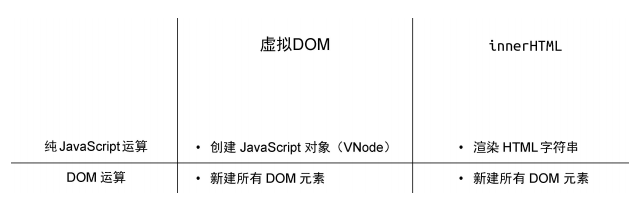
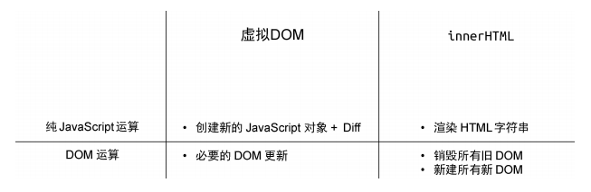
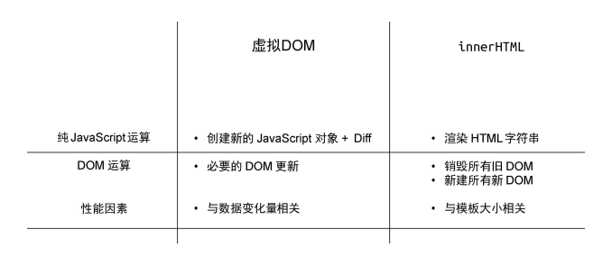
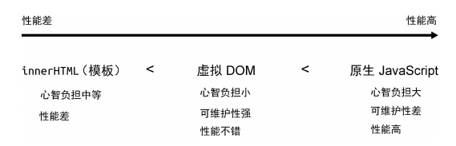
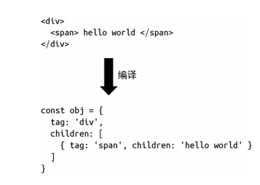
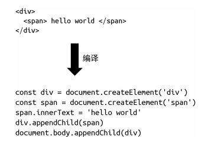

## 1.权衡的艺术

### 1.1.命令式和声明式

早年间流行的 jQuery 就是典型的命令式框架。命令式框架的一大特点就是**关注过程**。

与命令式框架更加关注过程不同，声明式框架更加**关注结果**。

### 1.2.性能和可维护性

**声明式代码的性能不优于命令式代码的性能。**

如果我们把直接修改的性能消耗定义为 A，把找出差异的性能消耗定义为 B，那么有：

命令式代码的更新性能消耗 = A  
声明式代码的更新性能消耗 = B + A

**在保持可维护性的同时让性能损失最小化。**

### 1.3.虚拟 DOM 的性能到底如何

**声明式代码的更新性能消耗 = 找出差异的性能消耗 + 直接修改的性能消耗**

因此，如果我们能够最小化找出差异的性能消耗，就可以让声明式代码的性能无限接近命令式代码的性能。而所谓的**虚拟 DOM**，就是为了**最小化**找出差异这一步的性能消耗而出现的。

那就是采用虚拟 DOM 的更新技术的性能理论上不可能比原生 JavaScript 操作 DOM 更高。这里我们强调了**理论上**三个字，因为这很关键，为什么呢？因为在大部分情况下，我们很难写出绝对优化的命令式代码，尤其是当应用程序的规模很大的时候，即使你写出了极致优化的代码，也一定耗费了巨大的精力，这时的投入产出比其实并不高。

用一个公式来表达通过 innerHTML 创建页面的性能：  
**HTML 字符串拼接的计算量 + innerHTML 的 DOM 计算量**

虚拟 DOM 创建页面的过程分为两步：第一步是创建 JavaScript 对象，这个对象可以理解为真实 DOM 的描述；第二步是递归地遍历虚拟 DOM 树并创建真实 DOM。我们同样可以用一个公式来表达：  
**创建 JavaScript 对象的计算量 + 创建真实 DOM 的计算量**



可以看到，无论是纯 JavaScript 层面的计算，还是 DOM 层面的计算，其实两者差距不大。这里我们从宏观的角度只看数量级上的差异。如果在同一个数量级，则认为没有差异。在创建页面的时候，都需要新建所有 DOM 元素。

刚刚我们讨论了创建页面时的性能情况，大家可能会觉得虚拟 DOM 相比 innerHTML 没有优势可言，甚至细究的话性能可能会更差。别着急，接下来我们看看它们在更新页面时的性能。

使用 innerHTML 更新页面的过程是重新构建 HTML 字符串，再重新设置 DOM 元素的 innerHTML 属性，这其实是在说，哪怕我们只更改了一个文字，也要重新设置 innerHTML 属性。而重新设置 innerHTML 属性就等价于销毁所有旧的 DOM 元素，再全量创建新的 DOM 元素。再来看虚拟 DOM 是如何更新页面的。它需要重新创建 JavaScript 对象（虚拟 DOM 树），然后比较新旧虚拟 DOM，找到变化的元素并更新它。



可以发现，在更新页面时，虚拟 DOM 在 JavaScript 层面的运算要比创建页面时多出一个 Diff 的性能消耗，然而它毕竟也是 JavaScript 层面的运算，所以不会产生数量级的差异。再观察 DOM 层面的运算，可以发现虚拟 DOM 在更新页面时只会更新必要的元素，但 innerHTML 需要全量更新。这时虚拟 DOM 的优势就体现出来了。

另外，我们发现，当更新页面时，影响虚拟 DOM 的性能因素与影响 innerHTML 的性能因素不同。对于虚拟 DOM 来说，无论页面多大，都只会更新变化的内容，而对于 innerHTML 来说，页面越大，就意味着更新时的性能消耗越大。如果加上性能因素，那么最终它们在更新页面时的性能如图所示



总结一下 innerHTML、虚拟 DOM 以及原生 JavaScript（指 createElement 等方法）在更新页面时的性能



### 1.4 运行时和编译时

**纯运行时**

```js
const obj = {
  tag: 'div',
  children: [{ tag: 'span', children: 'hello world' }],
};

function Render(obj, root) {
  const el = document.createElement(obj.tag);
  if (typeof obj.children === 'string') {
    const text = document.createTextNode(obj.children);
    el.appendChild(text);
  } else if (obj.children) {
    // 数组，递归调用 Render，使用 el 作为 root 参数
    obj.children.forEach(child => Render(child, el));
  }
  // 将元素添加到 root
  root.appendChild(el);
}

// 渲染到 body 下
Render(obj, document.body);
```

**运行时 + 编译时**



```js
const html = `
 <div>
 <span>hello world</span>
 </div>
 `;
// 调用 Compiler 编译得到树型结构的数据对象
const obj = Compiler(html);
// 再调用 Render 进行渲染
Render(obj, document.body);
```

上面的代码其实是**运行时编译**，意思是代码运行的时候才开始编译

**纯编译时**



这样我们只需要一个 Compiler 函数就可以了，连 Render 都不需要了。其实这就变成了一个纯编译时的框架，因为我们不支持任何运行时内容，用户的代码通过编译器编译后才能运行。

**Vue.js 3** 仍然保持了运行时 + 编译时的架构，在保持灵活性的基础上能够尽可能地去优化。
