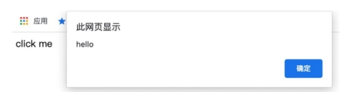

# Vue.js 设计与实现

## 1.权衡的艺术

### 1.1 命令式和声明式

早年间流行的 jQuery 就是典型的命令式框架。命令式框架的一大特点就是**关注过程**。

```js
- 获取 id 为 app 的 div 标签
- 它的文本内容为 hello world
- 为其绑定点击事件
- 当点击时弹出提示：ok

$('#app') // 获取 div
.text('hello world') // 设置文本内容
.on('click', () => { alert('ok') }) // 绑定点击事件

const div = document.querySelector('#app') // 获取 div
div.innerText = 'hello world' // 设置文本内容
div.addEventListener('click', () => { alert('ok') }) // 绑定点击事
```

可以看到，自然语言描述能够与代码产生一一对应的关系，代码本身描述的是“做事的过程”，这符合我们的逻辑直觉。

与命令式框架更加关注过程不同， 声明式框架更加**关注结果**。

```vue
<div @click="() => alert('ok')">hello world</div>
```

Vue.js 帮我们封装了过程。因此，我们能够猜到 Vue.js 的内部实现一定是命令式的，而暴露给用户的却更加声明式。

### 1.2 性能与可维护性的权衡

命令式和声明式各有优缺点，在框架设计方面，则体现在性能与可维护性之间的权衡。这里我们先抛出一个结论： **声明式代码的性能不优于命令式代码的性能。**

将 div 标签的文本内容修改为 hello vue3，那么如何用命令式代码实现呢？

```js
div.textContent = 'hello vue3'; // 直接修改
```

现在思考一下，还有没有其他办法比上面这句代码的性能更好？答案是“没有”。可以看到，**理论上命令式代码可以做到极致的性能优化**。

声明式代码不一定能做到这一点，因为它描述的是结果：

```vue
<!-- 之前： -->
<div @click="() => alert('ok')">hello world</div>
<!-- 之后： -->
<div @click="() => alert('ok')">hello vue3</div>
```

对于框架来说，为了实现最优的更新性能，它需要找到前后的差异并只更新变化的地方，但是最终完成这次更新的代码仍然是：

```js
div.textContent = 'hello vue3'; // 直接修改
```

如果我们把直接修改的性能消耗定义为 A，把找出差异的性能消耗定义为 B，那么有：

- 命令式代码的更新性能消耗 = A
- 声明式代码的更新性能消耗 = B + A

**声明式代码的可维护性更强。**

这就体现了我们在框架设计上要做出的关于可维护性与性能之间的权衡。在采用声明式提升可维护性的同时，性能就会有一定的损失，而框架设计者要做的就是：**在保持可维护性的同时让性能损失最小化**。

### 1.3 虚拟 DOM 的性能到底如何

前文说到，**声明式代码的更新性能消耗 = 找出差异的性能消耗+直接修改的性能消耗**，因此，如果我们能够最小化**找出差异的性能消耗**，就可以让声明式代码的性能无限接近命令式代码的性能。而所谓的虚拟 DOM，就是为了最小化找出差异这一步的性能消耗而出现的。

采用虚拟 DOM 的更新 技术的性能**理论上**不可能比原生 JavaScript 操作 DOM 更高。这里我们 强调了理论上三个字，因为这很关键，为什么呢？因为在大部分情况 下，**我们很难写出绝对优化的命令式代码**，尤其是当应用程序的规模很大的时候，即使你写出了极致优化的代码，也一定耗费了巨大的精力，这时的投入产出比其实并不高。

写声明式代码，还能够**保证应用程序的性能下限**。

**纯 JavaScript 层面的操作要比 DOM 操作快得多**

下图直观地对比了 innerHTML 和虚拟 DOM 在创建页面时的性能。


使用 innerHTML 更新页面的过程是重新构建 HTML 字符串，再重新设置 DOM 元素的 innerHTML 属性，这其实是在说，哪怕我们只更改了一个文字，也要重新设置 innerHTML 属性。而重新设置 innerHTML 属性就等价于销毁所有旧的 DOM 元素，再全量创建新的 DOM 元素。再来看虚拟 DOM 是如何更新页面的。它需要重新创建 JavaScript 对象（虚拟 DOM 树），然后比较新旧虚拟 DOM，找到变化的元素并更新它。


在更新页面时，虚拟 DOM 在 JavaScript 层面的运算要 比创建页面时多出一个 Diff 的性能消耗，然而它毕竟也是 JavaScript 层 面的运算，所以不会产生数量级的差异。再观察 DOM 层面的运算，可 以发现虚拟 DOM 在更新页面时只会更新必要的元素，但 innerHTML 需要全量更新。这时虚拟 DOM 的优势就体现出来了。


虚拟 DOM 和 innerHTML 在更新页面时的性能（加上性能因素）


### 1.4 运行时和编译时

当设计一个框架的时候，我们有三种选择：纯运行时的、运行时 + 编译时的或纯编译时的。

先聊聊**纯运行时的框架**。假设我们设计了一个框架，它提供一个 Render 函数，用户可以为该函数提供一个树型结构的数据对象，然后 Render 函数会根据该对象递归地将数据渲染成 DOM 元素。我们规定树型结构的数据对象如下：

```js
const obj = {
  tag: 'div',
  children: [{ tag: 'span', children: 'hello world' }]
};
```

每个对象都有两个属性：tag 代表标签名称，children 既可以是一个数组（代表子节点），也可以直接是一段文本（代表文本子节点）。接着，我们来实现 Render 函数：

```js
function Render(obj, root) {
  const el = document.createElement(obj.tag);
  if (typeof obj.children === 'string') {
    const text = document.createTextNode(obj.children);
    el.appendChild(text);
  } else if (obj.children) {
    // 数组，递归调用 Render，使用 el 作为 root 参数
    obj.children.forEach(child => Render(child, el));
  }

  // 将元素添加到 root
  root.appendChild(el);
}
```

有了这个函数，用户就可以这样来使用它：

```js
const obj = {
  tag: 'div',
  children: [{ tag: 'span', children: 'hello world' }]
};
// 渲染到 body 下
Render(obj, document.body);
```

手写树型结构的数据对象太麻烦了，而且不直观，能不能支持用类似于 HTML 标签的方式描述树型结构的数据对象呢？”你看了看现在的 Render 函数，然后回答：“抱歉，暂不支持。”实际上，我们刚刚编写的框架就是一个纯运行时的框架。

为了满足用户的需求，你开始思考，能不能引入编译的手段，把 HTML 标签编译成树型结构的数据对象，这样不就可以继续使用 Render 函数了吗？


你编写了一个叫作 Compiler 的程序，它的作用就是把 HTML 字符串编译成树型结构的数据对象，于是交付给用户去用了。那么用户该怎么用呢？其实这也是我们要思考的问题，最简单的方式就是让用户分别调用 Compiler 函数和 Render 函数：

```js
const html = `
 <div>
 <span>hello world</span>
 </div>
 `;
// 调用 Compiler 编译得到树型结构的数据对象
const obj = Compiler(html);
// 再调用 Render 进行渲染
Render(obj, document.body);
```

上面这段代码能够很好地工作，这时我们的框架就变成了一个**运行时 + 编译时**的框架。它既支持运行时，用户可以直接提供数据对象从而无须编译；又支持编译时，用户可以提供 HTML 字符串，我们将其编译为数据对象后再交给运行时处理。准确地说，上面的代码其实是运行时编译，意思是代码运行的时候才开始编译，而这会产生一定的性能开销，因此我们也可以在构建的时候就执行 Compiler 程序将用户提供的内容编译好，等到运行时就无须编译了，这对性能是非常友好的。

既然编译器可以把 HTML 字符串编译成数据对象，那么能不能直接编译成命令式代码呢？


这样我们只需要一个 Compiler 函数就可以了，连 Render 都不需要了。其实这就变成了一个**纯编译时**的框架，因为我们不支持任何运行时内容，用户的代码通过编译器编译后才能运行。

首先是纯运行时的框架。由于它没有编译的过程，因此我们没办法分析用户提供的内容，但是如果加入编译步骤，可能就大不一样了，我们可以分析用户提供的内容，看看哪些内容未来可能会改变，哪些内容永远不会改变，这样我们就可以在编译的时候提取这些信息，然后将其传递给 Render 函数，Render 函数得到这些信息之后，就可以做进一步的优化了。然而，假如我们设计的框架是纯编译时的，那么它也可以分析用户提供的内容。由于不需要任何运行时，而是直接编译成可执行的 JavaScript 代码，因此性能可能会更好，但是这种做法有损灵活性，即用户提供的内容必须编译后才能用。实际上，在这三个方向上业内都有探索，其中 Svelte 就是纯编译时的框架，但是它的真实性能可能达不到理论高度。**Vue.js 3 仍然保持了运行时 + 编译时的架构，在保持灵活性的基础上能够尽可能地去优化**。

## 2.框架设计的核心要素

### 2.1 提升用户的开发体验

```js
createApp(App).mount('#not-exist');
```

当我们创建一个 Vue.js 应用并试图将其挂载到一个不存在的 DOM 节点时，就会收到一条警告信息


除了提供必要的警告信息外，还有很多其他方面可以作为切入口，进一步提升用户的开发体验。例如，在 Vue.js 3 中，当我们在控制台打印一个 ref 数据时：

```js
const count = ref(0);
console.log(count);
```


可以发现，打印的数据非常不直观。当然，我们可以选择直接打印 count.value 的值，这样就只会输出 0，非常直观。那么有没有办法在打印 count 的时候让输出的信息更友好呢？当然可以，浏览器允许我们编写自定义的 formatter，从而自定义输出形式。在 Vue.js 3 的源码中，你可以搜索到名为 initCustomFormatter 的函数，该函数就是用来在开发环境下初始化自定义 formatter 的。以 Chrome 为例，我们可以打开 DevTools 的设置，然后勾选“Console”→“Enable custom formatters”选项


然后刷新浏览器并查看控制台，会发现输出内容变得非常直观


### 2.2 控制框架代码的体积

如果我们去看 Vue.js 3 的源码，就会发现每一个 warn 函数的调用都会配合 **DEV** 常量的检查

```js
if (__DEV__ && !res) {
  warn(
    `Failed to mount app: mount target selector "${container}"
returned null.`
  );
}
```

Vue.js 使用 rollup.js 对项目进行构建，这里的 **DEV** 常量实际上是通过 rollup.js 的插件配置来预定义的，其功能类似于 webpack 中的 DefinePlugin 插件。

**在开发环境中为用户提供友好的警告信息的 同时，不会增加生产环境代码的体积**。

### 2.3 框架要做到良好的 Tree-Shaking

什么是 Tree-Shaking 呢？在前端领域，这个概念因 rollup.js 而普及。简单地说，Tree-Shaking 指的就是消除那些永远不会被执行的代码，也就是排除 dead code，现在无论是 rollup.js 还是 webpack，都支持 Tree-Shaking。

因为静态地分析 JavaScript 代码很困难，所以像 rollup.js 这类工具都会提供一个机制，让我们能明确地告诉 rollup.js：“放心吧，这段代码不会产生副作用，你可以移除它。”具体怎么做呢？如以下代码所示，我们修改 input.js 文件：

```js
import { foo } from './utils';

/*#__PURE__*/ foo();
```

### 2.4 框架应该输出怎样的构建产物

这样当我们使用 \<script> 标签直接引入 vue.global.js 文件后，全局变量 Vue 就是可用的了。在 rollup.js 中，我们可以通过配置 format: 'iife' 来输出这种形式的资源：

```js
// rollup.config.js
const config = {
  input: 'input.js',
  output: {
    file: 'output.js',
    format: 'iife' // 指定模块形式
  }
};

export default config;
```

直接引入 ESM 格式的资源，例如 Vue.js 3 还会输出 vue.esm-browser.js 文件，用户可以直接用 \<script type="module"> 标签引入：

```js
<script type="module" src="/path/to/vue.esm-browser.js"></script>
```

为了输出 ESM 格式的资源，rollup.js 的输出格式需要配置为： format: 'esm'。

为什么 vue.esm-browser.js 文件中会有 - browser 字样？其实对于 ESM 格式的资源来说，Vue.js 还会输出一个 vue.esm-bundler.js 文件，其中 -browser 变成了 -bundler。为什么这么做呢？我们知道，无论是 rollup.js 还是 webpack，在寻找资源时，如果 package.json 中存在 module 字段，那么会优先使用 module 字段指向的资源来代替 main 字段指向的资源。我们可以打开 Vue.js 源码中的 packages/vue/package.json 文件看一下：

```js
 {
 "main": "index.js",
 "module": "dist/vue.runtime.esm-bundler.js",
 }
```

其中 module 字段指向的是 vue.runtime.esm-bundler.js 文件，意思是说，如果项目是使用 webpack 构建的，那么你使用的 Vue.js 资源就是 vue.runtime.esm-bundler.js 也就是说，带有 -bundler 字样的 ESM 资源是给 rollup.js 或 webpack 等打包工具使用的，而带有 -browser 字样的 ESM 资源是直接给 \<script type=\"module\"\>使用的。它们之间有何区别？

这就不得不提到上文中的 **DEV** 常量。当构建用于 \<script\> 标签的 ESM 资源时，如果是用于开发环境，那么 **DEV** 会设置为 \true；如果是用于生产环境，那么 **DEV** 常量会设置为 false，从而被 Tree-Shaking 移除。但是当我们构建提供给打包工具的 ESM 格式的资源时，不能直接把 **DEV** 设置为 true 或 false，如下面的源码：

```js
if (__DEV__) {
  warn(`useCssModule() is not supported in the global build.`);
}
```

在带有 -bundler 字样的资源中会变成：

```js
if (process.env.NODE_ENV !== 'production') {
  warn(`useCssModule() is not supported in the global build.`);
}
```

用户可以在 Node.js 中通过 require 语句引用资源，例如：

```js
const Vue = require('vue');
```

以通过修改 rollup.config.js 的配置 format: 'cjs' 来实现：

```js
// rollup.config.js
const config = {
  input: 'input.js',
  output: {
    file: 'output.js',
    format: 'cjs' // 指定模块形式
  }
};
export default config;
```

### 2.5 特性开关

在设计框架时，框架会给用户提供诸多特性（或功能），例如我们提供 A、B、C 三个特性给用户，同时还提供了 a、b、c 三个对应的特性开关，用户可以通过设置 a、b、c 为 true 或 false 来代表开启或关闭对应的特性，这将会带来很多益处。

- 对于用户关闭的特性，我们可以利用 Tree-Shaking 机制让其不包含在最终的资源中。
- 该机制为框架设计带来了灵活性，可以通过特性开关任意为框架添加新的特性，而不用担心资源体积变大。同时，当框架升级时，我们也可以通过特性开关来支持遗留 API，这样新用户可以选择不使用遗留 API，从而使最终打包的资源体积最小化。

那怎么实现特性开关呢？其实很简单，原理和上文提到的 **DEV** 常量一样，本质上是利用 rollup.js 的预定义常量插件来实现。拿 Vue.js 3 源码中的一段 rollup.js 配置来说：

```js
 {
 __FEATURE_OPTIONS_API__: isBundlerESMBuild ?
`__VUE_OPTIONS_API__` : true,
 }
```

其中 **FEATURE_OPTIONS_API** 类似于 **DEV**。在 Vue.js 3 的源码中搜索，可以找到很多类似于如下代码的判断分支：

```js
// support for 2.x options
if (__FEATURE_OPTIONS_API__) {
  currentInstance = instance;
  pauseTracking();
  applyOptions(instance, Component);
  resetTracking();
  currentInstance = null;
}
```

当 Vue.js 构建资源时，如果构建的资源是供打包工具使用的（即带有 -bundler 字样的资源），那么上面的代码在资源中会变成：

```js
// support for 2.x options
if (__VUE_OPTIONS_API__) {
  // 注意这里
  currentInstance = instance;
  pauseTracking();
  applyOptions(instance, Component);
  resetTracking();
  currentInstance = null;
}
```

其中 **VUE_OPTIONS_API** 是一个特性开关，用户可以通过设置 **VUE_OPTIONS_API** 预定义常量的值来控制是否要包含这段代码。通常用户可以使用 webpack.DefinePlugin 插件来实现：

```js
// webpack.DefinePlugin 插件配置
new webpack.DefinePlugin({
  __VUE_OPTIONS_API__: JSON.stringify(true) // 开启特性
});
```

最后详细解释 **VUE_OPTIONS_API** 开关有什么用。在 Vue.js 2 中，我们编写的组件叫作组件选项 API：

```js
export default {
  data() {}, // data 选项
  computed: {} // computed 选项
  // 其他选项
};
```

但是在 Vue.js 3 中，推荐使用 Composition API 来编写代码，例如：

```js
export default {
  setup() {
    const count = ref(0);
    const doubleCount = computed(() => count.value * 2);
    // 相当于 Vue.js 2 中的 computed 选项
  }
};
```

但是为了兼容 Vue.js 2，在 Vue.js 3 中仍然可以使用选项 API 的方式编写代码。但是如果明确知道自己不会使用选项 API，用户就可以使用 **VUE_OPTIONS_API** 开关来关闭该特性，这样在打包的时候 Vue.js 的这部分代码就不会包含在最终的资源中，从而减小资源体积。

### 2.6 错误处理

错误处理是框架开发过程中非常重要的环节。框架错误处理机制的好坏直接决定了用户应用程序的健壮性，还决定了用户开发时处理错误的心智负担。

为了让大家更加直观地感受错误处理的重要性，我们从一个小例子说起。假设我们开发了一个工具模块，代码如下：

```js
// utils.js
export default {
  foo(fn) {
    fn && fn();
  }
};
```

大家思考一下，如果用户提供的回调函数在执行的时候出错了，怎么办？此时有两个办法，第一个办法是让用户自行处理，这需要用户自己执行 try...catch：

```js
import utils from 'utils.js';
utils.foo(() => {
  try {
    // ...
  } catch (e) {
    // ...
  }
});
```

但是这会增加用户的负担。试想一下，如果 utils.js 不是仅仅提供了一个 foo 函数，而是提供了几十上百个类似的函数，那么用户在使用的时候就需要逐一添加错误处理程序。

第二个办法是我们代替用户统一处理错误，如以下代码所示：

```js
// utils.js
export default {
  foo(fn) {
    try {
      fn && fn();
    } catch (e) {
      /* ... */
    }
  },
  bar(fn) {
    try {
      fn && fn();
    } catch (e) {
      /* ... */
    }
  }
};
```

在每个函数内都增加 try...catch 代码块，实际上，我们可以进一步将错误处理程序封装为一个函数，假设叫它 callWithErrorHandling：

```js
// utils.js
export default {
  foo(fn) {
    callWithErrorHandling(fn);
  },
  bar(fn) {
    callWithErrorHandling(fn);
  }
};
function callWithErrorHandling(fn) {
  try {
    fn && fn();
  } catch (e) {
    console.log(e);
  }
}
```

可以看到，代码变得简洁多了。但简洁不是目的，这么做真正的好处是，我们能为用户提供统一的错误处理接口，如以下代码所示：

```js
// utils.js
let handleError = null;
export default {
  foo(fn) {
    callWithErrorHandling(fn);
  },
  // 用户可以调用该函数注册统一的错误处理函数
  registerErrorHandler(fn) {
    handleError = fn;
  }
};
function callWithErrorHandling(fn) {
  try {
    fn && fn();
  } catch (e) {
    // 将捕获到的错误传递给用户的错误处理程序
    handleError(e);
  }
}
```

我们提供了 registerErrorHandler 函数，用户可以使用它注册错误处理程序，然后在 callWithErrorHandling 函数内部捕获错误后，把错误传递给用户注册的错误处理程序。

这样用户侧的代码就会非常简洁且健壮：

```js
import utils from 'utils.js';
// 注册错误处理程序
utils.registerErrorHandler(e => {
  console.log(e);
});
utils.foo(() => {
  /*...*/
});
utils.bar(() => {
  /*...*/
});
```

这时错误处理的能力完全由用户控制，用户既可以选择忽略错误，也可以调用上报程序将错误上报给监控系统。

实际上，这就是 Vue.js 错误处理的原理，你可以在源码中搜索到 callWithErrorHandling 函数。另外，在 Vue.js 中，我们也可以注册统一的错误处理函数：

```js
import App from 'App.vue';
const app = createApp(App);
app.config.errorHandler = () => {
  // 错误处理程序
};
```

### 2.7 良好的 TypeScript 类型支持

TypeScript 是由微软开源的编程语言，简称 TS，它是 JavaScript 的超集，能够为 JavaScript 提供类型支持。现在越来越多的开发者和团队在项目中使用 TS。使用 TS 的好处有很多，如代码即文档、编辑器自动提示、一定程度上能够避免低级 bug、代码的可维护性更强等。因此对 TS 类型的支持是否完善也成为评价一个框架的重要指标。

## 3.Vue.js 3 的设计思路

### 3.1 声明式地描述 UI

- DOM 元素：例如是 div 标签还是 a 标签。
- 属性：如 a 标签的 href 属性，再如 id、class 等通用属性。
- 事件：如 click、keydown 等。元素的层级结构：DOM 树的层级结构，既有子节点，又有父节点。

那么，如何声明式地描述上述内容呢？这是框架设计者需要思考的问题。其实方案有很多。拿 Vue.js 3 来说，相应的解决方案是：

- 使用与 HTML 标签一致的方式来描述 DOM 元素，例如描述一个 div 标签时可以使用 `<div></div>`
- 使用与 HTML 标签一致的方式来描述属性，例如 `<div id="app"></div>`
- 使用 : 或 v-bind 来描述动态绑定的属性，例如 `<div :id="dynamicId"></div>`
- 使用 @ 或 v-on 来描述事件，例如点击事件 `<div @click="handler"></div>`
- 使用与 HTML 标签一致的方式来描述层级结构，例如一个具有 span 子节点的 div 标签 `<div><span></span></div>`

可以看到，在 Vue.js 中，哪怕是事件，都有与之对应的描述方式。用户不需要手写任何命令式代码，这就是所谓的声明式地描述 UI。

除了上面这种使用模板来声明式地描述 UI 之外，我们还可以用 JavaScript 对象来描述，代码如下所示：

```js
const title = {
  // 标签名称
  tag: 'h1',
  // 标签属性
  props: {
    onClick: handler,
  },
  // 子节点
  children: [{ tag: 'span' }],
};

//对应到 Vue.js 模板，其实就是：
<h1 @click="handler"><span></span></h1>
```

使用 JavaScript 对象描述 UI 更加灵活，假如我们要表示一个标题，根据标题级别的不同，会分别采用 h1~h6 这几个标签，如果用 JavaScript 对象来描述，我们只需要使用一个变量来代表 h 标签即可：

```js
// h 标签的级别
let level = 3;
const title = {
  tag: `h${level}`, // h3 标签
};

<h1 v-if="level === 1"></h1>
<h2 v-else-if="level === 2"></h2>
<h3 v-else-if="level === 3"></h3>
<h4 v-else-if="level === 4"></h4>
<h5 v-else-if="level === 5"></h5>
<h6 v-else-if="level === 6"></h6>
```

而使用 JavaScript 对象来描述 UI 的方式，其实就是所谓的虚拟 DOM。现在大家应该觉得虚拟 DOM 其实也没有那么神秘了吧。正是因为虚拟 DOM 的这种灵活性，Vue.js 3 除了支持使用模板描述 UI 外，还支持使用虚拟 DOM 描述 UI。其实我们在 Vue.js 组件中手写的渲染函数就是使用虚拟 DOM 来描述 UI 的，如以下代码所示：

```js
import { h } from 'vue';

export default {
  render() {
    return h('h1', { onClick: handler }); // 虚拟 DOM
  }
};
```

其实 h 函数的返回值就是一个对象，其作用是让我们编写虚拟 DOM 变得更加轻松。如果把上面 h 函数调用的代码改成 JavaScript 对象，就需要写更多内容：

```js
export default {
  render() {
    return {
      tag: 'h1',
      props: { onClick: handler }
    };
  }
};
```

h 函数就 是一个辅助创建虚拟 DOM 的工具函数。

### 3.2 初识渲染器

渲染器的作用就是把虚拟 DOM 渲染为真实 DOM。


虚拟 DOM：

```js
const vnode = {
  tag: 'div',
  props: {
    onClick: () => alert('hello')
  },
  children: 'click me'
};
```

要编写一个渲染器，把上面这段虚拟 DOM 渲染为真实 DOM：

```js
function renderer(vnode, container) {
  // 使用 vnode.tag 作为标签名称创建 DOM 元素
  const el = document.createElement(vnode.tag);
  // 遍历 vnode.props，将属性、事件添加到 DOM 元素
  for (const key in vnode.props) {
    if (/^on/.test(key)) {
      // 如果 key 以 on 开头，说明它是事件
      el.addEventListener(
        key.substr(2).toLowerCase(), // 事件名称 onClick ---> click
        vnode.props[key] // 事件处理函数
      );
    }
  }

  // 处理 children
  if (typeof vnode.children === 'string') {
    // 如果 children 是字符串，说明它是元素的文本子节点
    el.appendChild(document.createTextNode(vnode.children));
  } else if (Array.isArray(vnode.children)) {
    // 递归地调用 renderer 函数渲染子节点，使用当前元素 el 作为挂载点
    vnode.children.forEach(child => renderer(child, el));
  }

  // 将元素添加到挂载点下
  container.appendChild(el);
}
```

这里的 renderer 函数接收如下两个参数。

- vnode：虚拟 DOM 对象。
- container：一个真实 DOM 元素，作为挂载点，渲染器会把虚拟 DOM 渲染到该挂载点下。

```js
renderer(vnode, document.body); // body 作为挂载点
```

在浏览器中运行这段代码，会渲染出“click me”文本，点击该文本，会弹出 alert('hello')。



### 3.3 组件的本质

组件就是一组 DOM 元素的封装，因此我们可以定义一个函数来代表组件，而函数的返回值就代表组件要渲染的内容：

```js
const MyComponent = function () {
  return {
    tag: 'div',
    props: {
      onClick: () => alert('hello')
    },
    children: 'click me'
  };
};
```

可以看到，组件的返回值也是虚拟 DOM，它代表组件要渲染的内容。搞清楚了组件的本质，我们就可以定义用虚拟 DOM 来描述组件了。很简单，我们可以让虚拟 DOM 对象中的 tag 属性来存储组件函数：

```js
const vnode = {
  tag: MyComponent
};
```

修改前面提到的 renderer 函数，如下所示：

```js
function renderer(vnode, container) {
  if (typeof vnode.tag === 'string') {
    // 说明 vnode 描述的是标签元素
    mountElement(vnode, container);
  } else if (typeof vnode.tag === 'function') {
    // 说明 vnode 描述的是组件
    mountComponent(vnode, container);
  }
}
```

```js
function mountElement(vnode, container) {
  // 使用 vnode.tag 作为标签名称创建 DOM 元素
  const el = document.createElement(vnode.tag);
  // 遍历 vnode.props，将属性、事件添加到 DOM 元素
  for (const key in vnode.props) {
    if (/^on/.test(key)) {
      // 如果 key 以字符串 on 开头，说明它是事件
      el.addEventListener(
        key.substr(2).toLowerCase(), // 事件名称 onClick ---> click
        vnode.props[key] // 事件处理函数
      );
    }
  }

  // 处理 children
  if (typeof vnode.children === 'string') {
    // 如果 children 是字符串，说明它是元素的文本子节点
    el.appendChild(document.createTextNode(vnode.children));
  } else if (Array.isArray(vnode.children)) {
    // 递归地调用 renderer 函数渲染子节点，使用当前元素 el 作为挂载点
    vnode.children.forEach(child => renderer(child, el));
  }

  // 将元素添加到挂载点下
  container.appendChild(el);
}
```

```js
function mountComponent(vnode, container) {
  // 调用组件函数，获取组件要渲染的内容（虚拟 DOM）
  const subtree = vnode.tag();
  // 递归地调用 renderer 渲染 subtree
  renderer(subtree, container);
}
```

组件一定得是函数吗？当然不是，我们完全可以使用一个 JavaScript 对象来表达组件，例如：

```js
// MyComponent 是一个对象
const MyComponent = {
  render() {
    return {
      tag: 'div',
      props: {
        onClick: () => alert('hello')
      },
      children: 'click me'
    };
  }
};
```

```js
function renderer(vnode, container) {
  if (typeof vnode.tag === 'string') {
    mountElement(vnode, container);
  } else if (typeof vnode.tag === 'object') {
    // 如果是对象，说明 vnode 描述的是组件
    mountComponent(vnode, container);
  }
}
```

```js
function mountComponent(vnode, container) {
  // vnode.tag 是组件对象，调用它的 render 函数得到组件要渲染的内容（虚拟 DOM）
  const subtree = vnode.tag.render();
  // 递归地调用 renderer 渲染 subtree
  renderer(subtree, container);
}
```

### 3.4 模板的工作原理

编译器的作用其实就是将模板编译为渲染函数，例如给出如下模板：

```vue
<div @click="handler">click me</div>
```

对于编译器来说，模板就是一个普通的字符串，它会分析该字符串并生成一个功能与之相同的渲染函数：

```js
render() {
  return h('div', { onClick: handler }, 'click me')
}
```

一个 .vue 文件就是一个组件，如下所示：

```vue
<template>
  <div @click="handler">click me</div>
</template>

<script>
export default {
  data() {
    /* ... */
  },
  methods: {
    handler: () => {
      /* ... */
    }
  }
};
</script>
```

其中 \<template\> 标签里的内容就是模板内容，编译器会把模板内容编译成渲染函数并添加到 \<script\> 标签块的组件对象上，所以最终在浏览器里运行的代码就是：

```js
export default {
  data() {
    /* ... */
  },
  methods: {
    handler: () => {
      /* ... */
    }
  },
  render() {
    return h('div', { onClick: handler }, 'click me');
  }
};
```

无论是使用模板还是直接手写渲染函数，对于一个组件来 说，它要渲染的内容最终都是通过渲染函数产生的，然后渲染器再把 渲染函数返回的虚拟 DOM 渲染为真实 DOM，这就是模板的工作原 理，也是 Vue.js 渲染页面的流程。

### 3.5 Vue.js 是各个模块组成的有机整体

如前所述，组件的实现依赖于**渲染器**，模板的编译依赖于**编译器**，并且编译后生成的代码是根据渲染器和虚拟 DOM 的设计决定的，因此 Vue.js 的各个模块之间是互相关联、互相制约的，共同构成一个有机整体。

假设我们有如下模板：

```vue
<div id="foo" :class="cls"></div>
```

道编译器会把这段代码编译成渲染函数：

```js
 render() {
  // 为了效果更加直观，这里没有使用 h 函数，而是直接采用了虚拟 DOM 对象
  // 下面的代码等价于：
  // return h('div', { id: 'foo', class: cls })
  return {
    tag: 'div',
    props: {
      id: 'foo',
      class: cls
    }
  }
 }
```

能看出其中 id="foo" 是永远不会变化的，而 :class="cls" 是一个 v-bind 绑定，它是可能发生变化的。所以编译器能识别出哪些是静态属性，哪些是动态属性，在生成代码的时候完全可以附带这些信息：

```js
 render() {
  return {
  tag: 'div',
  props: {
    id: 'foo',
    class: cls
    },
    patchFlags: 1 // 假设数字 1 代表 class 是动态的
  }
 }
```

对于渲染器来说，就相当于省去了寻找变更点的工作量，性能自然就提升了。

通过这个例子，我们了解到编译器和渲染器之间是存在信息交流的，它们互相配合使得性能进一步提升，而它们之间交流的媒介就是虚拟 DOM 对象。

### 3.6 总结

1. 虚拟 DOM 要比模板更加灵活，但模板要 比虚拟 DOM 更加直观
2. 渲染器的作用是，把虚 拟 DOM 对象渲染为真实 DOM 元素。
3. Vue.js 的模板会被一个叫作编译器的程序编译为渲染函数。

## 4.响应系统的作用与实现

### 4.1 响应式数据与副作用函数

副作用函数指的是会产生副作用的函数，如下面的代码所示：

```js
function effect() {
  document.body.innerText = 'hello vue3';
}
```

当 effect 函数执行时，它会设置 body 的文本内容，但除了 effect 函数之外的任何函数都可以读取或设置 body 的文本内容。也就是说，effect 函数的执行会直接或间接影响其他函数的执行，这时我们说 effect 函数产生了副作用。副作用很容易产生，例如一个函数修改了全局变量，这其实也是一个副作用，如下面的代码所示：

```js
// 全局变量
let val = 1;

function effect() {
  val = 2; // 修改全局变量，产生副作用
}
```

### 4.2 响应式数据的基本实现

如何才能让 obj 变成响应式数据呢？通过观察我们能发现两点线索：

- 当副作用函数 effect 执行时，会触发字段 obj.text 的读取操作；
- 当修改 obj.text 的值时，会触发字段 obj.text 的设置操作。

如果我们能拦截一个对象的读取和设置操作，事情就变得简单了，当读取字段 obj.text 时，我们可以把副作用函数 effect 存储到一个“桶”里。


当设置 obj.text 时，再把副作用函数 effect 从“桶”里取出并执行即可。


在 ES2015 之前，只能通过 Object.defineProperty 函数实现，这也是 Vue.js 2 所采用的方式。在 ES2015+ 中，我们可以使用代理对象 Proxy 来实现，这也是 Vue.js 3 所采用的方式。

```js
// 存储副作用函数的桶
const bucket = new Set();

// 原始数据
const data = { text: 'hello world' };
// 对原始数据的代理
const obj = new Proxy(data, {
  // 拦截读取操作
  get(target, key) {
    // 将副作用函数 effect 添加到存储副作用函数的桶中
    bucket.add(effect);
    // 返回属性值
    return target[key];
  },
  // 拦截设置操作
  set(target, key, newVal) {
    // 设置属性值
    target[key] = newVal;
    // 把副作用函数从桶里取出并执行
    bucket.forEach(fn => fn());
    // 返回 true 代表设置操作成功
    return true;
  }
});
```

### 4.3 设计一个完善的响应系统

从上一节的例子中不难看出，一个响应系统的工作流程如下：

- 当**读取**操作发生时，将副作用函数收集到“桶”中；
- 当**设置**操作发生时，从“桶”中取出副作用函数并执行。

提供一个用来注册副作用函数的机制，如以下代码所示：

```js
// 用一个全局变量存储被注册的副作用函数
let activeEffect;
// effect 函数用于注册副作用函数
function effect(fn) {
  // 当调用 effect 注册副作用函数时，将副作用函数 fn 赋值给activeEffect
  activeEffect = fn;
  // 执行副作用函数
  fn();
}
```

可以按照如下所示的方式使用 effect 函数：

```js
effect(
  // 一个匿名的副作用函数
  () => {
    document.body.innerText = obj.text;
  }
);
```

```js
const obj = new Proxy(data, {
  get(target, key) {
    // 将 activeEffect 中存储的副作用函数收集到“桶”中
    if (activeEffect) {
      // 新增
      bucket.add(activeEffect); // 新增
    } // 新增
    return target[key];
  },
  set(target, key, newVal) {
    target[key] = newVal;
    bucket.forEach(fn => fn());
    return true;
  }
});
```

在响应式数据 obj 上设置一个不存在的属性时：

```js
effect(
  // 匿名副作用函数
  () => {
    console.log('effect run'); // 会打印 2 次
    document.body.innerText = obj.text;
  }
);

setTimeout(() => {
  // 副作用函数中并没有读取 notExist 属性的值
  obj.notExist = 'hello vue3';
}, 1000);
```

在副作用函数与被操作的字段之间建立联系。

先仔细观察下面的代码：

```js
effect(function effectFn() {
  document.body.innerText = obj.text;
});
```

在这段代码中存在三个角色：

- 被操作（读取）的代理对象 obj；
- 被操作（读取）的字段名 text；
- 使用 effect 函数注册的副作用函数 effectFn。

如果用 target 来表示一个代理对象所代理的原始对象，用 key 来表示被操作的字段名，用 effectFn 来表示被注册的副作用函数，那么可以为这三个角色建立如下关系：

```js
 target
 └── key
 └── effectFn
```

如果有两个副作用函数同时读取同一个对象的属性值：

```js
effect(function effectFn1() {
  obj.text;
});
effect(function effectFn2() {
  obj.text;
});
```

那么关系如下：

```js
 target
 └── text
 └── effectFn1
 └── effectFn2
```

如果一个副作用函数中读取了同一个对象的两个不同属性：

```js
effect(function effectFn() {
  obj.text1;
  obj.text2;
});
```

那么关系如下：

```js
 target
 └── text1
 └── effectFn
 └── text2
 └── effectFn
```

如果在不同的副作用函数中读取了两个不同对象的不同属性：

```js
effect(function effectFn1() {
  obj1.text1;
});
effect(function effectFn2() {
  obj2.text2;
});
```

那么关系如下：

```js
 target1
 └── text1
 └── effectFn1
 target2
 └── text2
 └── effectFn2
```

总之，这其实就是一个树型数据结构。这个联系建立起来之后，就可以解决前文提到的问题了。拿上面的例子来说，如果我们设置了 obj2.text2 的值，就只会导致 effectFn2 函数重新执行，并不会导致 effectFn1 函数重新执行。

接下来我们尝试用代码来实现这个新的“桶”。

```js
// 存储副作用函数的桶
const bucket = new WeakMap();

const obj = new Proxy(data, {
  // 拦截读取操作
  get(target, key) {
    // 没有 activeEffect，直接 return
    if (!activeEffect) return target[key];
    // 根据 target 从“桶”中取得 depsMap，它也是一个 Map 类型：key --> effects
    let depsMap = bucket.get(target);
    // 如果不存在 depsMap，那么新建一个 Map 并与 target 关联
    if (!depsMap) {
      bucket.set(target, (depsMap = new Map()));
    }
    // 再根据 key 从 depsMap 中取得 deps，它是一个 Set 类型，
    // 里面存储着所有与当前 key 相关联的副作用函数：effects
    let deps = depsMap.get(key);
    // 如果 deps 不存在，同样新建一个 Set 并与 key 关联
    if (!deps) {
      depsMap.set(key, (deps = new Set()));
    }
    // 最后将当前激活的副作用函数添加到“桶”里
    deps.add(activeEffect);

    // 返回属性值
    return target[key];
  },
  // 拦截设置操作
  set(target, key, newVal) {
    // 设置属性值
    target[key] = newVal;
    // 根据 target 从桶中取得 depsMap，它是 key --> effects
    const depsMap = bucket.get(target);
    if (!depsMap) return;
    // 根据 key 取得所有副作用函数 effects
    const effects = depsMap.get(key);
    // 执行副作用函数
    effects && effects.forEach(fn => fn());
  }
});
```

从这段代码可以看出构建数据结构的方式，我们分别使用了 WeakMap、Map 和 Set：

- WeakMap 由 target --> Map 构成；
- Map 由 key --> Set 构成。

其中 WeakMap 的键是原始对象 target，WeakMap 的值是一个 Map 实例，而 Map 的键是原始对象 target 的 key，Map 的值是一个由副作用函数组成的 Set。


Set 数据结构所存储的副作用 函数集合称为 key 的依赖集合

最后，我们对上文中的代码做一些封装处理。在目前的实现中，当读取属性值时，我们直接在 get 拦截函数里编写把副作用函数收集到“桶”里的这部分逻辑，但更好的做法是将这部分逻辑单独封装到一个 track 函数中，函数的名字叫 track 是为了表达追踪的含义。同样，我们也可以把触发副作用函数重新执行的逻辑封装到 trigger 函数中：

```js
const obj = new Proxy(data, {
  // 拦截读取操作
  get(target, key) {
    // 将副作用函数 activeEffect 添加到存储副作用函数的桶中
    track(target, key);
    // 返回属性值
    return target[key];
  },
  // 拦截设置操作
  set(target, key, newVal) {
    // 设置属性值
    target[key] = newVal;
    // 把副作用函数从桶里取出并执行
    trigger(target, key);
  }
});

// 在 get 拦截函数内调用 track 函数追踪变化
function track(target, key) {
  // 没有 activeEffect，直接 return
  if (!activeEffect) return;
  let depsMap = bucket.get(target);
  if (!depsMap) {
    bucket.set(target, (depsMap = new Map()));
  }
  let deps = depsMap.get(key);
  if (!deps) {
    depsMap.set(key, (deps = new Set()));
  }
  deps.add(activeEffect);
}
// 在 set 拦截函数内调用 trigger 函数触发变化
function trigger(target, key) {
  const depsMap = bucket.get(target);
  if (!depsMap) return;
  const effects = depsMap.get(key);
  effects && effects.forEach(fn => fn());
}
```

### 4.4 分支切换与 cleanup

```js
const data = { ok: true, text: 'hello world' };
const obj = new Proxy(data, {
  /* ... */
});

effect(function effectFn() {
  document.body.innerText = obj.ok ? obj.text : 'not';
});
```

在 effectFn 函数内部存在一个三元表达式，根据字段 obj.ok 值的不同会执行不同的代码分支。当字段 obj.ok 的值发生变化时，代码执行的分支会跟着变化，这就是所谓的分支切换。

分支切换可能会产生遗留的副作用函数。拿上面这段代码来说，字段 obj.ok 的初始值为 true，这时会读取字段 obj.text 的值，所以当 effectFn 函数执行时会触发字段 obj.ok 和字段 obj.text 这两个属性的读取操作，此时副作用函数 effectFn 与响应式数据之间建立的联系如下：

```js
 data
 └── ok
 └── effectFn
 └── text
 └── effectFn
```


可以看到，副作用函数 effectFn 分别被字段 data.ok 和字段 data.text 所对应的依赖集合收集。当字段 obj.ok 的值修改为 false，并触发副作用函数重新执行后，由于此时字段 obj.text 不会被读取，只会触发字段 obj.ok 的读取操作，所以理想情况下副作用函数 effectFn 不应该被字段 obj.text 所对应的依赖集合收集。

遗留的副作用函数会导致不必要的更新，拿下面这段代码来说：

```js
const data = { ok: true, text: 'hello world' };
const obj = new Proxy(data, {
  /* ... */
});

effect(function effectFn() {
  document.body.innerText = obj.ok ? obj.text : 'not';
});

obj.ok = false;
```

这会触发更新，即副作用函数会重新执行。但由于此时 obj.ok 的值为 false，所以不再会读取字段 obj.text 的值。换句话说，无论字段 obj.text 的值如何改变，document.body.innerText 的值始终都是字符串 'not'。所以最好的结果是，无论 obj.text 的值怎么变，都不需要重新执行副作用函数。但事实并非如此，如果我们再尝试修改 obj.text 的值：

```js
obj.text = 'hello vue3';
```

这仍然会导致副作用函数重新执行，即使 document.body.innerText 的值不需要变化。

解决这个问题的思路很简单，每次副作用函数执行时，我们可以先把它从所有与之关联的依赖集合中删除。


要将一个副作用函数从所有与之关联的依赖集合中移除，就需要明确知道哪些依赖集合中包含它，因此我们需要重新设计副作用函数，如下面的代码所示。在 effect 内部我们定义了新的 effectFn 函数，并为其添加了 effectFn.deps 属性，该属性是一个数组，用来存储所有包含当前副作用函数的依赖集合：

```js
// 用一个全局变量存储被注册的副作用函数
let activeEffect;
function effect(fn) {
  const effectFn = () => {
    // 当 effectFn 执行时，将其设置为当前激活的副作用函数
    activeEffect = effectFn;
    fn();
  };
  // activeEffect.deps 用来存储所有与该副作用函数相关联的依赖集合
  effectFn.deps = [];
  // 执行副作用函数
  effectFn();
}
```

那么 effectFn.deps 数组中的依赖集合是如何收集的呢？其实是在 track 函数中：

```js
function track(target, key) {
  // 没有 activeEffect，直接 return
  if (!activeEffect) return;
  let depsMap = bucket.get(target);
  if (!depsMap) {
    bucket.set(target, (depsMap = new Map()));
  }
  let deps = depsMap.get(key);
  if (!deps) {
    depsMap.set(key, (deps = new Set()));
  }
  // 把当前激活的副作用函数添加到依赖集合 deps 中
  deps.add(activeEffect);
  // deps 就是一个与当前副作用函数存在联系的依赖集合
  // 将其添加到 activeEffect.deps 数组中
  activeEffect.deps.push(deps); // 新增
}
```

这样就完成了对依赖集合的收集。


有了这个联系后，我们就可以在每次副作用函数执行时，根据 effectFn.deps 获取所有相关联的依赖集合，进而将副作用函数从依赖集合中移除：

```js
// 用一个全局变量存储被注册的副作用函数
let activeEffect;
function effect(fn) {
  const effectFn = () => {
    // 调用 cleanup 函数完成清除工作
    cleanup(effectFn); // 新增
    activeEffect = effectFn;
    fn();
  };
  effectFn.deps = [];
  effectFn();
}
```

```js
function cleanup(effectFn) {
  // 遍历 effectFn.deps 数组
  for (let i = 0; i < effectFn.deps.length; i++) {
    // deps 是依赖集合
    const deps = effectFn.deps[i];
    // 将 effectFn 从依赖集合中移除
    deps.delete(effectFn);
  }
  // 最后需要重置 effectFn.deps 数组
  effectFn.deps.length = 0;
}
```

至此，我们的响应系统已经可以避免副作用函数产生遗留了。但如果你尝试运行代码，会发现目前的实现会导致无限循环执行，问题出在 trigger 函数中：

```js
function trigger(target, key) {
  const depsMap = bucket.get(target);
  if (!depsMap) return;
  const effects = depsMap.get(key);
  effects && effects.forEach(fn => fn()); // 问题出在这句代码
}
```

这个行为可以用如下简短的代码来表达：

```js
const set = new Set([1]);
set.forEach(item => {
  set.delete(1);
  set.add(1);
  console.log('遍历中');
});
```

解决办法很简单，我们可以构造另外一个 Set 集合并遍历它：

```js
const set = new Set([1]);

const newSet = new Set(set);
newSet.forEach(item => {
  set.delete(1);
  set.add(1);
  console.log('遍历中');
});
```

回到 trigger 函数，我们需要同样的手段来避免无限执行：

```js
function trigger(target, key) {
  const depsMap = bucket.get(target);
  if (!depsMap) return;
  const effects = depsMap.get(key);

  const effectsToRun = new Set(effects); // 新增
  effectsToRun.forEach(effectFn => effectFn()); // 新增
  // effects && effects.forEach(effectFn => effectFn()) // 删除
}
```

### 4.5 嵌套的 effect 与 effect 栈

effect 是可以发生嵌套的，例如：

```js
effect(function effectFn1() {
  effect(function effectFn2() {
    /* ... */
  });
  /* ... */
});
```

在上面这段代码中，effectFn1 内部嵌套了 effectFn2， effectFn1 的执行会导致 effectFn2 的执行。那么，什么场景下会出现嵌套的 effect 呢？拿 Vue.js 来说，实际上 Vue.js 的渲染函数就是在一个 effect 中执行的：

```js
// Foo 组件
const Foo = {
  render() {
    return; /* ... */
  }
};
```

在一个 effect 中执行 Foo 组件的渲染函数：

```js
effect(() => {
  Foo.render();
});
```

当组件发生嵌套时，例如 Foo 组件渲染了 Bar 组件：

```js
// Bar 组件
const Bar = {
  render() {
    /* ... */
  }
};
// Foo 组件渲染了 Bar 组件
const Foo = {
  render() {
    return <Bar />; // jsx 语法
  }
};
```

此时就发生了 effect 嵌套，它相当于：

```js
effect(() => {
  Foo.render();
  // 嵌套
  effect(() => {
    Bar.render();
  });
});
```

目前我们所实现的响应系统并不支持 effect 嵌套，可以用下面的代码来测试一下：

```js
// 原始数据
const data = { foo: true, bar: true };
// 代理对象
const obj = new Proxy(data, {
  /* ... */
});

// 全局变量
let temp1, temp2;

// effectFn1 嵌套了 effectFn2
effect(function effectFn1() {
  console.log('effectFn1 执行');

  effect(function effectFn2() {
    console.log('effectFn2 执行');
    // 在 effectFn2 中读取 obj.bar 属性
    temp2 = obj.bar;
  });
  // 在 effectFn1 中读取 obj.foo 属性
  temp1 = obj.foo;
});
```

尝试修改 obj.foo 的值，会发现输出为：

```js
'effectFn1 执行';
'effectFn2 执行';
'effectFn2 执行';
```

一共打印三次，前两次分别是副作用函数 effectFn1 与 effectFn2 初始执行的打印结果，到这一步是正常的，问题出在第三行打印。

问题出在哪里呢？其实就出在我们实现的 effect 函数与 activeEffect 上。观察下面这段代码：

```js
// 用一个全局变量存储当前激活的 effect 函数
let activeEffect;
function effect(fn) {
  const effectFn = () => {
    cleanup(effectFn);
    // 当调用 effect 注册副作用函数时，将副作用函数赋值给 activeEffect
    activeEffect = effectFn;
    fn();
  };
  // activeEffect.deps 用来存储所有与该副作用函数相关的依赖集合
  effectFn.deps = [];
  // 执行副作用函数
  effectFn();
}
```

我们用全局变量 activeEffect 来存储通过 effect 函数注册的副作用函数，这意味着同一时刻 activeEffect 所存储的副作用函数只能有一个。当副作用函数发生嵌套时，内层副作用函数的执行会覆盖 activeEffect 的值，并且永远不会恢复到原来的值。这时如果再有响应式数据进行依赖收集，即使这个响应式数据是在外层副作用函数中读取的，它们收集到的副作用函数也都会是内层副作用函数，这就是问题所在。

为了解决这个问题，我们需要一个副作用函数栈 effectStack，在副作用函数执行时，将当前副作用函数压入栈中，待副作用函数执行完毕后将其从栈中弹出，并始终让 activeEffect 指向栈顶的副作用函数。这样就能做到一个响应式数据只会收集直接读取其值的副作用函数，而不会出现互相影响的情况，如以下代码所示：

```js
// 用一个全局变量存储当前激活的 effect 函数
let activeEffect;
// effect 栈
const effectStack = []; // 新增

function effect(fn) {
  const effectFn = () => {
    cleanup(effectFn);
    // 当调用 effect 注册副作用函数时，将副作用函数赋值给 activeEffect
    activeEffect = effectFn;
    // 在调用副作用函数之前将当前副作用函数压入栈中
    effectStack.push(effectFn); // 新增
    fn();
    // 在当前副作用函数执行完毕后，将当前副作用函数弹出栈，
    // 并把 activeEffect 还原为之前的值
    effectStack.pop(); // 新增
    activeEffect = effectStack[effectStack.length - 1]; // 新增
  };
  // activeEffect.deps 用来存储所有与该副作用函数相关的依赖集合
  effectFn.deps = [];
  // 执行副作用函数
  effectFn();
}
```

我们定义了 effectStack 数组，用它来模拟栈， activeEffect 没有变化，它仍然指向当前正在执行的副作用函数。不同的是，当前执行的副作用函数会被压入栈顶，这样当副作用函数发生嵌套时，栈底存储的就是外层副作用函数，而栈顶存储的则是内层副作用函数。


当内层副作用函数 effectFn2 执行完毕后，它会被弹出栈，并将副作用函数 effectFn1 设置为 activeEffect。


### 4.6 避免无限递归循环

```js
const data = { foo: 1 };
const obj = new Proxy(data, {
  /*...*/
});

effect(() => obj.foo++);
```

obj.foo++ 这个自增操作分开来看，它相当于：

```js
effect(() => {
  // 语句
  obj.foo = obj.foo + 1;
});
```

在这个语句中，既会读取 obj.foo 的值，又会设置 obj.foo 的值，而这就是导致问题的根本原因。我们可以尝试推理一下代码的执行流程：首先读取 obj.foo 的值，这会触发 track 操作，将当前副作用函数收集到“桶”中，接着将其加 1 后再赋值给 obj.foo，此时会触发 trigger 操作，即把“桶”中的副作用函数取出并执行。但问题是该副作用函数正在执行中，还没有执行完毕，就要开始下一次的执行。这样会导致无限递归地调用自己，于是就产生了栈溢出。

解决办法并不难。通过分析这个问题我们能够发现，读取和设置操作是在同一个副作用函数内进行的。此时无论是 track 时收集的副作用函数，还是 trigger 时要触发执行的副作用函数，都是 activeEffect。基于此，我们可以在 trigger 动作发生时增加守卫条件：**如果 trigger 触发执行的副作用函数与当前正在执行的副作用函数相同，则不触发执行**，如以下代码所示：

```js
function trigger(target, key) {
  const depsMap = bucket.get(target);
  if (!depsMap) return;
  const effects = depsMap.get(key);

  const effectsToRun = new Set();
  effects &&
    effects.forEach(effectFn => {
      // 如果 trigger 触发执行的副作用函数与当前正在执行的副作用函数相同，则不触发执行
      if (effectFn !== activeEffect) {
        // 新增
        effectsToRun.add(effectFn);
      }
    });
  effectsToRun.forEach(effectFn => effectFn());
  // effects && effects.forEach(effectFn => effectFn())
}
```

### 4.7 调度执行

可调度性是响应系统非常重要的特性。首先我们需要明确什么是可调度性。所谓可调度，指的是当 trigger 动作触发副作用函数重新执行时，有能力决定副作用函数执行的时机、次数以及方式。

我们可以为 effect 函数设计一个选项参数 options，允许用户指定调度器：

```js
effect(
  () => {
    console.log(obj.foo);
  },
  // options
  {
    // 调度器 scheduler 是一个函数
    scheduler(fn) {
      // ...
    }
  }
);
```

用户在调用 effect 函数注册副作用函数时，可以传递第二个参数 options。它是一个对象，其中允许指定 scheduler 调度函数，同时在 effect 函数内部我们需要把 options 选项挂载到对应的副作用函数上：

```js
function effect(fn, options = {}) {
  const effectFn = () => {
    cleanup(effectFn);
    // 当调用 effect 注册副作用函数时，将副作用函数赋值给 activeEffect
    activeEffect = effectFn;
    // 在调用副作用函数之前将当前副作用函数压栈
    effectStack.push(effectFn);
    fn();
    // 在当前副作用函数执行完毕后，将当前副作用函数弹出栈，
    // 并把 activeEffect 还原为之前的值
    effectStack.pop();
    activeEffect = effectStack[effectStack.length - 1];
  };
  // 将 options 挂载到 effectFn 上
  effectFn.options = options; // 新增
  // activeEffect.deps 用来存储所有与该副作用函数相关的依赖集合
  effectFn.deps = [];
  // 执行副作用函数
  effectFn();
}
```

有了调度函数，我们在 trigger 函数中触发副作用函数重新执行时，就可以直接调用用户传递的调度器函数，从而把控制权交给用户：

```js
function trigger(target, key) {
  const depsMap = bucket.get(target);
  if (!depsMap) return;
  const effects = depsMap.get(key);

  const effectsToRun = new Set();
  effects &&
    effects.forEach(effectFn => {
      if (effectFn !== activeEffect) {
        effectsToRun.add(effectFn);
      }
    });
  effectsToRun.forEach(effectFn => {
    // 如果一个副作用函数存在调度器，则调用该调度器，并将副作用函数作为参数传递
    if (effectFn.options.scheduler) {
      effectFn.options.scheduler(effectFn); // 新增
    } else {
      // 否则直接执行副作用函数（之前的默认行为）
      effectFn(); // 新增
    }
  });
}
```

在 trigger 动作触发副作用函数执行时，我们优先判断该副作用函数是否存在调度器，如果存在，则直接调用调度器函数，并把当前副作用函数作为参数传递过去，由用户自己控制如何执行；否则保留之前的行为，即直接执行副作用函数。

```js
const data = { foo: 1 };
const obj = new Proxy(data, {
  /* ... */
});

effect(
  () => {
    console.log(obj.foo);
  },
  // options
  {
    // 调度器 scheduler 是一个函数
    scheduler(fn) {
      // 将副作用函数放到宏任务队列中执行
      setTimeout(fn);
    }
  }
);

obj.foo++;

console.log('结束了');

// 1
// '结束了'
// 2
```

调度器控制执行次数。

```js
// 定义一个任务队列
const jobQueue = new Set();
// 使用 Promise.resolve() 创建一个 promise 实例，我们用它将一个任务添加到微任务队列
const p = Promise.resolve();

// 一个标志代表是否正在刷新队列
let isFlushing = false;
function flushJob() {
  // 如果队列正在刷新，则什么都不做
  if (isFlushing) return;
  // 设置为 true，代表正在刷新
  isFlushing = true;
  // 在微任务队列中刷新 jobQueue 队列
  p.then(() => {
    jobQueue.forEach(job => job());
  }).finally(() => {
    // 结束后重置 isFlushing
    isFlushing = false;
  });
}

effect(
  () => {
    console.log(obj.foo);
  },
  {
    scheduler(fn) {
      // 每次调度时，将副作用函数添加到 jobQueue 队列中
      jobQueue.add(fn);
      // 调用 flushJob 刷新队列
      flushJob();
    }
  }
);

obj.foo++;
obj.foo++;
```

整段代码的效果是，连续对 obj.foo 执行两次自增操作，会同步且连续地执行两次 scheduler 调度函数，这意味着同一个副作用函数会被 jobQueue.add(fn) 语句添加两次，但由于 Set 数据结构的去重能力，最终 jobQueue 中只会有一项，即当前副作用函数。类似地，flushJob 也会同步且连续地执行两次，但由于 isFlushing 标志的存在，实际上 flushJob 函数在一个事件循环内只会执行一次，即在微任务队列内执行一次。当微任务队列开始执行时，就会遍历 jobQueue 并执行里面存储的副作用函数。由于此时 jobQueue 队列内只有一个副作用函数，所以只会执行一次，并且当它执行时，字段 obj.foo 的值已经是 3 了，这样我们就实现了期望的输出：

```js
1;
3;
```

### 4.8 计算属性 computed 与 lazy

我们所实现的 effect 函数会立即执行传递给它的副作用函数，例如：

```js
effect(
  // 这个函数会立即执行
  () => {
    console.log(obj.foo);
  }
);
```

有些场景下，我们并不希望它立即执行，而是希望它在需要的时候才执行，例如计算属性。这时我们可以通过在 options 中添加 lazy 属性来达到目的，如下面的代码所示：

```js
effect(
  // 指定了 lazy 选项，这个函数不会立即执行
  () => {
    console.log(obj.foo);
  },
  // options
  {
    lazy: true
  }
);
```

lazy 选项和之前介绍的 scheduler 一样，它通过 options 选项对象指定。有了它，我们就可以修改 effect 函数的实现逻辑了，当 options.lazy 为 true 时，则不立即执行副作用函数：

```js
function effect(fn, options = {}) {
  const effectFn = () => {
    cleanup(effectFn);
    activeEffect = effectFn;
    effectStack.push(effectFn);
    fn();
    effectStack.pop();
    activeEffect = effectStack[effectStack.length - 1];
  };
  effectFn.options = options;
  effectFn.deps = [];
  // 只有非 lazy 的时候，才执行
  if (!options.lazy) {
    // 新增
    // 执行副作用函数
    effectFn();
  }
  // 将副作用函数作为返回值返回
  return effectFn; // 新增
}
```

通过上面的代码可以看到，我们将副作用函数 effectFn 作为 effect 函数的返回值，这就意味着当调用 effect 函数时，通过其返回值能够拿到对应的副作用函数，这样我们就能手动执行该副作用函数了：

```js
const effectFn = effect(
  () => {
    console.log(obj.foo);
  },
  { lazy: true }
);

// 手动执行副作用函数
effectFn();
```

如果仅仅能够手动执行副作用函数，其意义并不大。但如果我们把传递给 effect 的函数看作一个 getter，那么这个 getter 函数可以返回任何值，例如：

```js
const effectFn = effect(
  // getter 返回 obj.foo 与 obj.bar 的和
  () => obj.foo + obj.bar,
  { lazy: true }
);
```

这样我们在手动执行副作用函数时，就能够拿到其返回值：

```js
const effectFn = effect(
  // getter 返回 obj.foo 与 obj.bar 的和
  () => obj.foo + obj.bar,
  { lazy: true }
);
// value 是 getter 的返回值
const value = effectFn();
```

为了实现这个目标，我们需要再对 effect 函数做一些修改，如以下代码所示：

```js
function effect(fn, options = {}) {
  const effectFn = () => {
    cleanup(effectFn);
    activeEffect = effectFn;
    effectStack.push(effectFn);
    // 将 fn 的执行结果存储到 res 中
    const res = fn(); // 新增
    effectStack.pop();
    activeEffect = effectStack[effectStack.length - 1];
    // 将 res 作为 effectFn 的返回值
    return res; // 新增
  };
  effectFn.options = options;
  effectFn.deps = [];
  if (!options.lazy) {
    effectFn();
  }

  return effectFn;
}
```

通过新增的代码可以看到，传递给 effect 函数的参数 fn 才是真正的副作用函数，而 effectFn 是我们包装后的副作用函数。为了通过 effectFn 得到真正的副作用函数 fn 的执行结果，我们需要将其保存到 res 变量中，然后将其作为 effectFn 函数的返回值。

现在我们已经能够实现懒执行的副作用函数，并且能够拿到副作用函数的执行结果了，接下来就可以实现计算属性了，如下所示：

```js
function computed(getter) {
  // 把 getter 作为副作用函数，创建一个 lazy 的 effect
  const effectFn = effect(getter, {
    lazy: true
  });

  const obj = {
    // 当读取 value 时才执行 effectFn
    get value() {
      return effectFn();
    }
  };

  return obj;
}
```

首先我们定义一个 computed 函数，它接收一个 getter 函数作为参数，我们把 getter 函数作为副作用函数，用它创建一个 lazy 的 effect。computed 函数的执行会返回一个对象，该对象的 value 属性是一个访问器属性，只有当读取 value 的值时，才会执行 effectFn 并将其结果作为返回值返回。

我们可以使用 computed 函数来创建一个计算属性：

```js
const data = { foo: 1, bar: 2 };
const obj = new Proxy(data, {
  /* ... */
});
const sumRes = computed(() => obj.foo + obj.bar);
console.log(sumRes.value); // 3
```

我们实现的计算属性只做到了懒计算，也就是说，只有当你真正读取 sumRes.value 的值时，它才会进行计算并得到值。但是还做不到对值进行缓存，即假如我们多次访问 sumRes.value 的值，会导致 effectFn 进行多次计算，即使 obj.foo 和 obj.bar 的值本身并没有变化：

```js
console.log(sumRes.value); // 3
console.log(sumRes.value); // 3
console.log(sumRes.value); // 3
```

上面的代码多次访问 sumRes.value 的值，每次访问都会调用 effectFn 重新计算。

为了解决这个问题，就需要我们在实现 computed 函数时，添加对值进行缓存的功能，如以下代码所示：

```js
function computed(getter) {
  // value 用来缓存上一次计算的值
  let value;
  // dirty 标志，用来标识是否需要重新计算值，为 true 则意味着“脏”，需要计算
  let dirty = true;

  const effectFn = effect(getter, {
    lazy: true
  });

  const obj = {
    get value() {
      // 只有“脏”时才计算值，并将得到的值缓存到 value 中
      if (dirty) {
        value = effectFn();
        // 将 dirty 设置为 false，下一次访问直接使用缓存到 value 中的值
        dirty = false;
      }
      return value;
    }
  };

  return obj;
}
```

如果此时我们修改 obj.foo 或 obj.bar 的值，再访问 sumRes.value 会发现访问到的值没有发生变化：

```js
const data = { foo: 1, bar: 2 };
const obj = new Proxy(data, {
  /* ... */
});

const sumRes = computed(() => obj.foo + obj.bar);

console.log(sumRes.value); // 3
console.log(sumRes.value); // 3

// 修改 obj.foo
obj.foo++;

// 再次访问，得到的仍然是 3，但预期结果应该是 4
console.log(sumRes.value); // 3
```

解决办法很简单，当 obj.foo 或 obj.bar 的值发生变化时，只要 dirty 的值重置为 true 就可以了。那么应该怎么做呢？这时就用到了上一节介绍的 scheduler 选项，如以下代码所示：

```js
function computed(getter) {
  let value;
  let dirty = true;

  const effectFn = effect(getter, {
    lazy: true,
    // 添加调度器，在调度器中将 dirty 重置为 true
    scheduler() {
      dirty = true;
    }
  });

  const obj = {
    get value() {
      if (dirty) {
        value = effectFn();
        dirty = false;
      }
      return value;
    }
  };

  return obj;
}
```

我们为 effect 添加了 scheduler 调度器函数，它会在 getter 函数中所依赖的响应式数据变化时执行，这样我们在 scheduler 函数内将 dirty 重置为 true，当下一次访问 sumRes.value 时，就会重新调用 effectFn 计算值，这样就能够得到预期的结果了。

现在，我们设计的计算属性已经趋于完美了，但还有一个缺陷，它体现在当我们在另外一个 effect 中读取计算属性的值时：

```js
const sumRes = computed(() => obj.foo + obj.bar);

effect(() => {
  // 在该副作用函数中读取 sumRes.value
  console.log(sumRes.value);
});

// 修改 obj.foo 的值
obj.foo++;
```

运行上面这段代码，会发现修改 obj.foo 的值并不会触发副作用函数的渲染，因此我们说这是一个缺陷。

从本质上看这就是一个典型的 effect 嵌套。一个计算属性内部拥有自己的 effect，并且它是懒执行的，只有当真正读取计算属性的值时才会执行。对于计算属性的 getter 函数来说，它里面访问的响应式数据只会把 computed 内部的 effect 收集为依赖。而当把计算属性用于另外一个 effect 时，就会发生 effect 嵌套，外层的 effect 不会被内层 effect 中的响应式数据收集。

解决办法很简单。当读取计算属性的值时，我们可以手动调用 track 函数进行追踪；当计算属性依赖的响应式数据发生变化时，我们可以手动调用 trigger 函数触发响应：

```js
function computed(getter) {
  let value;
  let dirty = true;

  const effectFn = effect(getter, {
    lazy: true,
    scheduler() {
      if (!dirty) {
        dirty = true;
        // 当计算属性依赖的响应式数据变化时，手动调用 trigger 函数触发响应
        trigger(obj, 'value');
      }
    }
  });

  const obj = {
    get value() {
      if (dirty) {
        value = effectFn();
        dirty = false;
      }
      // 当读取 value 时，手动调用 track 函数进行追踪
      track(obj, 'value');
      return value;
    }
  };

  return obj;
}
```

这时，对于如下代码来说：

```js
effect(function effectFn() {
  console.log(sumRes.value);
});
```

它会建立这样的联系：

```js
 computed(obj)
 └── value
 └── effectFn
```


### 4.9 watch 的实现原理

所谓 watch，其本质就是观测一个响应式数据，当数据发生变化时通知并执行相应的回调函数。举个例子：

```js
watch(obj, () => {
  console.log('数据变了');
});

// 修改响应数据的值，会导致回调函数执行
obj.foo++;
```

实际上，watch 的实现本质上就是利用了 effect 以及 options.scheduler 选项，如以下代码所示：

```js
effect(
  () => {
    console.log(obj.foo);
  },
  {
    scheduler() {
      // 当 obj.foo 的值变化时，会执行 scheduler 调度函数
    }
  }
);
```

当响应式数据变化时，会触发副作用函数重新执行。但有一个例外，即如果副作用函数存在 scheduler 选项，当响应式数据发生变化时，会触发 scheduler 调度函数执行，而非直接触发副作用函数执行。从这个角度来看，其实 scheduler 调度函数就相当于一个回调函数，而 watch 的实现就是利用了这个特点。下面是最简单的 watch 函数的实现：

```js
// watch 函数接收两个参数，source 是响应式数据，cb 是回调函数
function watch(source, cb) {
  effect(
    // 触发读取操作，从而建立联系
    () => source.foo,
    {
      scheduler() {
        // 当数据变化时，调用回调函数 cb
        cb();
      }
    }
  );
}
```

我们可以如下所示使用 watch 函数：

```js
const data = { foo: 1 };
const obj = new Proxy(data, {
  /* ... */
});

watch(obj, () => {
  console.log('数据变化了');
});

obj.foo++;
```

上面这段代码能正常工作，但是我们注意到在 watch 函数的实现中，硬编码了对 source.foo 的读取操作。换句话说，现在只能观测 obj.foo 的改变。为了让 watch 函数具有通用性，我们需要一个封装一个通用的读取操作：

```js
function watch(source, cb) {
  effect(
    // 调用 traverse 递归地读取
    () => traverse(source),
    {
      scheduler() {
        // 当数据变化时，调用回调函数 cb
        cb();
      }
    }
  );
}

function traverse(value, seen = new Set()) {
  // 如果要读取的数据是原始值，或者已经被读取过了，那么什么都不做
  if (typeof value !== 'object' || value === null || seen.has(value)) return;
  // 将数据添加到 seen 中，代表遍历地读取过了，避免循环引用引起的死循环
  seen.add(value);
  // 暂时不考虑数组等其他结构
  // 假设 value 就是一个对象，
  // 使用 for...in 读取对象的每一个值，并递归地调用 traverse 进行处理
  for (const k in value) {
    traverse(value[k], seen);
  }

  return value;
}
```

如上面的代码所示，在 watch 内部的 effect 中调用 traverse 函数进行递归的读取操作，代替硬编码的方式，这样就能读取一个对象上的任意属性，从而当任意属性发生变化时都能够触发回调函数执行。

watch 函数除了可以观测响应式数据，还可以接收一个 getter 函数：

```js
watch(
  // getter 函数
  () => obj.foo,
  // 回调函数
  () => {
    console.log('obj.foo 的值变了');
  }
);
```

在 getter 函数内部，用户可以指定该 watch 依赖哪些响应式数据，只有当这些数据变化时，才会触发回调函数执行。如下代码实现了这一功能：

```js
function watch(source, cb) {
  // 定义 getter
  let getter;
  // 如果 source 是函数，说明用户传递的是 getter，所以直接把 source 赋值给 getter
  if (typeof source === 'function') {
    getter = source;
  } else {
    // 否则按照原来的实现调用 traverse 递归地读取
    getter = () => traverse(source);
  }

  effect(
    // 执行 getter
    () => getter(),
    {
      scheduler() {
        cb();
      }
    }
  );
}
```

现在的实现还缺少一个非常重要的能力，即在回调函数中拿不到旧值与新值。通常我们在使用 Vue.js 中的 watch 函数时，能够在回调函数中得到变化前后的值：

```js
watch(
  () => obj.foo,
  (newValue, oldValue) => {
    console.log(newValue, oldValue); // 2, 1
  }
);

obj.foo++;
```

这需要充分利用 effect 函数的 lazy 选项，如以下代码所示：

```js
function watch(source, cb) {
  let getter;
  if (typeof source === 'function') {
    getter = source;
  } else {
    getter = () => traverse(source);
  }
  // 定义旧值与新值
  let oldValue, newValue;
  // 使用 effect 注册副作用函数时，开启 lazy 选项，
  // 并把返回值存储到 effectFn 中以便后续手动调用
  const effectFn = effect(() => getter(), {
    lazy: true,
    scheduler() {
      // 在 scheduler 中重新执行副作用函数，得到的是新值
      newValue = effectFn();
      // 将旧值和新值作为回调函数的参数
      cb(newValue, oldValue);
      // 更新旧值，不然下一次会得到错误的旧值
      oldValue = newValue;
    }
  });
  // 手动调用副作用函数，拿到的值就是旧值
  oldValue = effectFn();
}
```

### 4.10 立即执行的 watch 与回调执行时机

首先来看立即执行的回调函数。默认情况下，一个 watch 的回调只会在响应式数据发生变化时才执行：

```js
// 回调函数只有在响应式数据 obj 后续发生变化时才执行
watch(obj, () => {
  console.log('变化了');
});
```

在 Vue.js 中可以通过选项参数 immediate 来指定回调是否需要立即执行：

```js
watch(
  obj,
  () => {
    console.log('变化了');
  },
  {
    // 回调函数会在 watch 创建时立即执行一次
    immediate: true
  }
);
```

```js
function watch(source, cb, options = {}) {
  let getter;
  if (typeof source === 'function') {
    getter = source;
  } else {
    getter = () => traverse(source);
  }

  let oldValue, newValue;

  // 提取 scheduler 调度函数为一个独立的 job 函数
  const job = () => {
    newValue = effectFn();
    cb(newValue, oldValue);
    oldValue = newValue;
  };

  const effectFn = effect(
    // 执行 getter
    () => getter(),
    {
      lazy: true,
      // 使用 job 函数作为调度器函数
      scheduler: job
    }
  );

  if (options.immediate) {
    // 当 immediate 为 true 时立即执行 job，从而触发回调执行
    job();
  } else {
    oldValue = effectFn();
  }
}
```

由于回调函数是立即执行的，所以第一次回调执行时没有所谓的旧值，因此此时回调函数的 oldValue 值为 undefined，这也是符合预期的。

除了指定回调函数为立即执行之外，还可以通过其他选项参数来指定回调函数的执行时机，例如在 Vue.js 3 中使用 flush 选项来指定：

```js
watch(
  obj,
  () => {
    console.log('变化了');
  },
  {
    // 回调函数会在 watch 创建时立即执行一次
    flush: 'pre' // 还可以指定为 'post' | 'sync'
  }
);
```

flush 本质上是在指定调度函数的执行时机。前文讲解过如何在微任务队列中执行调度函数 scheduler，这与 flush 的功能相同。当 flush 的值为 'post' 时，代表调度函数需要将副作用函数放到一个微任务队列中，并等待 DOM 更新结束后再执行，我们可以用如下代码进行模拟：

```js
function watch(source, cb, options = {}) {
  let getter;
  if (typeof source === 'function') {
    getter = source;
  } else {
    getter = () => traverse(source);
  }

  let oldValue, newValue;

  const job = () => {
    newValue = effectFn();
    cb(newValue, oldValue);
    oldValue = newValue;
  };

  const effectFn = effect(
    // 执行 getter
    () => getter(),
    {
      lazy: true,
      scheduler: () => {
        // 在调度函数中判断 flush 是否为 'post'，如果是，将其放到微任务队列中执行
        if (options.flush === 'post') {
          const p = Promise.resolve();
          p.then(job);
        } else {
          job();
        }
      }
    }
  );

  if (options.immediate) {
    job();
  } else {
    oldValue = effectFn();
  }
}
```

如以上代码所示，我们修改了调度器函数 scheduler 的实现方式，在调度器函数内检测 options.flush 的值是否为 post，如果是，则将 job 函数放到微任务队列中，从而实现异步延迟执行；否则直接执行 job 函数，这本质上相当于 'sync' 的实现机制，即同步执行。对于 options.flush 的值为 'pre' 的情况，我们暂时还没有办法模拟，因为这涉及组件的更新时机，其中 'pre' 和 'post' 原本的语义指的就是组件更新前和更新后，不过这并不影响我们理解如何控制回调函数的更新时机。

### 4.11 过期的副作用

竞态问题通常在多进程或多线程编程中被提及，前端工程师可能很少讨论它，但在日常工作中你可能早就遇到过与竞态问题相似的场景，举个例子：

```js
let finalData;

watch(obj, async () => {
  // 发送并等待网络请求
  const res = await fetch('/path/to/request');
  // 将请求结果赋值给 data
  finalData = res;
});
```

但仔细思考会发现这段代码会发生竞态问题。假设我们第一次修改 obj 对象的某个字段值，这会导致回调函数执行，同时发送了第一次请求 A。随着时间的推移，在请求 A 的结果返回之前，我们对 obj 对象的某个字段值进行了第二次修改，这会导致发送第二次请求 B。此时请求 A 和请求 B 都在进行中，那么哪一个请求会先返回结果呢？我们不确定，如果请求 B 先于请求 A 返回结果，就会导致最终 finalData 中存储的是 A 请求的结果。


但由于请求 B 是后发送的，因此我们认为请求 B 返回的数据才是 “最新”的，而请求 A 则应该被视为“过期”的，所以我们希望变量 finalData 存储的值应该是由请求 B 返回的结果，而非请求 A 返回的结果。

实际上，我们可以对这个问题做进一步总结。请求 A 是副作用函数第一次执行所产生的副作用，请求 B 是副作用函数第二次执行所产生的副作用。由于请求 B 后发生，所以请求 B 的结果应该被视为“最新”的，而请求 A 已经“过期”了，其产生的结果应被视为无效。通过这种方式，就可以避免竞态问题导致的错误结果。

归根结底，我们需要的是一个让副作用过期的手段。为了让问题更加清晰，我们先拿 Vue.js 中的 watch 函数来复现场景，看看 Vue.js 是如何帮助开发者解决这个问题的，然后尝试实现这个功能。

在 Vue.js 中，watch 函数的回调函数接收第三个参数 onInvalidate，它是一个函数，类似于事件监听器，我们可以使用 onInvalidate 函数注册一个回调，这个回调函数会在当前副作用函数过期时执行：

```js
watch(obj, async (newValue, oldValue, onInvalidate) => {
  // 定义一个标志，代表当前副作用函数是否过期，默认为 false，代表没有过期
  let expired = false;
  // 调用 onInvalidate() 函数注册一个过期回调
  onInvalidate(() => {
    // 当过期时，将 expired 设置为 true
    expired = true;
  });

  // 发送网络请求
  const res = await fetch('/path/to/request');

  // 只有当该副作用函数的执行没有过期时，才会执行后续操作。
  if (!expired) {
    finalData = res;
  }
});
```

如上面的代码所示，在发送请求之前，我们定义了 expired 标志变量，用来标识当前副作用函数的执行是否过期；接着调用 onInvalidate 函数注册了一个过期回调，当该副作用函数的执行过期时将 expired 标志变量设置为 true；最后只有当没有过期时才采用请求结果，这样就可以有效地避免上述问题了。

那么 Vue.js 是怎么做到的呢？换句话说，onInvalidate 的原理是什么呢？其实很简单，在 watch 内部每次检测到变更后，在副作用函数重新执行之前，会先调用我们通过 onInvalidate 函数注册的过期回调，仅此而已，如以下代码所示：

```js
function watch(source, cb, options = {}) {
  let getter;
  if (typeof source === 'function') {
    getter = source;
  } else {
    getter = () => traverse(source);
  }

  let oldValue, newValue;

  // cleanup 用来存储用户注册的过期回调
  let cleanup;
  // 定义 onInvalidate 函数
  function onInvalidate(fn) {
    // 将过期回调存储到 cleanup 中
    cleanup = fn;
  }

  const job = () => {
    newValue = effectFn();
    // 在调用回调函数 cb 之前，先调用过期回调
    if (cleanup) {
      cleanup();
    }
    // 将 onInvalidate 作为回调函数的第三个参数，以便用户使用
    cb(newValue, oldValue, onInvalidate);
    oldValue = newValue;
  };

  const effectFn = effect(
    // 执行 getter
    () => getter(),
    {
      lazy: true,
      scheduler: () => {
        if (options.flush === 'post') {
          const p = Promise.resolve();
          p.then(job);
        } else {
          job();
        }
      }
    }
  );

  if (options.immediate) {
    job();
  } else {
    oldValue = effectFn();
  }
}
```

可以看到 onInvalidate 函数的实现非常简单，只是把过期回调赋值给了 cleanup 变量。这里的关键点在 job 函数内，每次执行回调函数 cb 之前，先检查是否存在过期回调，如果存在，则执行过期回调函数 cleanup。最后我们把 onInvalidate 函数作为回调函数的第三个参数传递给 cb，以便用户使用。

```js
watch(obj, async (newValue, oldValue, onInvalidate) => {
  let expired = false;
  onInvalidate(() => {
    expired = true;
  });

  const res = await fetch('/path/to/request');

  if (!expired) {
    finalData = res;
  }
});

// 第一次修改
obj.foo++;
setTimeout(() => {
  // 200ms 后做第二次修改
  obj.foo++;
}, 200);
```

如以上代码所示，我们修改了两次 obj.foo 的值，第一次修改是立即执行的，这会导致 watch 的回调函数执行。由于我们在回调函数内调用了 onInvalidate，所以会注册一个过期回调，接着发送请求 A。假设请求 A 需要 1000ms 才能返回结果，而我们在 200ms 时第二次修改了 obj.foo 的值，这又会导致 watch 的回调函数执行。这时要注意的是，在我们的实现中，每次执行回调函数之前要先检查过期回调是否存在，如果存在，会优先执行过期回调。由于在 watch 的回调函数第一次执行的时候，我们已经注册了一个过期回调，所以在 watch 的回调函数第二次执行之前，会优先执行之前注册的过期回调，这会使得第一次执行的副作用函数内闭包的变量 expired 的值变为 true，即副作用函数的执行过期了。于是等请求 A 的结果返回时，其结果会被抛弃，从而避免了过期的副作用函数带来的影响。


